# Complete Subscription Purchase Flow Analysis

## Overview

This document provides a comprehensive analysis of how subscription purchases flow from the Stripe checkout page to the Supabase database in the AGI Workforce web application.

---

## Visual Flow Diagram

```mermaid
sequenceDiagram
    actor User
    participant Frontend as Web Frontend<br/>(pricing/page.tsx)
    participant CheckoutAPI as Checkout API<br/>(/api/checkout)
    participant Stripe as Stripe<br/>(Hosted Checkout)
    participant WebhookAPI as Webhook API<br/>(/api/stripe-webhook)
    participant SubService as Subscription Service<br/>(subscription-service.ts)
    participant CreditService as Credit Service<br/>(credit-service.ts)
    participant Supabase as Supabase Database
    participant SuccessPage as Payment Success Page<br/>(/payment-success)

    User->>Frontend: Click "Subscribe" button<br/>(plan: hobby, interval: annual)

    Frontend->>CheckoutAPI: POST /api/checkout<br/>{plan, billingInterval}

    CheckoutAPI->>CheckoutAPI: Authenticate user via Supabase
    CheckoutAPI->>CheckoutAPI: Lookup price ID from env vars<br/>(STRIPE_PRICE_IDS)

    CheckoutAPI->>Stripe: Create checkout session<br/>mode: subscription<br/>client_reference_id: user_id<br/>metadata: {supabase_user_id, plan_tier}

    Stripe-->>CheckoutAPI: Return checkout URL
    CheckoutAPI-->>Frontend: {url: checkout_url}

    Frontend->>Stripe: Redirect to checkout URL
    Stripe->>User: Display payment form

    User->>Stripe: Enter payment details<br/>& complete payment

    Stripe->>Stripe: Process payment
    Stripe->>Stripe: Create Customer & Subscription

    rect rgb(40, 40, 60)
    Note over Stripe,WebhookAPI: WEBHOOK EVENTS (Multiple)

    Stripe->>WebhookAPI: checkout.session.completed
    WebhookAPI->>WebhookAPI: Verify webhook signature
    WebhookAPI->>Supabase: Check if event already processed<br/>(processed_stripe_events)

    alt Event not processed
        WebhookAPI->>WebhookAPI: Extract user_id from:<br/>1. metadata.supabase_user_id<br/>2. client_reference_id<br/>3. customer email (fallback)

        WebhookAPI->>WebhookAPI: Ensure profile exists<br/>(ensureProfileExists)

        WebhookAPI->>Stripe: Retrieve subscription details<br/>(prices, periods, coupons)

        WebhookAPI->>Supabase: UPSERT subscriptions table<br/>{user_id, stripe_customer_id,<br/>stripe_subscription_id, plan_tier,<br/>status, period_start, period_end, etc.}

        WebhookAPI->>SubService: allocateCreditsForPeriod()<br/>(with 3 retry attempts)

        SubService->>CreditService: getOrCreateAccount()<br/>allocate credits based on plan

        CreditService->>Supabase: INSERT/UPDATE token_credits<br/>{credits_allocated_cents,<br/>period_start, period_end}

        WebhookAPI->>Supabase: INSERT processed_stripe_events<br/>{event_id}

        WebhookAPI-->>Stripe: 200 OK {received: true}
    else Event already processed
        WebhookAPI-->>Stripe: 200 OK {message: already processed}
    end

    Stripe->>WebhookAPI: customer.subscription.created
    Note over WebhookAPI: Similar processing as above

    Stripe->>WebhookAPI: invoice.payment_succeeded
    WebhookAPI->>Supabase: UPDATE subscriptions<br/>SET status='active'
    end

    Stripe->>User: Redirect to success_url<br/>(/payment-success?session_id=...)

    User->>SuccessPage: Load payment success page

    rect rgb(60, 40, 40)
    Note over SuccessPage,Supabase: SELF-HEALING MECHANISM

    loop Every 3 seconds (max 15 attempts)
        SuccessPage->>Supabase: Poll subscription status<br/>(refreshSubscriptionStatus)

        alt Valid subscription found
            Supabase-->>SuccessPage: {subscription data}
            SuccessPage->>User: Display success with plan details
        else No subscription after 3 attempts (9 sec)
            SuccessPage->>SubService: syncSubscriptionFromStripe()<br/>(manual sync fallback)

            SubService->>Stripe: Find customer by email
            SubService->>Stripe: List active/trialing subscriptions
            SubService->>Supabase: UPSERT subscription data
            SubService->>CreditService: Allocate credits
            SubService-->>SuccessPage: {subscription data}
            SuccessPage->>User: Display success with plan details
        end
    end
    end

    User->>SuccessPage: Click "Go to Dashboard"
    SuccessPage->>Frontend: Navigate to /dashboard
```



---

## Detailed Step-by-Step Breakdown

### PHASE 1: Checkout Initiation (Frontend → API → Stripe)

**File:** `apps/web/app/pricing/page.tsx`

1. **User Action:** User clicks "Subscribe" button on pricing page
   - Selected plan: `'hobby'`, `'pro'`, or `'max'`
   - Billing interval: `'monthly'` or `'annual'`

2. **API Request:** Frontend calls `POST /api/checkout`
   ```typescript
   const response = await fetch('/api/checkout', {
     method: 'POST',
     body: JSON.stringify({ plan, billingInterval }),
   });
   ```

**File:** `apps/web/app/api/checkout/route.ts`

3. **Authentication:** Server validates user session via Supabase Auth

4. **Price Lookup:** Maps plan + interval to Stripe Price ID

   ```typescript
   // From STRIPE_PRICE_IDS mapping in pricing.ts
   const priceId = STRIPE_PRICE_IDS[plan][billingInterval];
   // Example: STRIPE_PRICE_IDS.hobby.annual = "price_xxx"
   ```

5. **Create Stripe Session:**

   ```typescript
   const checkoutSession = await stripe.checkout.sessions.create({
     mode: 'subscription',
     locale: 'en', // Prevent i18n issues
     line_items: [{ price: priceId, quantity: 1 }],
     success_url: '/payment-success?session_id={CHECKOUT_SESSION_ID}',
     cancel_url: '/pricing',
     client_reference_id: session.user.id, // Primary user identifier
     metadata: {
       supabase_user_id: session.user.id, // Canonical key
       userId: session.user.id, // Legacy compatibility
       plan_tier: plan, // For webhook
     },
     allow_promotion_codes: true,
   });
   ```

6. **Redirect:** Frontend redirects user to Stripe checkout URL

---

### PHASE 2: Payment Processing (Stripe Hosted Page)

**Platform:** Stripe Checkout (External)

7. **Payment Form:** User enters:
   - Email: `nagulasiddhartha2@gmail.com`
   - Payment method: Mastercard \*\*\*\* 6732
   - Billing details: Name, country, ZIP

8. **Stripe Processing:**
   - Creates `Stripe Customer` object (if new)
   - Creates `Stripe Subscription` object
   - Charges payment method
   - Generates subscription ID and customer ID

---

### PHASE 3: Webhook Processing (Critical Integration)

**File:** `apps/web/app/api/stripe-webhook/route.ts`

#### Event 1: `checkout.session.completed`

9. **Webhook Reception:**
   - Stripe sends POST to `/api/stripe-webhook`
   - Includes signature for verification

10. **Security Verification:**

    ```typescript
    event = stripe.webhooks.constructEvent(body, signature, STRIPE_WEBHOOK_SECRET);
    ```

11. **Idempotency Check:**

    ```typescript
    const { count } = await supabaseAdmin
      .from('processed_stripe_events')
      .select('event_id', { count: 'exact' })
      .eq('event_id', event.id);

    if (count > 0) {
      return { received: true, message: 'Already processed' };
    }
    ```

12. **User ID Resolution (Multi-source):**

    ```typescript
    let supabaseUserId =
      session.metadata?.['supabase_user_id'] || // Primary
      session.metadata?.['userId'] || // Legacy
      session.client_reference_id; // Fallback 1

    // Fallback 2: Email-based lookup
    if (!supabaseUserId && session.customer) {
      const customer = await stripe.customers.retrieve(session.customer);
      const { data } = await supabaseAdmin
        .from('subscriptions')
        .select('user_id')
        .eq('email', customer.email)
        .single();
      supabaseUserId = data?.user_id;
    }
    ```

13. **Profile Existence Check (FK Constraint):**

    ```typescript
    await ensureProfileExists(supabaseUserId, customerEmail);
    // Creates profile if missing to satisfy foreign key constraint
    ```

14. **Subscription Data Retrieval:**

    ```typescript
    const subscription = await stripe.subscriptions.retrieve(stripeSubId);
    const stripePriceId = subscription.items.data[0].price.id;
    const currentPeriodStart = new Date(subscription.current_period_start * 1000);
    const currentPeriodEnd = new Date(subscription.current_period_end * 1000);
    const stripeCouponId = subscription.discounts[0]?.coupon?.id || null;
    ```

15. **Plan Tier Resolution (Strict Mapping):**

    ```typescript
    const planTier = resolvePlanTier(
      session.metadata, // Try metadata first
      priceId, // Fallback to strict price ID mapping
    );
    // Uses lib/price-tier-mapping.ts with explicit price ID → tier lookup
    ```

16. **Database Upsert:**

    ```typescript
    const subData = {
      user_id: supabaseUserId,
      stripe_customer_id: stripeCustomerId,
      stripe_subscription_id: stripeSubId,
      stripe_price_id: stripePriceId,
      stripe_coupon_id: stripeCouponId,
      plan_tier: planTier,                    // 'hobby', 'pro', 'max'
      status: subscription.status,            // 'active', 'trialing', etc.
      current_period_start: periodStart.toISOString(),
      current_period_end: periodEnd.toISOString(),
      cancel_at_period_end: subscription.cancel_at_period_end,
      canceled_at: subscription.canceled_at ? new Date(...).toISOString() : null
    };

    await supabaseAdmin
      .from('subscriptions')
      .upsert(subData, { onConflict: 'user_id' })
      .select()
      .single();
    ```

**File:** `apps/web/lib/services/subscription-service.ts`

17. **Credit Allocation (with Retry):**
    ```typescript
    // Retry up to 3 times with exponential backoff
    for (let attempt = 1; attempt <= 3; attempt++) {
      try {
        await SubscriptionService.allocateCreditsForPeriod(
          supabaseUserId,
          subscriptionId,
          planTier, // 'hobby' = 350 cents, 'pro' = 1050, 'max' = 10500
          periodStart,
          periodEnd,
        );
        break;
      } catch (creditError) {
        // Wait 100ms * 2^attempt before retry
        await new Promise((resolve) => setTimeout(resolve, 100 * Math.pow(2, attempt)));
      }
    }
    ```

**File:** `apps/web/lib/services/credit-service.ts`

18. **Token Credits Table Update:**

    ```typescript
    const creditsCents = PLAN_CREDITS[planTier.toLowerCase()];
    // hobby: 350 ($3.50/month)
    // pro: 1050 ($10.50/month)
    // max: 10500 ($105.00/month)

    await CreditService.getOrCreateAccount(
      userId,
      subscriptionId,
      periodStart,
      periodEnd,
      creditsCents
    );

    // Inserts into token_credits table:
    {
      user_id,
      subscription_id,
      period_start,
      period_end,
      credits_allocated_cents: creditsCents,
      credits_used_cents: 0,
      credits_remaining_cents: creditsCents
    }
    ```

19. **Event Recording (Idempotency):**
    ```typescript
    await supabaseAdmin.from('processed_stripe_events').insert({ event_id: event.id });
    ```

#### Event 2: `customer.subscription.created`

20. **Redundant Processing:**
    - Same flow as `checkout.session.completed`
    - Updates subscription record if exists
    - Ensures consistency

#### Event 3: `invoice.payment_succeeded`

21. **Status Update:**
    ```typescript
    await supabaseAdmin
      .from('subscriptions')
      .update({
        status: 'active',
        current_period_start: periodStart.toISOString(),
        current_period_end: periodEnd.toISOString(),
      })
      .eq('stripe_subscription_id', stripeSubId);
    ```

---

### PHASE 4: Payment Success Page (Self-Healing)

**File:** `apps/web/app/payment-success/page.tsx`

22. **Page Load:**
    - User redirected to `/payment-success?session_id=cs_xxx`
    - Component mounts and starts polling

23. **Polling Mechanism (15 attempts × 3 seconds = 45 seconds max):**

    ```typescript
    const pollSubscription = async () => {
      // Attempt 1: Direct DB fetch
      let sub = await refreshSubscriptionStatus();

      if (isValidSubscription(sub)) {
        setSubscription(sub);
        setIsPolling(false);
        return; // Success!
      }

      // After 3 failed attempts (9 seconds), trigger manual sync
      if (attemptsRef.current >= 3 && !syncTriggeredRef.current) {
        const syncResult = await syncSubscriptionFromStripe();
        if (isValidSubscription(syncResult)) {
          setSubscription(syncResult);
          setIsPolling(false);
          return;
        }
      }
    };
    ```

24. **Self-Healing Sync (Fallback):**
    **File:** `apps/web/lib/services/subscription-service.ts`

    ```typescript
    static async syncWithStripe(userId: string, email: string) {
      // 1. Find Stripe customer by email
      const customers = await stripe.customers.list({ email, limit: 1 });
      const customerId = customers.data[0]?.id;

      // 2. Query for active/trialing subscriptions
      const subscriptions = await stripe.subscriptions.list({
        customer: customerId,
        status: 'active',  // Also checks 'trialing'
        limit: 1
      });

      // 3. Upsert to Supabase
      await supabaseAdmin
        .from('subscriptions')
        .upsert({ ...subscriptionData }, { onConflict: 'user_id' });

      // 4. Allocate credits
      await this.allocateCreditsForPeriod(...);
    }
    ```

25. **User Display:**
    - Shows "Payment Successful!" with plan details
    - Buttons: "Go to Dashboard", "Manage Billing", "Open Desktop App"

---

## Database Schema (Supabase PostgreSQL)

### Table: `subscriptions`

**File:** `apps/web/supabase/migrations/20260101000000_consolidated_schema.sql:59`

```sql
CREATE TABLE public.subscriptions (
  id uuid PRIMARY KEY DEFAULT uuid_generate_v4(),
  user_id uuid NOT NULL UNIQUE,  -- FK to profiles(id)

  -- Stripe identifiers
  stripe_customer_id text UNIQUE,
  stripe_subscription_id text UNIQUE,
  stripe_price_id text,
  stripe_coupon_id text,

  -- Plan information
  plan_tier text NOT NULL DEFAULT 'free'
    CHECK (plan_tier IN ('free', 'hobby', 'pro', 'max')),
  status text NOT NULL DEFAULT 'active'
    CHECK (status IN ('active', 'trialing', 'past_due', 'canceled',
                      'incomplete', 'incomplete_expired', 'unpaid')),

  -- Billing period
  current_period_start timestamp with time zone,
  current_period_end timestamp with time zone,
  cancel_at_period_end boolean DEFAULT false,
  canceled_at timestamp with time zone,

  -- Metadata
  created_at timestamp with time zone DEFAULT timezone('utc', now()),
  updated_at timestamp with time zone DEFAULT timezone('utc', now()),

  CONSTRAINT subscriptions_user_id_fkey
    FOREIGN KEY (user_id) REFERENCES profiles(id)
);
```

### Table: `token_credits`

```sql
CREATE TABLE public.token_credits (
  id uuid PRIMARY KEY DEFAULT gen_random_uuid(),
  user_id uuid NOT NULL,
  subscription_id uuid REFERENCES subscriptions(id),

  -- Credit period
  period_start timestamp with time zone NOT NULL,
  period_end timestamp with time zone NOT NULL,

  -- Credit tracking (in cents)
  credits_allocated_cents integer NOT NULL DEFAULT 0,
  credits_used_cents integer NOT NULL DEFAULT 0,
  credits_remaining_cents integer NOT NULL DEFAULT 0
    CHECK (credits_remaining_cents >= 0),

  -- Metadata
  created_at timestamp with time zone DEFAULT timezone('utc', now()),
  updated_at timestamp with time zone DEFAULT timezone('utc', now())
);
```

### Table: `processed_stripe_events`

```sql
CREATE TABLE public.processed_stripe_events (
  event_id text PRIMARY KEY,
  processed_at timestamp with time zone DEFAULT timezone('utc', now())
);
```

---

## Credit Allocation Rules (35% Strategy)

**File:** `apps/web/lib/services/subscription-service.ts:19`

```typescript
const PLAN_CREDITS: Record<string, number> = {
  free: 0,
  hobby: 350, // $3.50/month (35% of $10/month plan)
  pro: 1050, // $10.50/month (35% of $30/month plan)
  max: 10500, // $105.00/month (35% of $300/month plan)
  enterprise: 0, // Custom - handled separately
};
```

**Annual Subscriptions:** Credits are allocated per billing period. For annual plans:

- Hobby annual ($59.88/year): Gets 350 cents/month × 12 = 4200 cents ($42) total
- Pro annual: Gets 1050 cents/month × 12 = 12600 cents ($126) total
- Max annual: Gets 10500 cents/month × 12 = 126000 cents ($1260) total

**Credit Reset:** When a new billing period starts:

```typescript
static async resetCreditsForNewPeriod(
  userId, subscriptionId, planTier, periodStart, periodEnd
) {
  await CreditService.resetForPeriod(
    userId, subscriptionId, periodStart, periodEnd, creditsCents
  );
}
```

---

## Key Architectural Features

### 1. Multi-Source User ID Resolution

Ensures user can be identified even if metadata is missing:

1. `metadata.supabase_user_id` (primary, most reliable)
2. `metadata.userId` (legacy compatibility)
3. `client_reference_id` (fallback 1)
4. Email-based lookup via subscriptions table (fallback 2)

### 2. Profile FK Constraint Handling

Before creating subscription, ensures profile exists:

```typescript
async function ensureProfileExists(userId: string, email?: string) {
  const { data } = await supabase.from('profiles').select('id').eq('id', userId).maybeSingle();

  if (!data) {
    await supabase.from('profiles').insert({ id: userId, email });
  }
}
```

### 3. Idempotent Webhook Processing

Prevents duplicate processing:

- Checks `processed_stripe_events` before handling
- Records event ID after successful processing
- Returns 200 OK for already-processed events

### 4. Retry Logic with Exponential Backoff

Credit allocation retries 3 times:

```typescript
for (let attempt = 1; attempt <= 3; attempt++) {
  try {
    await allocateCredits(...);
    break;
  } catch (error) {
    await sleep(100 * Math.pow(2, attempt)); // 200ms, 400ms, 800ms
  }
}
```

### 5. Self-Healing Mechanism

Multiple fallbacks for missing/delayed data:

- Payment success page polling (15 attempts × 3 sec)
- Manual sync trigger after 3 failed attempts
- `/api/sync-subscription` endpoint for manual recovery
- Stripe portal email-based lookup

### 6. Strict Price Tier Mapping

**File:** `apps/web/lib/price-tier-mapping.ts`

Uses explicit price ID → tier mapping instead of substring matching:

```typescript
const PRICE_TO_TIER_MAP: Record<string, PlanTier> = {
  [process.env.STRIPE_PRICE_HOBBY_MONTHLY!]: 'hobby',
  [process.env.STRIPE_PRICE_HOBBY_ANNUAL!]: 'hobby',
  [process.env.STRIPE_PRICE_PRO_MONTHLY!]: 'pro',
  [process.env.STRIPE_PRICE_PRO_ANNUAL!]: 'pro',
  // ... etc
};

export function resolvePlanTier(
  metadata: Record<string, string> | null,
  priceId: string | null,
): string | null {
  // 1. Try metadata first
  if (metadata?.plan_tier) return metadata.plan_tier;

  // 2. Try strict mapping
  if (priceId && PRICE_TO_TIER_MAP[priceId]) {
    return PRICE_TO_TIER_MAP[priceId];
  }

  return null;
}
```

### 7. Comprehensive Event Handling

| Webhook Event                              | Action                           | Database Updates                                  |
| ------------------------------------------ | -------------------------------- | ------------------------------------------------- |
| `checkout.session.completed`               | Primary subscription creation    | INSERT/UPDATE subscriptions, token_credits        |
| `checkout.session.async_payment_succeeded` | Handle delayed payment success   | Same as above                                     |
| `checkout.session.async_payment_failed`    | Mark payment failure             | UPDATE status='past_due'                          |
| `customer.subscription.created`            | Redundant creation (reliability) | INSERT/UPDATE subscriptions                       |
| `customer.subscription.updated`            | Handle plan changes, renewals    | UPDATE subscriptions, reset credits if new period |
| `customer.subscription.deleted`            | Handle cancellation              | UPDATE status='canceled', canceled_at             |
| `invoice.payment_succeeded`                | Confirm payment success          | UPDATE status='active', period dates              |
| `invoice.payment_failed`                   | Handle payment failure           | UPDATE status='past_due'                          |

---

## Error Handling & Edge Cases

### Case 1: Webhook arrives before user redirects

- User completes payment → Webhook processes → User redirects to success page
- Success page polling finds subscription immediately (attempt 1)
- ✅ No issues

### Case 2: Webhook delayed (most common)

- User completes payment → Redirects to success page → Webhook arrives 5-10 seconds later
- Success page polls empty for 3 attempts (9 seconds)
- Triggers `syncSubscriptionFromStripe()` to force sync from Stripe
- Finds subscription via email lookup
- ✅ Self-healing successful

### Case 3: Webhook fails completely

- User completes payment → No webhook received (network issue, Stripe outage)
- Success page polling fails all 15 attempts
- User clicks "Refresh Subscription Status" button
- Calls `syncSubscriptionFromStripe()` manually
- ✅ Manual recovery successful

### Case 4: Duplicate webhook events

- Stripe sends same event multiple times (retry logic)
- First event processes successfully
- Subsequent events check `processed_stripe_events` table
- Returns 200 OK without re-processing
- ✅ Idempotency preserved

### Case 5: Missing profile (FK constraint violation)

- Webhook attempts to create subscription
- User profile doesn't exist (auth.users exists but profiles missing)
- `ensureProfileExists()` creates profile with email
- Subscription creation proceeds
- ✅ FK constraint satisfied

### Case 6: Credit allocation fails

- Subscription created successfully
- Credit allocation throws error (DB issue, race condition)
- Retry with exponential backoff (3 attempts)
- If all retries fail, logs critical error but webhook returns 200 OK
- User can trigger manual sync later via `/api/sync-subscription`
- ✅ Graceful degradation

---

## Monitoring & Debugging

### Logging Points (All logged via Winston logger)

1. **Checkout API:**
   - Stripe session creation
   - Error details (sanitized for user)

2. **Webhook API:**
   - Event reception and type
   - Signature verification result
   - User ID resolution (all attempts)
   - Profile creation/existence
   - Subscription upsert success/failure
   - Credit allocation attempts and results
   - Idempotency checks

3. **Subscription Service:**
   - Sync initiation
   - Stripe API calls
   - Database operations

4. **Payment Success Page:**
   - Polling attempts
   - Sync trigger events
   - Final subscription status

### Debug Checklist

**Issue:** Subscription not appearing in database

1. Check Stripe Dashboard → Webhooks → Event logs
   - Was webhook sent?
   - What was the response code?

2. Check application logs:

   ```bash
   # Search for webhook event ID
   grep "evt_xxx" logs/app.log

   # Check for errors
   grep "ERROR.*subscription" logs/app.log
   ```

3. Check Supabase:

   ```sql
   -- Check subscription record
   SELECT * FROM subscriptions WHERE user_id = 'user-uuid';

   -- Check processed events
   SELECT * FROM processed_stripe_events WHERE event_id = 'evt_xxx';

   -- Check credits
   SELECT * FROM token_credits WHERE user_id = 'user-uuid';
   ```

4. Manual recovery:
   ```bash
   # Trigger manual sync via API
   curl -X POST https://app.agiworkforce.com/api/sync-subscription \
     -H "Cookie: your-session-cookie"
   ```

**Issue:** Credits not allocated

1. Check subscription exists:

   ```sql
   SELECT id, plan_tier, current_period_start, current_period_end
   FROM subscriptions WHERE user_id = 'user-uuid';
   ```

2. Check token_credits table:

   ```sql
   SELECT * FROM token_credits
   WHERE user_id = 'user-uuid'
   ORDER BY created_at DESC;
   ```

3. Check webhook logs for credit allocation errors:

   ```bash
   grep "Failed to allocate credits" logs/app.log
   ```

4. Manually allocate credits (admin):
   ```typescript
   await SubscriptionService.allocateCreditsForPeriod(
     userId,
     subscriptionId,
     'hobby',
     periodStart,
     periodEnd,
   );
   ```

---

## Security Considerations

### 1. Webhook Signature Verification

All webhooks are verified using Stripe's signature:

```typescript
event = stripe.webhooks.constructEvent(body, signature, STRIPE_WEBHOOK_SECRET);
```

Rejects requests with invalid signatures (400 response).

### 2. Environment Variables

Sensitive keys never exposed to client:

- `STRIPE_SECRET_KEY` - Server-only
- `STRIPE_WEBHOOK_SECRET` - Server-only
- `SUPABASE_SERVICE_ROLE_KEY` - Server-only

### 3. Error Message Sanitization

**File:** `apps/web/app/api/checkout/route.ts:68`

Error messages are sanitized before sending to client:

```typescript
let safeMessage = 'An error occurred during checkout. Please try again.';

if (error instanceof Stripe.errors.StripeCardError) {
  safeMessage = error.message; // Safe to show card errors
} else {
  // Never expose internal errors, stack traces, or env details
  safeMessage = 'Generic user-friendly message';
}
```

### 4. Row Level Security (RLS)

Supabase RLS policies ensure:

- Users can only view their own subscriptions
- Service role can manage all subscriptions
- Webhook uses service role for bypass

### 5. Idempotency Protection

Prevents double-billing and duplicate credits:

- `processed_stripe_events` table tracks event IDs
- Upsert operations use `onConflict: 'user_id'`
- Stripe-native idempotency for API calls

---

## Performance Optimizations

### 1. Lazy Stripe Client Initialization

**File:** `apps/web/app/api/checkout/route.ts:10`

Stripe client is initialized on-demand to avoid build-time errors:

```typescript
let stripeClient: Stripe | null = null;
function getStripe(): Stripe {
  if (!stripeClient) {
    stripeClient = new Stripe(requireEnv('STRIPE_SECRET_KEY'), {
      apiVersion: '2025-12-15.clover',
    });
  }
  return stripeClient;
}
```

### 2. Webhook Idempotency Check (Early Exit)

Checks `processed_stripe_events` BEFORE processing:

```typescript
const { count } = await supabaseAdmin
  .from('processed_stripe_events')
  .select('event_id', { count: 'exact', head: true })
  .eq('event_id', event.id);

if (count > 0) {
  return NextResponse.json({ received: true }); // Exit early
}
```

### 3. Subscription Upsert (Single Query)

Uses `UPSERT` instead of SELECT + INSERT/UPDATE:

```typescript
await supabaseAdmin
  .from('subscriptions')
  .upsert(subData, { onConflict: 'user_id' })
  .select()
  .single();
```

### 4. Parallel Webhook Processing

Multiple webhook events can be processed concurrently:

- Each event has unique ID (idempotency)
- Database transactions ensure consistency
- No race conditions due to upsert semantics

### 5. Client-Side Polling with Exponential Backoff

Payment success page uses intelligent polling:

- Initial poll: immediate
- Subsequent polls: every 3 seconds
- Max 15 attempts (45 seconds total)
- Triggers manual sync after 3 failed attempts

---

## Testing Recommendations

### Unit Tests

```typescript
describe('Subscription Service', () => {
  it('should allocate credits based on plan tier', async () => {
    const credits = SubscriptionService.getCreditAllocation('hobby');
    expect(credits).toBe(350);
  });

  it('should infer plan tier from price ID', () => {
    const tier = resolvePlanTier(null, 'price_hobby_annual');
    expect(tier).toBe('hobby');
  });
});
```

### Integration Tests

```typescript
describe('Webhook Handler', () => {
  it('should create subscription from checkout.session.completed', async () => {
    const event = mockStripeEvent('checkout.session.completed');
    const response = await POST(event);

    expect(response.status).toBe(200);

    const sub = await db.subscriptions.findOne({ user_id });
    expect(sub.plan_tier).toBe('hobby');
    expect(sub.status).toBe('active');
  });

  it('should not process duplicate events', async () => {
    const event = mockStripeEvent('checkout.session.completed');

    await POST(event); // First call
    const response = await POST(event); // Duplicate

    expect(response.message).toBe('Event already processed');
  });
});
```

### E2E Tests

```typescript
describe('Subscription Purchase Flow', () => {
  it('should complete full purchase flow', async () => {
    // 1. Create checkout session
    const { url } = await createCheckoutSession('hobby', 'annual');

    // 2. Complete payment (use Stripe test mode)
    await completeStripeCheckout(url, testCard);

    // 3. Wait for webhook
    await waitForWebhook('checkout.session.completed');

    // 4. Verify subscription
    const sub = await getSubscription(userId);
    expect(sub.plan_tier).toBe('hobby');

    // 5. Verify credits
    const credits = await getCredits(userId);
    expect(credits.credits_allocated_cents).toBe(350 * 12); // Annual
  });
});
```

---

## Conclusion

The subscription purchase flow is a robust, multi-layered system with:

✅ **Reliability:** Multiple fallback mechanisms ensure subscriptions are always captured
✅ **Security:** Webhook verification, RLS policies, sanitized errors
✅ **Performance:** Lazy initialization, efficient queries, parallel processing
✅ **Self-Healing:** Automatic sync, manual retry, idempotent operations
✅ **Observability:** Comprehensive logging at every step
✅ **Data Integrity:** FK constraints, idempotency checks, transaction safety

The flow handles edge cases gracefully and recovers from failures automatically, ensuring a seamless user experience even when webhooks are delayed or network issues occur.
