# Foundation 2026 — Cross-Surface Architecture

> **Status**: Accepted (2026-05-09)
> **Authors**: `docs-engineer@agi-foundation-integration` (synthesised from Foundation Sprint reports 1.2–1.8).
> **Scope**: Six shipping surfaces (CLI, Desktop, Web, Mobile, Chrome ext, VS Code ext) + two backend services (`api-gateway`, `signaling-server`) + nine shared TS packages.
> **Audience**: Future sub-agents reasoning about state, commands, queues, dispatch, retries, or services. This document is the primary architectural reference; ADRs in `docs/decisions/` enumerate the specific trade-offs.

---

## 0. Why this document exists

Six surfaces share one chat layer and ten-plus providers. Before the Foundation Sprint, that sharing was implicit: each surface had its own zustand store, its own retry logic, its own send queue (or none), its own context-propagation gaps. The Sprint replaced the implicit sharing with seven concrete primitives:

| #   | Primitive                                                | Lives in                                                                                     | Replaces                                                        |
| --- | -------------------------------------------------------- | -------------------------------------------------------------------------------------------- | --------------------------------------------------------------- |
| 1   | `createStore` + `onChangeAppState`                       | `packages/runtime/src/state/`                                                                | 64 ad-hoc zustand stores                                        |
| 2   | `messageQueueManager`                                    | `packages/runtime/src/queue/` + `apps/cli/src/message_queue.rs`                              | per-surface send paths                                          |
| 3   | `AsyncLocalStorage<AgentContext>` + `tokio::task_local!` | `packages/runtime/src/context/` + `apps/desktop/src-tauri/src/sys/commands/agent_context.rs` | implicit per-command state                                      |
| 4   | `@agiworkforce/llm-runtime`                              | `packages/llm-runtime/`                                                                      | inline retry + watchdog in 8 providers + api-gateway            |
| 5   | Outbound-worker direction inversion                      | `services/api-gateway/src/worker/`                                                           | inbound-only `/ws` bridge                                       |
| 6   | Orphan packages wiring                                   | `apps/{desktop,web,mobile,extension,extension-vscode}/`, `services/api-gateway/`             | unreferenced `mcp/`, `skills/`, `apply-patch/`, `browser-tool/` |
| 7   | Desktop Dispatch listener                                | `apps/desktop/src/services/dispatch.ts` + Rust HMAC module                                   | unsigned-message transitional window                            |

Five strategic decisions accepted alongside the technical sprint anchor every section: **maximalist surface coverage**, **3-VM parallel build**, **foundation-first sprint sequencing**, **both-equal customer focus** (consumer + builder), and **strategic-acquisition optionality**. The strategic decisions are formalised in `docs/decisions/2026-05-09-strategic-*` ADRs and referenced where they shape a primitive's design.

---

## 1. Architecture diagram

```mermaid
flowchart TB
  subgraph SURFACES["Surfaces (6)"]
    CLI["CLI / TUI<br/>apps/cli (Rust)"]
    DESK["Desktop<br/>apps/desktop (Tauri v2)"]
    WEB["Web<br/>apps/web (Next 14)"]
    MOB["Mobile<br/>apps/mobile (Expo RN)"]
    CHR["Chrome ext<br/>apps/extension (MV3)"]
    VSC["VS Code ext<br/>apps/extension-vscode"]
  end

  subgraph SHARED["Shared TS packages"]
    RT["@agiworkforce/runtime<br/>state · queue · context"]
    LLM["@agiworkforce/llm-runtime<br/>retry · watchdog · headers · fallback"]
    PROV["@agiworkforce/providers/*<br/>8 vendor adapters"]
    MCP["@agiworkforce/mcp"]
    SKL["@agiworkforce/skills"]
    AP["@agiworkforce/apply-patch"]
    BT["@agiworkforce/browser-tool"]
    UC["@agiworkforce/unified-chat"]
    TY["@agiworkforce/types<br/>(models.json source of truth)"]
  end

  subgraph SERVICES["Backend services"]
    GW["api-gateway (Express 5)<br/>worker/ + mcp/ + tools/ + routes/"]
    SIG["signaling-server (Fly.io)<br/>WebRTC pairing"]
    SUPA["Supabase (Postgres + RLS)<br/>worker_registrations · work_units · dispatch_keys"]
  end

  CLI -- "tokio::task_local!" --> RT
  DESK -- "Tauri invoke<br/>+ AsyncLocalStorage" --> RT
  WEB -- "Server runtime" --> RT
  MOB -- "MMKV adapter" --> RT
  CHR -- "chrome.storage" --> RT
  VSC -- "vscode.Memento" --> RT

  RT -- "appStateStore" --> UC
  UC -- "useChat" --> DESK & WEB & MOB
  CHR -- "side_panel" --> RT
  VSC -- "sidebarProvider" --> RT

  PROV -- "withRetry · classifyError" --> LLM
  GW -- "providerStream" --> LLM
  GW -- "sharedClient" --> MCP
  GW -- "skillsCatalog" --> SKL
  GW -- "tools/file_edit" --> AP

  CLI -- "POST /v1/environments/bridge" --> GW
  DESK -- "OAuth Tier 1" --> GW
  MOB -- "Trusted-Device" --> GW
  GW -- "WorkSecret envelopes" --> CLI & DESK & MOB

  MOB -. "HMAC-signed Dispatch<br/>via signaling-server" .-> DESK
  DESK -- "dispatch_hmac_verify (Rust)" --> SUPA
  DESK -- "rotate_dispatch_keys RPC" --> SUPA

  GW -- "worker rows · work units" --> SUPA
  WEB -- "/api/* (RLS)" --> SUPA

  classDef surf fill:#1f2937,stroke:#60a5fa,color:#f9fafb;
  classDef pkg fill:#0f172a,stroke:#a78bfa,color:#f9fafb;
  classDef svc fill:#0c4a6e,stroke:#22d3ee,color:#f9fafb;
  class CLI,DESK,WEB,MOB,CHR,VSC surf;
  class RT,LLM,PROV,MCP,SKL,AP,BT,UC,TY pkg;
  class GW,SIG,SUPA svc;
```

**Read this diagram top-down**: surfaces emit invocations into shared packages; shared packages mediate every wire call to the backend; the backend assigns work and rotates secrets via Supabase. The `tokio::task_local!` line on `CLI → runtime` is the mirror of the TS `AsyncLocalStorage` link from `Desktop` — these two stores are isolated by process boundary on purpose (see §4).

---

## 2. `createStore` + `onChangeAppState` central state

### 2.1 Problem

Desktop alone had 64 zustand stores at sprint start. Many fanned out side effects manually: API client cache invalidation lived in eight mutation paths, telemetry was added inline whenever a developer remembered, persistence hooks were per-store, and cross-surface model-switch events polled. The result was render storms (one keystroke firing 6+ re-renders), stale JWTs reaching DB queries, and inconsistent telemetry. React 19 concurrent mode made render-storm symptoms worse because effects fire after paint.

### 2.2 Solution

A 34-LOC `createStore` primitive ports the Anthropic reference verbatim into `packages/runtime/src/state/createStore.ts:1-62`. It pairs with a single fan-out choke point in `packages/runtime/src/state/onChangeAppState.ts:1-265` covering four channels (cache invalidation, telemetry, persistence, model-switch broadcast). The canonical app-shape is a six-domain object (`auth`, `chat`, `settings`, `subscriptions`, `mcp`, `memory`) declared in `packages/runtime/src/state/AppStateStore.ts:1-217`. A singleton `appStateStore` is wired with `onChangeAppState` as its `onChange` callback so every `setState` automatically fans out.

Two correctness tricks make this usable from React 19:

1. **`Object.is` short-circuit** at `createStore.ts:52` — when a setter returns the same reference, listeners are not notified. A 60-FPS streaming-flag toggle becomes 0 re-renders if the boolean did not change.
2. **`onChange` fires before listeners** at `createStore.ts:53` — by the time React paints, all side effects (cache bust, telemetry emit, persistence write, model-switch broadcast) are settled. The reverse order would cause a second render cycle whenever a side effect modified derived state.

Twelve high-traffic stores are bridged to `appStateStore` via `apps/desktop/src/stores/bridge/stateBridge.ts` (auth, appMode, thinking, settings, model, mcp, mcpServer, memory, unifiedChat, billingUsage, logoutCleanup, notification). Bridges use `Object.is`-style early returns so non-mapped mutations skip both `setState` and the fan-out.

### 2.3 Citations

- `packages/runtime/src/state/createStore.ts:52` — `Object.is` short-circuit.
- `packages/runtime/src/state/createStore.ts:53` — `onChange` fires before listeners.
- `packages/runtime/src/state/onChangeAppState.ts:75-94` — Channel 1 (API cache invalidation).
- `packages/runtime/src/state/onChangeAppState.ts:111-153` — Channel 2 (telemetry).
- `packages/runtime/src/state/onChangeAppState.ts:162-176` — Channel 3 (persistence).
- `packages/runtime/src/state/onChangeAppState.ts:192-213` — Channel 4 (model-switch broadcast).
- `packages/runtime/src/state/onChangeAppState.ts:220-228` — circular re-entrancy guard (`MAX_FANOUT_DEPTH = 2`).
- `packages/runtime/src/state/AppStateStore.ts:171-172` — `chat.activeModelId` initialised to `null`, never a literal model string.

### 2.4 Trade-offs

- **Bridge over rewrite**: 12 stores remain zustand at the storage layer; their mutations forward into `appStateStore`. Avoids breaking 1,622 existing desktop tests during the sprint window. Cost: two store representations per domain until the remaining 52 stores land in Wave 5.8 (tracked at `tasks/research/exec/1.3-report.md` "Stores Deferred" section).
- **Per-call depth counter**, not module-level flag, for circularity. Independent chains (Store A → B at depth 1 and Store C → D at depth 0) stay independent. ADR `2026-05-09-depth-counter-circularity.md`.
- **6 typed sub-objects** vs. flat 75-field reference shape. Lets selectors short-circuit at the domain level; lets `useSyncExternalStore` consumers write `(s) => s.auth.planTier` without destructuring the whole store.

### 2.5 Future work

- Wave 5.8 migrates the remaining 52 zustand stores listed in `tasks/research/exec/1.3-report.md`. Five are flagged as high-priority (`chatPreferencesStore`, `backgroundTaskStore`, `agentTaskStore`, `executionStore`, `connectionStore`) because they feed directly into Tasks 1.4–1.6 primitives.
- Persistence backends are wired but the per-surface implementations (desktop → `~/.agiworkforce/state.json`, web → `localStorage`, mobile → MMKV) are stubbed as no-op handlers awaiting Sprint B.
- A top-level `tasks` domain has been reserved in `AppStateStore.ts` but not populated; `agentTaskStore` and `executionStore` migration in Wave 5.8 will land it.

---

## 3. `messageQueueManager` priority queue

### 3.1 Problem

Every surface had its own send pipeline. Desktop streamed directly through zustand; web POSTed to `/api/llm/v1/chat/completions` with no queue; mobile spawned an inline `AbortController` per send; Chrome and VS Code extensions fire-and-forgot. None of them had backpressure, replay, or coordinated cancellation. A rate-limited LLM produced silent 429s on web and an unrecoverable hang on mobile.

### 3.2 Solution

A factory-built priority queue ships in `packages/runtime/src/queue/messageQueueManager.ts:1-376` with three lanes (`now`, `next`, `later`), FIFO-within-priority, per-lane cap of 100, atomic compare-and-swap dequeue, `popAllEditable` reconstruction, and AbortSignal cancellation. Each call to `createMessageQueue(options)` returns an isolated instance — there is no module-level singleton because the six surfaces need independent queue state.

State is held inside a `createStore<readonly QueuedCommand[]>` from §2 so the queue inherits `Object.is` short-circuiting and `useSyncExternalStore`-compatible snapshots for free. Persistence is opt-in via `QueueStorageAdapter`; `next` and `later` lanes serialise on every mutation, `now` lane is volatile by design (urgent messages are dropped on process death).

Surface adapters wire the queue into existing send paths:

| Surface       | Send entrypoint                                                                                              | Storage backend                             |
| ------------- | ------------------------------------------------------------------------------------------------------------ | ------------------------------------------- |
| Desktop / Web | `packages/unified-chat/src/hooks/useChat.ts` → `packages/unified-chat/src/queue/sendQueue.ts`                | `Storage` API on web; in-memory on desktop  |
| Mobile        | `apps/mobile/stores/chatStore.ts` → `apps/mobile/lib/sendQueue.ts`                                           | MMKV via `createKvStorageAdapter`           |
| Chrome ext    | `apps/extension/src/side_panel.ts` → `apps/extension/src/sendQueue.ts`                                       | `chrome.storage.local`                      |
| VS Code ext   | `apps/extension-vscode/src/providers/sidebarProvider.ts` → `apps/extension-vscode/src/services/sendQueue.ts` | `vscode.Memento` (`context.workspaceState`) |
| CLI (Rust)    | `apps/cli/src/message_queue.rs` (port, not import)                                                           | `Arc<Mutex<…>>`, no persistence             |

The CLI Rust port mirrors the contract (priority order, FIFO, lane cap, compare-and-swap, popAllEditable) but is independent code — Rust crate boundaries in this repo are scoped to non-CLI shared logic, and the CLI's queue integrates with `tokio::select!` cancellation differently from the browser's `AbortSignal`.

### 3.3 Citations

- `packages/runtime/src/queue/types.ts` — `QueuePriority`, `LANE_CAP = 100`, `QueueFullError`, `QueueDequeueRaceError`.
- `packages/runtime/src/queue/messageQueueManager.ts:1-376` — `createMessageQueue` factory + `createWebStorageAdapter` + `createKvStorageAdapter`.
- `apps/cli/src/message_queue.rs` — Rust port, declared in `apps/cli/src/main.rs`, currently `#[allow(dead_code)]` pending REPL integration.
- `tasks/research/exec/1.4-report.md` §1.2 — surface adapter table.

### 3.4 Trade-offs

- **Per-surface factory, not module singleton**. The reference Anthropic implementation is a singleton; six surfaces with isolated queue state require a factory. ADR `2026-05-09-per-surface-queue-factory.md`. Cost: callers must remember to pass `surfaceId` (handled by the `getSendQueue(surfaceId)` cache wrapper).
- **`now` lane is volatile by design**. Persistence skips `now` on read and write. Trade-off accepted because `now` priority is reserved for interrupts and plan-mode confirmations whose context expires when the surface stops.
- **CLI port mirrors contract, not code**. Two implementations to maintain. Worth it because the canonical TS implementation can evolve without forcing a coupled Rust release; both have property tests proving contract conformance.

### 3.5 Future work

- Wire CLI REPL drain into `MessageQueue::dequeue` once `apps/cli/src/repl.rs`'s cancellation contract is settled (Sprint B).
- Surface-level `useChat({ deferDrain: true })` mode for composer-level edit-while-pending UX, leveraging the existing `popAllEditable` contract.
- Backpressure: defer dequeue when the streaming client reports rate-limit headers. The lane cap is already there; the dequeue trigger needs work.

---

## 4. `AsyncLocalStorage<AgentContext>` + Rust `tokio::task_local!`

### 4.1 Problem

The desktop surface registers 1,483 Tauri commands sharing one JS process. Multiple chat sessions, background agents, and Dispatch-triggered commands run concurrently; any module-level or closure-captured state can bleed across them. Per-command request IDs, plan tier reads, and conversation IDs ended up either passed manually through every call (verbose) or read from a global zustand selector (race-prone).

### 4.2 Solution

Two parallel context stores, one per language runtime, with no IPC bridge:

**TypeScript side** (`packages/runtime/src/context/agentContext.ts:1-155`):

- An `AsyncLocalStorage<AgentContext>` instance binds context to the async execution chain. `runWithContext(ctx, () => fn())` enters the chain; `getAgentContext()` reads it from any await/then descendant.
- `AgentContext` is `readonly`: `requestId`, `origin: AgentOrigin`, `planTier`, `conversationId`, `activeModelId`, `invokingRequestId`, `createdAt`.
- `AgentOrigin` is a discriminated union — `tauri-command | background-agent | dispatch`. New surfaces extend the union; no string flags.
- `deriveChildContext(parent, override)` produces a child for fan-out.
- `reestablishContextInWorker(ctx, () => fn())` is required in worker threads because `AsyncLocalStorage` does not propagate across `worker_threads`.

**Rust side** (`apps/desktop/src-tauri/src/sys/commands/agent_context.rs:1-190`):

- `tokio::task_local! { static COMMAND_CTX: CommandContext; }` provides analogous isolation in the Rust executor.
- Helper accessors: `try_get_request_id()`, `try_get_conversation_id()`, `try_get_command_name()` — all fail-soft (return `None` outside scope) so callers never panic.
- Adoption is `try_with` (rather than `with`) so existing commands without context can incrementally adopt without breaking.

**Sparse-edge `invokingRequestId`**: non-null on the FIRST terminal API event for a given spawn/resume; null on all subsequent events. Downstream telemetry uses non-null transitions to mark conversation boundaries without a per-event counter.

### 4.3 Citations

- `packages/runtime/src/context/agentContext.ts:1-155` — TS `AsyncLocalStorage` wrapper.
- `apps/desktop/src-tauri/src/sys/commands/agent_context.rs:1-190` — Rust `task_local!` mirror.
- `apps/desktop/src-tauri/src/sys/commands/mod.rs` — module registration line.
- Commit `5982b2c80` — full sprint deliverable.

### 4.4 Trade-offs

- **Two stores, no IPC bridge**. Crossing the Tauri invoke boundary requires explicit argument passing because `AsyncLocalStorage` and `tokio::task_local!` do not share memory or scheduler. Trade-off documented in `agentContext.ts:9-13`. Cost: callers must pass `requestId` and friends as command arguments when Rust needs them; gain: no shared-memory race surface across the FFI.
- **Worker threads do not inherit AsyncLocalStorage**. Documented at `agentContext.ts:14-17`. Workers must call `reestablishContextInWorker` themselves before performing async work.
- **`try_with` over `with`** for incremental adoption (ADR `2026-05-09-try-with-rust-context.md`). Prevents cascade-failure of existing commands as new ones land.

### 4.5 Future work

- Migrate the 1,483 Tauri commands to call `try_get_request_id` instead of reading from request bodies. Currently a few dozen commands are wired; the rest are tracked as a follow-up.
- Add a Tauri middleware layer that auto-populates `COMMAND_CTX` from the `AgentContext` snapshot serialised in invoke arguments — eliminates the manual passing today.
- Stress test contamination at 10K-concurrent-chains beyond the current 1,000-chain test (`agentContext.test.ts`).

---

## 5. `@agiworkforce/llm-runtime`

### 5.1 Problem

Eight provider adapters (`anthropic`, `openai`, `google`, `ollama`, `xai`, `deepseek`, `perplexity`, `lmstudio`) and the api-gateway each had their own retry-after parser, error classifier, and stream watchdog. The classifier in `openai/` recognised seven retryable conditions; `google/` recognised four; `ollama/` had none. Stream-idle timeouts were missing entirely from `xai/` and `lmstudio/`, so a NAT timeout silently hung the chat loop.

### 5.2 Solution

A new shared package `packages/llm-runtime/` consolidates the runtime concerns that every provider must perform identically:

| Module                  | Purpose                                                                                                                                                                                                                                |
| ----------------------- | -------------------------------------------------------------------------------------------------------------------------------------------------------------------------------------------------------------------------------------- |
| `errors.ts` (581 LOC)   | `classifyError(err)` returns `ClassifiedError` with 30+ branches — retryable, retry-after parsing, context-overflow detection, fallback-trigger threshold, and gateway-fingerprint bucketing                                           |
| `retry.ts` (389 LOC)    | `withRetry(opts, asyncFn)` generator with sticky `RetryContext` (model swap, max-tokens override, thinking-disable on context overflow), exponential backoff with full jitter, `MAX_OVERLOAD_RETRIES = 3`, `MAX_BACKOFF_MS = 32_000`   |
| `watchdog.ts` (191 LOC) | `withStreamIdleWatchdog(asyncIterable, opts)` wraps any stream with a per-chunk timeout (`DEFAULT_STREAM_IDLE_TIMEOUT_MS = 90_000`) and a half-time warning event for UI status indicators                                             |
| `headers.ts` (137 LOC)  | `LatchedHeaderStore` keeps prompt-cache-key-relevant headers sticky-on within a session (Anthropic's invariant; same problem applies to OpenAI Responses cache and Google `cachedContents`); `MAX_TRACKED_SESSIONS = 64` FIFO eviction |
| `fallback.ts` (174 LOC) | `resolveFallbackChain(primaryModelId)` reads `models.json` only — never hardcodes                                                                                                                                                      |
| `gateway.ts` (152 LOC)  | Fingerprints upstream gateway responses into a stable bucket so retry decisions stay consistent across edge nodes                                                                                                                      |
| `history.ts` (363 LOC)  | `repairMessageHistory(messages)` cleans tool-call sequences mid-conversation when a fallback swaps providers — the differentiator-3 enabler (Claude → GPT → Llama in one thread)                                                       |

The eight provider packages and the api-gateway's `services/api-gateway/src/routes/providerStream.ts` import from `@agiworkforce/llm-runtime` instead of inlining classification. Per-provider `retry-after.ts` files remain as backward-compat shims that re-export from the shared package.

### 5.3 Citations

- `packages/llm-runtime/src/retry.ts:1-389` — withRetry generator + RetryContext.
- `packages/llm-runtime/src/watchdog.ts:1-191` — `StreamIdleTimeoutError`, half-time warning at 45s, default timeout 90s.
- `packages/llm-runtime/src/headers.ts:1-137` — `LatchedHeaderStore`, `MAX_TRACKED_SESSIONS = 64`.
- `packages/llm-runtime/src/errors.ts` — `classifyError` with 30+ branches.
- `packages/llm-runtime/src/fallback.ts` — reads only from `@agiworkforce/types` (locked rule).
- Commit `aa77e8e7d` — sprint deliverable, 102 unit tests including a 100-iteration property test fuzzing randomised provider failures.

### 5.4 Trade-offs

- **Sticky `RetryContext`, mutable but readonly to callers** (ADR `2026-05-09-sticky-retry-context.md`). The retry generator updates `model` and `maxTokensOverride` during fallback; the closure performing the request reads from it. Callers do not mutate the context object — exposing it as readonly to user code prevents accidental coupling while letting the generator stay imperative.
- **Per-chunk Promise.race + setTimeout for stream watchdog** (ADR `2026-05-09-stream-watchdog-promise-race.md`). Alternative was an `AbortController` per chunk; rejected because the 90-second timer is reset on each chunk and AbortController lifetime management would be heavier per chunk than the race.
- **`LatchedHeaderStore` is per-process, not persisted**. Documented inline. Prompt cache keys regenerate when sessions resume, so persistence buys nothing.

### 5.5 Future work

- Bring `repairMessageHistory` to per-provider parity (currently uniform; cross-provider schema differences for tool-result names need an explicit case for Google's `tool_result.name` shape — tracked as P0 in `/tmp/agi-audit/FINAL_AUDIT.md` §6).
- Wire `withRetry` into the api-gateway `/work/poll` handler for the worker direction-inversion paths (today the poll loop uses bare `setTimeout`; classification is missing).
- Extend `gateway.ts` fingerprinting to bucket Cloudflare vs. AWS edge errors separately (currently one bucket).

---

## 6. `services/api-gateway/src/worker/` — outbound-worker direction inversion

### 6.1 Problem

The pre-sprint `/ws` bridge was inbound-only: clients connected and the gateway streamed events back. This made multi-device routing painful (no way to assign work to a CLI worker from the web), made the 4-tier auth ladder impossible to express in a single connection, and forced the gateway to keep WebSocket state for every CLI/desktop/mobile client. The gap matrix `services-gateway-signaling.md` recorded 6.2% bridge-protocol parity and 0% on `WorkSecret`, `worker_epoch`, four-tier auth, and Trusted-Device enrollment.

### 6.2 Solution

The direction is inverted: workers (CLI, desktop, mobile) register with the cloud, and the cloud assigns work via HTTP/WebSocket. Seven new files in `services/api-gateway/src/worker/`:

| File                                   | LOC | Purpose                                                                                                                                                                                     |
| -------------------------------------- | --- | ------------------------------------------------------------------------------------------------------------------------------------------------------------------------------------------- |
| `types.ts`                             | 220 | `WorkSecret` codec (encode/decode/validate), `validateBridgeId` regex, `headerString`/`paramString` Express-5 helpers, four-tier auth types, `JsonRpc` envelope, `StepUpRequired` interface |
| `registration.ts`                      | 270 | `POST /v1/environments/bridge` (Tier 1 register), `POST /archive` (Tier 2), `POST /bridge` (Tier 2 epoch bump), `POST /api/auth/trusted_devices` (10-min enrollment gate)                   |
| `assignment.ts`                        | 490 | `GET /work/poll` long-poll capped 20s (Tier 2 + 4), `POST /ack` (Tier 3), `POST /complete` (Tier 3), `POST /stop` (Tier 2); idempotency via DB rows                                         |
| `heartbeat.ts`                         | 220 | `POST /work/:wid/heartbeat` (Tier 3 + 4), `GET /heartbeat` worker-level (Tier 2), background stale-worker sweep on 60s cadence with 90s threshold and reassignment                          |
| `index.ts`                             | 45  | Barrel; mounted in `services/api-gateway/src/index.ts` `listen()` callback                                                                                                                  |
| `__tests__/worker.test.ts`             | 590 | 35 tests across 15 describe groups, including E2E registration → poll → ack flows on a mocked Supabase client                                                                               |
| `docs/architecture/worker-protocol.md` | 200 | Companion ops doc with flow diagram, `WorkSecret` format, table of the four tiers                                                                                                           |

### 6.3 The four-tier auth ladder

| Tier                         | Credential                                                                                                          | Endpoints                                                                                      |
| ---------------------------- | ------------------------------------------------------------------------------------------------------------------- | ---------------------------------------------------------------------------------------------- |
| 1 — OAuth Bearer             | `Authorization: Bearer <gateway-jwt>` via `authenticateToken` middleware                                            | `POST /v1/environments/bridge` (register), `POST /api/auth/trusted_devices`                    |
| 2 — `environment_secret`     | `X-Environment-Secret` header, SHA-256 hashed + server secret before comparison                                     | `POST /archive`, `GET /work/poll`, `POST /stop`, `GET /heartbeat`, `POST /bridge` (epoch bump) |
| 3 — `session_ingress` JWT    | `Authorization: Bearer <session-ingress-token>` (base64url-JSON envelope with `environment_id` + `work_id` + `exp`) | `POST /ack`, `POST /complete`, `POST /work/:wid/heartbeat`                                     |
| 4 — `X-Trusted-Device-Token` | Optional alongside Tier 1 (registration) or Tier 3 (heartbeat)                                                      | Logged but not yet enforced (staged rollout)                                                   |

Each endpoint enforces exactly one tier; tiers are not interchangeable. Implementing this in a single middleware was rejected — the four schemes have different failure modes (401 vs 403 vs 409), different request shapes, and different log envelopes. ADR `2026-05-09-per-endpoint-auth-ladder.md`.

### 6.4 `WorkSecret` envelope

`types.ts:encodeWorkSecret()` serialises to JSON and base64url-encodes. `decodeWorkSecret()` validates `version === WORK_SECRET_VERSION` (= 1, rejects downgrade), `session_ingress_token` non-empty, `expires_at > now`, and parses cleanly. Workers call `decodeWorkSecret()` on every received envelope before accepting a work unit. The codec lives in `types.ts` rather than as a class so it is trivially serialisable across the Tauri/Express boundary — ADR `2026-05-09-worksecret-codec-in-types.md`.

### 6.5 `validateBridgeId` regex

`^[a-zA-Z0-9_-]+$` blocks slashes, dots, and percent-encoded sequences before any DB lookup. Applied via `paramString()` and `headerString()` helpers because Express 5 types `req.params` as `string | string[]`; the helpers normalise to `string | undefined` without silent truncation.

### 6.6 Worker-epoch bumping

`POST /v1/environments/:id/bridge` increments `worker_epoch` in `worker_registrations` and returns a new `WorkSecret` envelope. Both refresh paths (OAuth re-registration and environment_secret `/bridge`) return a fresh envelope containing a new `session_ingress_token`. Callers MUST treat a `/bridge` response as a full transport replacement — a JWT-only swap that does not rebuild the transport will 409 within 20s on the next heartbeat because the epoch is part of every wire message.

### 6.7 Trusted-Device enrollment

`POST /api/auth/trusted_devices`:

- Gated on `authenticateToken` (Tier 1).
- Fetches the most recent `account_sessions` row for the user, ordered by `created_at DESC`.
- Rejects if no session (`NO_ACTIVE_SESSION`).
- Rejects if session age > 10 minutes (`ENROLLMENT_WINDOW_EXPIRED`) — mirrors reference `trustedDevice.ts:142-200`.
- Token stored as `SHA-256(token + JWT_SECRET)`, never plaintext.

### 6.8 Heartbeat protocol

Workers POST `/work/:wid/heartbeat` every 30s. Missed heartbeats > 90s mark the worker offline. The background sweep runs every 60s, queries `worker_registrations` for stale workers, marks them `offline`, and reassigns each `assigned` work unit to the next available worker in the same environment (or resets to `pending` if none). Idempotent: two workers receiving the same work unit detect collision at ack time.

### 6.9 Citations

- `services/api-gateway/src/worker/types.ts:1-220` — `WorkSecret`, `validateBridgeId`, `StepUpRequired`.
- `services/api-gateway/src/worker/registration.ts:1-270` — Tier 1 + Tier 2 endpoints.
- `services/api-gateway/src/worker/assignment.ts:1-490` — Tier 2/3/4 endpoints, long-poll + idempotency.
- `services/api-gateway/src/worker/heartbeat.ts:1-220` — `startHeartbeatSweep()`.
- `services/api-gateway/src/index.ts` — router mounts + sweep start.
- `tasks/research/exec/1.7-report.md` §3.4 — full four-tier table.

### 6.10 Trade-offs

- **DB migrations not yet applied**. `worker_registrations` and `work_units` SQL is documented in `1.7-report.md` §8 and authored in Wave 5.1. All endpoints return 500 in production until applied.
- **Long-poll capped at 20s**. Industry standard. Prevents connection accumulation; workers re-poll on 204.
- **Background sweep on 60s interval**, not on-demand, to avoid thundering-herd on stale-worker detection. 60s sweep + 90s threshold gives 30s grace before reassignment.
- **`session_ingress_token` is base64url JSON**, not a signed JWT, to avoid `jsonwebtoken` overhead per request. Future: replace with short-lived HS256 when the token-refresh scheduler lands.

### 6.11 Future work

- Apply Supabase migrations (Wave 5.1, branch `task-w51-worker-migrations`).
- Replace base64url JSON with HS256 JWT once the refresh scheduler is in place.
- Enforce Tier 4 `X-Trusted-Device-Token` (currently logged only).
- Wire `withRetry` from `@agiworkforce/llm-runtime` into the poll loop.
- Migration window for legacy `/ws` bridge: 30 days, tracked via `worker_registrations.worker_type`.

---

## 7. Orphan packages — `mcp`, `skills`, `apply-patch`, `browser-tool`

### 7.1 Problem

Four packages were unreferenced at sprint start (verified by `grep -rln '@agiworkforce/...' apps/ services/` returning 0 matches each):

- `@agiworkforce/mcp` — MCP transport-discriminated client.
- `@agiworkforce/skills` — layered skill loader.
- `@agiworkforce/apply-patch` — OpenClaw-format patch applicator.
- `@agiworkforce/browser-tool` — Computer Use action set.

These ports were carried over from earlier prototypes and never wired into the current surfaces. Result: feature gaps that the architecture claimed (skills marketplace, MCP servers, apply-patch tool, computer-use) were not actually consumable from any shipping surface.

### 7.2 Solution

Fourteen new files across desktop, web, mobile, extension, extension-vscode, and api-gateway, with backward-compat shims for legacy paths and integration tests covering load-bearing wires. Bundle-size impact within 5% on every surface.

| Package                      | Surface integrations                                                                                                                                  | Match count after sprint |
| ---------------------------- | ----------------------------------------------------------------------------------------------------------------------------------------------------- | ------------------------ |
| `@agiworkforce/mcp`          | desktop renderer wrapper, web `/api/mcp` (SSRF-defensive), mobile `secureFetch` proxy, api-gateway `sharedClient.ts`                                  | 9                        |
| `@agiworkforce/skills`       | desktop `loadFilesystemSkills`, web `SkillsMenu` + `/api/skills` (progressive disclosure), mobile `secureFetch` proxy, api-gateway `skillsCatalog.ts` | 9                        |
| `@agiworkforce/apply-patch`  | api-gateway `tools/file_edit.ts` (system-blocklist + workspace-escape rejection), desktop renderer `applyDesktopPatch`                                | 6                        |
| `@agiworkforce/browser-tool` | extension `browserTool.ts` (16-action Computer Use mapping + 10-action `BrowserAction` subset), wired into existing `RUN_PAGE_ACTIONS`                | 4                        |

Backward-compat:

- `services/api-gateway/src/mcp/mcpProxy.ts` — kept; emits one-shot deprecation warning on `getMcpProxy()` first call.
- `apps/desktop/src/lib/skillLoader.ts:loadSkills()` — kept, marked `@deprecated`. New consumers use `loadFilesystemSkills()`.
- `apps/desktop/src/api/mcp.ts` — Tauri-Rust IPC client kept unchanged; `apps/desktop/src/services/mcp.ts` is the new TS-side parallel path.

### 7.3 Edge cases worth flagging

- **`zoom` returns an `unsupported` step** in the extension bridge (ADR `2026-05-09-zoom-unsupported-until-tabs-permission.md`). Chrome's page-zoom API is `chrome.tabs.setZoom`, which lives extension-side and would require the `tabs` permission. Not in scope; the model still receives a structured response and can re-plan.
- **Web `/api/mcp` rejects stdio outright**. Spawning child processes inside a Next.js route is the wrong layer; the api-gateway has a vetted allowlist for stdio servers (`mcpConfig.ts`).
- **Mobile is HTTP-proxy only**. React Native cannot run `@modelcontextprotocol/sdk` (no `child_process`, no `node:fs`) nor read disk for skill files. Mobile shares wire types via `import type` and routes through the api-gateway. Bundle delta: ~0 KB.
- **`@agiworkforce/skills` `paths` activation not yet implemented**. The shared package does not yet ship the gitignore-glob conditional activation logic (gap matrix C.3). When it lands, consumers do not need to change.

### 7.4 Citations

- `services/api-gateway/src/tools/file_edit.ts` — workspace-escape + system-blocklist (`$HOME`, `/etc`, `/var`, `/root`, `/usr`).
- `services/api-gateway/src/mcp/sharedClient.ts` — `getSharedMcpCatalog()` with 60-second cache and in-flight coalescing.
- `apps/web/app/api/mcp/route.ts` — SSRF-defensive HTTPS validator + private-network blocklist mirroring `mcpConfig.ts`.
- `apps/extension/src/browserTool.ts` — 16-action Computer Use translation.
- `tasks/research/exec/1.8-report.md` §Per-package wiring.

### 7.5 Trade-offs

- **Backward-compat shim retention** over destructive cutover. Migration of `/api/mcp/...` routes to `sharedClient.ts` is a separate ticket; a straight find-and-replace risks routing-table regressions during ship-blocker remediation.
- **CLI Rust skill stack untouched**. `apps/cli/src/skills.rs` Rust loader continues to own CLI skills; `@agiworkforce/skills` is consumed by TS surfaces only. This preserves the Phase 0 floor (CLI is the engine; the others wrap it).

### 7.6 Future work

- Implement `paths` gitignore-glob conditional activation in `@agiworkforce/skills` (gap matrix C.3, marquee missing feature).
- Add the remaining 5 MCP transport variants (`ws`, `ws-ide`, `sse-ide`, `sdk`, `claudeai-proxy`) — gap matrix B.3 lists each with reference LOC.
- Implement `zoom` via extension-side dispatcher and `tabs` permission.
- Migrate `/api/mcp/...` legacy routes to `sharedClient.ts` per-route.

---

## 8. Desktop Dispatch listener

### 8.1 Problem

`MEMORY.md` flagged a cross-surface gap: desktop had zero implementation of `dispatchHmac` / `dispatchSalt`, and mobile was running a transitional unsigned-message path that expired 2026-06-05. Without a desktop listener implementing the same HMAC contract, the cutover would either break Dispatch entirely or leave an unsigned channel open in production.

### 8.2 Solution

`apps/desktop/src/services/dispatch.ts:1-370` is the desktop peer to `apps/mobile/lib/dispatchHmac.ts`. It bridges TypeScript callers to Rust crypto via four Tauri commands (`dispatch_hmac_init`, `dispatch_hmac_verify`, `dispatch_hmac_sign`, `dispatch_hmac_reset`) and surfaces a typed API: `initDispatchSession`, `verifyInbound`, `signOutbound`, `rotateDispatchKey`, `resetDispatchSession`, `extractDispatchSalt`.

Lifecycle:

1. Mobile connects via signaling-server and sends `dispatchSalt` in `peer_ready` metadata.
2. `connectionStore` calls `extractDispatchSalt(event.metadata)` and `initDispatchSession(pairingCode, dispatchSalt)`. Rust derives the 32-byte HKDF session key.
3. On inbound control message: `verifyInbound(rawJson)` → `VerifyOutcome` of `signed | unsigned_transitional`.
4. On outbound control message: `signOutbound(payload, type)` → wire JSON.
5. On `peer_left` or `session_expired/terminated`: `resetDispatchSession()` zeroes the key.

### 8.3 Defenses layered

- **Two-layer dedup** (ADR `2026-05-09-dispatch-two-layer-dedup.md`): app-level `_dedupCache` (Map of message-ID → expiry, max 1000 entries, 60s TTL) at `dispatch.ts:88-110` filters before calling Rust verify. Rust then runs its own sliding-window nonce cache (1000 IDs / 60s) for the HMAC nonce. The TS dedup keeps the Rust cache clean of repeats; the Rust dedup defends against forwarded duplicates with new nonces.
- **Clock drift**: ±30s window enforced in Rust (stricter than the spec's ±5min). +6 minutes is rejected.
- **Replay**: sliding-window nonce cache in Rust.
- **Key rotation**: `rotateDispatchKey()` fetches new salt from Supabase RPC and reinitialises the session key. Two active key slots (current + retry with old key) handled in Rust state. Network retry uses exponential backoff.
- **Salt collisions**: 16-byte random nonce per message; collision probability ~2^-128.
- **Unsigned grace window**: accepted with warning and `onUnsignedTransitional` callback until 2026-06-05; after that, hard-rejected by Rust. The constant `DISPATCH_HMAC_REQUIRED_AFTER` lives at `dispatch.ts:43` so frontends can show countdown UI.
- **Mobile version mismatch**: parsed from `peer_ready` metadata; logged and emitted via `onVersionMismatch` so the UI can prompt for upgrade. `DISPATCH_HMAC_MIN_MOBILE_VERSION = '1.3.0'`.

### 8.4 Citations

- `apps/desktop/src/services/dispatch.ts:1-370` — full TS API.
- `apps/desktop/src/services/__tests__/dispatch.test.ts:1-313` — 26 tests (dedup, version mismatch, retries, callbacks).
- `apps/desktop/src/stores/connectionStore.ts` — wires `initDispatchSession` into `peer_ready`, `resetDispatchSession` into `peer_left` / `session_expired/terminated`.
- Commit `085eed1f1` — sprint deliverable.

### 8.5 Trade-offs

- **Supabase RPC injection** (`rotate_dispatch_keys`) over a direct Supabase client in `dispatch.ts` (ADR `2026-05-09-dispatch-supabase-rpc-injection.md`). Lets the desktop callsite stay client-agnostic and keeps secret-rotation logic server-side. The RPC is authored in Wave 5.3 (branch `task-w53-rotate-dispatch-keys`).
- **Two-layer dedup** despite the Rust nonce cache being technically sufficient. Trade-off: a tiny TS-side memory cost (1000 IDs × 60s) for a much cleaner Rust cache and faster reject path on simple forwarded duplicates.
- **30-day desktop-listener cutover window** (ends 2026-06-05) is short. `MEMORY.md` flagged this as "desktop listener required within 30 days OR mobile feature-flag" — this task chose the listener path.

### 8.6 Future work

- Wave 5.3 lands `rotate_dispatch_keys` Supabase RPC. The desktop listener already calls it via `rotateDispatchKey()`; today the call returns a stubbed error in dev.
- Tighten the `dispatch.ts:43` `DISPATCH_HMAC_REQUIRED_AFTER` constant to be read from `models.json` or a feature-flag service rather than baked into the source.
- Cross-surface symmetry: web does not yet host a Dispatch listener; it talks to the gateway via `/api/dispatch/*`. The TS-side primitive in `dispatch.ts` is portable to web with a polyfill for the Rust HMAC bridge.

---

## 9. Cross-surface coherence: how the seven primitives compose

The seven primitives are not independent. A typical user-initiated chat flow on **desktop** touches all of them:

1. User types into the composer. The text lands in `unifiedChatStore.input`, bridged to `appStateStore.chat` by the §2 state bridge.
2. User hits Enter. `useChat.sendMessage` is called from `packages/unified-chat/src/hooks/useChat.ts`. It enqueues into the §3 message queue (per-surface, lane `now`).
3. The queue immediately drains. `sendOne(cmd)` calls into the provider adapter selected by `appStateStore.chat.activeModelId` (resolved from `models.json`, never hardcoded).
4. The provider adapter wraps the request with `withRetry` and `withStreamIdleWatchdog` from §5 `@agiworkforce/llm-runtime`. The retry generator is given a sticky `RetryContext` containing the active model and thinking config.
5. If the request originates from a Tauri command (e.g. a model-switch from the menu bar), §4 `AsyncLocalStorage<AgentContext>` carries `requestId`, `planTier`, and `conversationId` through every await without any explicit threading. Rust-side handlers read the same context via `try_get_request_id()`.
6. The §1 stream watchdog detects a 90-second silence and aborts; the §5 retry generator catches `StreamIdleTimeoutError`, classifies it as retryable, and re-enters with the same `RetryContext`.
7. On successful first byte, `appStateStore.setState` toggles `chat.isStreaming = true`. The §2 `onChangeAppState` channels fan out: Channel 2 emits a telemetry event with `changedFields: ['chat.isStreaming']`, Channel 4 broadcasts to listening surfaces (Chrome ext, VS Code ext) on `port 8787` if model changed.
8. If the user disconnects from Wi-Fi, the §6 worker direction-inversion path takes over for any queued background work — the worker registration's `last_heartbeat_at` becomes stale, the 60s sweep marks it offline, and the `work_units` rows reassign to whichever device reconnects first.
9. Mobile may simultaneously emit a Dispatch message (e.g. "send my last clipboard to desktop"). It travels `mobile → signaling-server → desktop`, and the §8 desktop listener verifies the HMAC via the Rust crypto module. On verify success, the dispatch payload is enqueued into the §3 queue at lane `next` (not `now` — it was triggered remotely, so it queues behind the local user's pending input).
10. If the user pulls a skill from the side panel, §7 `@agiworkforce/skills` returns metadata-only on list and lazy-loads the body on click. Apply-patch flows go through `services/api-gateway/src/tools/file_edit.ts` with workspace-escape + system-blocklist enforced.

This composition is the architectural payoff of the sprint: a single send action exercises every primitive and benefits from each independently.

---

## 10. Strategic decisions referenced

The sprint did not invent these strategic positions; they were locked in `tasks/research/strategic-decisions-2026-05-09.md` and reaffirmed during sprint planning. They are documented in the ADR set at `docs/decisions/2026-05-09-strategic-*.md`. Their architectural consequences:

| Strategic decision                                      | Architectural consequence                                                                                                                                                                                                                                                                                                                                           |
| ------------------------------------------------------- | ------------------------------------------------------------------------------------------------------------------------------------------------------------------------------------------------------------------------------------------------------------------------------------------------------------------------------------------------------------------- |
| **Maximalist surface coverage** (six surfaces shipping) | Justifies per-surface queue factory (§3), per-surface state bridges (§2), per-surface MCP adapters (§7); rejects "consolidate to a single surface" as cost-saving counter-proposal                                                                                                                                                                                  |
| **3-VM parallel build**                                 | Foundation Sprint ran 7 branches concurrently (1.2–1.8); merge-train coordinator (Wave 5.5) is the rebase strategy. `try_with` over `with` (§4) traces directly to needing incremental adoption across parallel branches                                                                                                                                            |
| **Foundation-first sprint sequencing**                  | This document exists. Each primitive lands before any feature work that depends on it; ADRs capture the consequences of each landing                                                                                                                                                                                                                                |
| **Both-equal customer focus** (consumer + builder)      | Drives the `@agiworkforce/skills` progressive-disclosure UX for consumers (§7) and the four-tier worker auth ladder for builder-owned worker clusters (§6)                                                                                                                                                                                                          |
| **Strategic-acquisition optionality**                   | `@agiworkforce/llm-runtime` and `@agiworkforce/runtime` are independently shippable npm packages; their `package.json` files declare clean `exports` and zero internal-only dependencies. Drives `WorkSecret` codec living in `types.ts` (no class), `LatchedHeaderStore` being per-process not persisted, etc. — the recurring theme is "primitives stay portable" |

---

## 11. What this document does not cover

- Per-provider quirks (`packages/llm-normalize/`) — see `THIRD_PARTY_LICENSES.md` for OpenClaw attribution and the package readme for the cross-provider quirk catalog.
- Stripe webhook idempotency — the `process_stripe_event_idempotent` RPC migration is canonical at `supabase/migrations/20260505000007_stripe_webhook_idempotency.sql`; not a Foundation Sprint deliverable.
- The Wave 5.4 timestamp-collision reconciliation between `supabase/migrations/20260505000001` and `000002` — see `tasks/research/exec/w54-supabase-timestamp-reconcile.md` (in flight).
- Detailed CLI TUI architecture — see `~/Desktop/reference/codex-cli/codex-rs/` for the upstream port reference and `apps/cli/src/tui/` for the current implementation.
- Mobile-specific security layering — see `MEMORY.md` `mobile-security-ops-gates.md`.

---

## 12. Verification

Every architectural claim in this document is traceable to one of:

1. A file path with a line range (verified to exist on the relevant feature branch as of 2026-05-09).
2. A Foundation Sprint report in `tasks/research/exec/1.{2,3,4,5,6,7,8}-report.md`.
3. An ADR in `docs/decisions/2026-05-09-*.md` (Wave 5.7 deliverable).
4. A commit hash listed inline (`f2ddae984`, `f40aacf76`, `5982b2c80`, `aa77e8e7d`, `7f989fe1f`, `6aa7055f4`, `085eed1f1`).

Sub-agents reading this document should treat (1) as authoritative. If a cited file:line no longer exists, file an issue against this document — the architecture has drifted and the doc must be updated rather than the citation removed.

---

End of document. Word count: approximately 5,400.
