# 1. Platform Architecture

Status: Current
Owner: Platform lead
Last updated: 2026-07-15

AGI Workforce is one product ("AGI"; formal name "AGI Workforce") delivered across **six surfaces**, running one of **two runtimes**, under one of **three trust boundaries**, built on a **capability-first** shared architecture with zero intended duplication. This file establishes those axes and the dependency graph. Everything else in the doc set elaborates one slice of it.

## 1.1 The six surfaces

Each surface is a shippable app under `apps/`. It owns only its platform shell and platform-specific glue; all product logic lives in shared packages/crates.

| Surface           | Path                          | Stack                                              | Role                                                                                                  |
| ----------------- | ----------------------------- | -------------------------------------------------- | ----------------------------------------------------------------------------------------------------- |
| CLI               | `apps/cli`                    | Rust, Ratatui TUI                                  | Developer engine + terminal surface; Claude-Code-style workflow. Session-scoped.                      |
| Desktop           | `apps/desktop`                | Tauri v2 (React/Vite front, Rust `src-tauri` back) | Local-first private compute host: artifacts, MCP/connectors, computer-use, local files, local models. |
| Web               | `apps/web`                    | Next.js 16 (App Router, `proxy.ts`)                | Account, projects, synced app chats, artifacts, billing, admin. Hosts the public API.                 |
| Mobile            | `apps/mobile` (+ root `ios/`) | Expo / React Native                                | On-device Local LLM chat + public-alpha Cloud chat (no BYOK), continuity, approvals, preview/share.   |
| Chrome extension  | `apps/extension`              | Chrome MV3                                         | Browser context capture, research/action, native-messaging bridge to Desktop.                         |
| VS Code extension | `apps/extension-vscode`       | VS Code extension API                              | IDE-native developer surface and agent session UI.                                                    |

The isolated renderer at `infrastructure/sandbox` is **not a user surface**. It
is deployed separately to `sandbox.agiworkforce.com` and renders generated
artifacts inside a cross-origin isolated iframe, receiving content only via
`postMessage`. See area 7.

**Surface count discipline:** the master plan and matrix treat "one AGI suite, six surfaces" as a locked rule (`packages/contracts/types/src/suite-contracts.ts`). Every feature must declare which surfaces it supports and which sync/trust boundary it crosses.

## 1.2 The two runtimes

Every chat/agent turn runs in exactly one of two runtimes:

- **Cloud runtime** — the request is served by AGI's hosted backend. The web app hosts the public **v1 OpenAI-compatible route** (`apps/web/app/api/llm/v1/chat/completions/route.ts`) and the **api-gateway** service (`services/api-gateway`) proxies to LLM providers. Web and Mobile-Cloud always use this. Desktop/CLI/VS Code Cloud modes ride the same web REST API with a Bearer JWT (they do **not** run a separate backend — founder-locked, see area 10).
- **Local runtime** — inference happens on the user's device. Desktop runs a Rust engine in `src-tauri` (currently `core/llm`, migrating onto the shared crates); CLI runs the shared Rust crates directly; Mobile runs an on-device tiered inference stack (`packages/platform/local-llm`). No AGI account is required for Local.

The runtime is chosen by an explicit, guarded mode toggle per dual-mode surface — `apps/desktop/src/features/v3/LocalCloudToggle.tsx` and `apps/mobile/src/features/chat/components/ModeToggle.tsx` — each delegating to a guarded mode store. There are exactly two such trust-mode toggles, one per dual-mode surface (the shared-packages decision log corrects an earlier "3x mode toggle" keyword artifact).

## 1.3 The three trust boundaries

Runtime is _where_ compute happens; trust boundary is _whose keys and whose data path_ is used. There are three, and they are non-negotiably separate:

| Boundary            | Meaning                                          | Key custody                                             | Data path                       |
| ------------------- | ------------------------------------------------ | ------------------------------------------------------- | ------------------------------- |
| **Local**           | On-device model, no network egress for inference | none                                                    | stays on device                 |
| **BYOK**            | User's own provider API key, direct to provider  | user-supplied, stored encrypted locally (desktop vault) | device → provider directly      |
| **Managed (Cloud)** | AGI-hosted managed compute                       | AGI's                                                   | device → AGI backend → provider |

Hard rules (mirrored in `AGENTS.md`, `CLAUDE.md`, enforced by `pnpm check:boundaries` + policy tests):

- **Never silently route** Local chats/files/developer sessions to BYOK or Managed.
- **Local → BYOK is an explicit fork/continuation** with context selection, secret scan, payload preview, user consent, and a visible provider label. It persists the accepted redacted payload + preview hash + redaction report + selected-context metadata; it does **not** clone original Local messages into the BYOK conversation. Helper: `packages/platform/utils` `./privacy-handoff` subpath.
- **Managed cloud is public alpha, open by default** (founder decision 2026-06-27). The old private-beta/waitlist gate is removed; `AGI_MANAGED_COMPUTE_PRIVATE_BETA` remains only as an incident kill-switch. Billing/metering/abuse/refunds must keep pace but no longer gate access.

### Surface × trust-boundary matrix

| Surface | Local |           BYOK           |                  Managed Cloud                  |
| ------- | :---: | :----------------------: | :---------------------------------------------: |
| Web     |   —   |            —             |                 ✓ (cloud-only)                  |
| Chrome  |   —   |            —             |                 ✓ (task-scoped)                 |
| Desktop |   ✓   |            ✓             | fast-follow ("coming soon", Local+BYOK shipped) |
| CLI     |   ✓   |            ✓             |                        ✓                        |
| VS Code |   ✓   |            ✓             |                        ✓                        |
| Mobile  |   ✓   | ✗ (no BYOK on mobile v1) |         ✓ (public alpha, sign-in gated)         |

Source: `docs/current/trust-mode-surface-matrix.md`, `docs/current/source-of-truth.md`. CLI/VS Code/Chrome sessions stay workspace/task-scoped and are **not** synced to app chats unless the user creates an explicit redacted handoff. Normal chat sync is only Web/Mobile/Desktop.

## 1.4 Capability-first design

Instead of asking "which model/provider is this?", the product asks "does this model+provider+runtime _support_ this capability?" and only then exposes the control. Capability metadata (function calling/tool use, vision, image generation, web search, code execution, file creation, structured output, reasoning/effort) is authoring-owned by `packages/ai/model-registry/catalog` and compiled into TypeScript and Rust projections; `packages/contracts/types` consumes the generated compatibility catalog. It is never hardcoded per surface. This is why:

- Model IDs are read from `packages/contracts/types/src/models.json` — never invented or hardcoded (locked rule).
- Tool/effort/vision controls appear only when the selected model+provider+runtime can support them.
- "Capability honesty is sacred": no fake availability badges, no over-claimed managed-cloud SLA.

## 1.5 Dependency graph (apps → packages → crates → services)

The import direction is strictly one-way. Enforced by `pnpm check:boundaries`: **apps may import `packages/*`; packages must not import apps; services must not import UI packages; an app must not import another app.** TS and Rust are joined by the `agiworkforce-protocol` crate (ts-rs codegen → `@agiworkforce/types/protocol`).

```mermaid
graph TD
  subgraph Surfaces["apps/ (six surfaces) + isolated renderer"]
    web[web · Next.js]
    desktop[desktop · Tauri]
    mobile[mobile · Expo]
    cli[cli · Rust]
    ext[extension · Chrome MV3]
    vsc[extension-vscode]
    sbx[infrastructure/sandbox · static iframe]
  end

  subgraph TS["packages/ (shared TypeScript)"]
    types["types + models.json + protocol"]
    providers["providers-* adapters"]
    llmrt[provider-runtime]
    llmnorm[provider-protocol]
    unified[unified-chat]
    ui[ui]
    tokens[design-tokens]
    cloudcontracts[cloud-contracts · managed-cloud wire truth]
    artifacts["artifacts · derivation + publish + state"]
    sync["sync · cross-surface delta apply"]
    trust["trust-boundaries · Managed host policy"]
    search["search · harness availability"]
    services_pkg["services · compatibility facade"]
    mcp[mcp]
    localllm[local-llm]
    routing[routing]
    runtime[client-runtime]
    datalayer[data-layer]
    apipkg[desktop-command-client · Tauri command wrappers]
  end

  subgraph Rust["crates/ (shared Rust)"]
    proto[agiworkforce-protocol · ts-rs]
    appserver[agiworkforce-app-server · developer sessions]
    agentcore[agent-core · turn loop]
    rllm[llm · provider HTTP/SSE]
    rmcp[mcp · MCP client]
    execpolicy[execpolicy]
    sandboxpol[sandbox-policy]
  end

  subgraph Svc["services/"]
    gateway[api-gateway]
    signaling[signaling-server]
    vetting[skill-vetting · Python]
  end

  web --> unified
  web --> providers
  web --> cloudcontracts
  web --> artifacts
  web --> search
  web --> routing
  web --> datalayer
  web --> types
  web --> ui
  desktop --> unified
  desktop --> apipkg
  desktop --> artifacts
  desktop --> sync
  desktop --> ui
  desktop --> cloudcontracts
  desktop --> routing
  desktop --> trust
  desktop -->|Tauri IPC| agentcore
  desktop -->|Tauri IPC| rllm
  desktop -->|Tauri IPC| rmcp
  desktop -->|Tauri IPC| execpolicy
  mobile --> unified
  mobile --> localllm
  mobile --> cloudcontracts
  mobile --> artifacts
  mobile --> sync
  mobile --> routing
  mobile --> trust
  cli --> agentcore
  cli --> rllm
  cli --> rmcp
  cli --> execpolicy
  cli --> sandboxpol
  cli --> proto
  cli --> appserver
  ext --> types
  ext --> ui
  vsc -->|typed JSONL via CLI process| appserver
  vsc --> types
  vsc --> ui
  web -->|postMessage only| sbx

  providers --> llmrt
  providers --> llmnorm
  providers --> types
  unified --> ui
  unified --> tokens
  unified --> types
  unified --> runtime
  ui --> tokens
  cloudcontracts --> types
  artifacts --> cloudcontracts
  artifacts --> types
  sync --> cloudcontracts
  services_pkg --> artifacts
  services_pkg --> cloudcontracts
  services_pkg --> routing
  services_pkg --> search
  services_pkg --> sync
  services_pkg --> trust
  search --> types
  gateway --> providers
  gateway --> llmnorm
  gateway --> datalayer
  agentcore --> proto
  rllm --> proto
  rmcp --> proto
  appserver --> proto
```

Key structural facts the graph encodes (each detailed in area 2):

- **One provider layer** (`packages/ai/providers/*`) feeds both the web v1 route _and_ the api-gateway proxy — no per-surface provider forks.
- **One TS streaming client** (`packages/ai/provider-runtime`) wraps every provider adapter's `stream()`.
- **One managed-cloud contract owner** (`packages/contracts/cloud-contracts`) is consumed directly by Web, Desktop, and Mobile; `packages/client/sync` owns the shared apply engine and golden fixtures pinned to Desktop's Rust apply, while `packages/platform/artifacts` owns shared artifact derivation, publish, state, and cloud merge/apply.
- **The Rust engine** is being consolidated so CLI and Desktop share `agent-core` (turn loop), `llm` (provider HTTP/SSE), `mcp` (client), `execpolicy`. CLI already consumes them; desktop adoption of several is live-gated (see areas 2, 3, 7 and `docs/plans/rust-engine-extraction-2026-07-09.md`).
- **CLI and VS Code developer sessions have one execution owner.** The Rust
  app-server contract owns typed admission/transport; the CLI host owns
  persistence and execution; VS Code owns workspace/editor context and UI. MCP
  discovery is nonblocking. Checkpoints and worktrees are not advertised by
  this host yet.
- **Chrome conversations have a separate local owner.** They persist in
  `chrome.storage.local` and do not enter Web/Mobile/Desktop chat sync without
  an explicit selected/redacted transfer.

## 1.6 Build and release graph

`turbo.json` is the Node workspace task graph. Package-owned tasks compose
through dependency edges, root commands delegate to Turbo, and CI selects
affected tasks only after a static dry-run guard proves the graph is readable.
Cargo remains the Rust workspace graph.

Release identities are product-specific. CLI automation accepts only
`v-cli-*`, validates Cargo/npm versions, and signs checksum bundles with
Sigstore. Desktop automation accepts only `v-desktop-*` and uses Tauri updater
signatures. Installers and platform workflows must filter by product tag rather
than use an unqualified latest release. This separation does not mean all
platform signing/notarization and release-readiness checks are complete.

## 1.7 Where to go next

- The full per-package/per-crate ownership map: [02-shared-packages.md](./02-shared-packages.md).
- How a request actually flows through this graph: [03-ai-runtime-and-routing.md](./03-ai-runtime-and-routing.md).
- Why these axes exist (rationale + decision logs): [10-design-decisions.md](./10-design-decisions.md).
