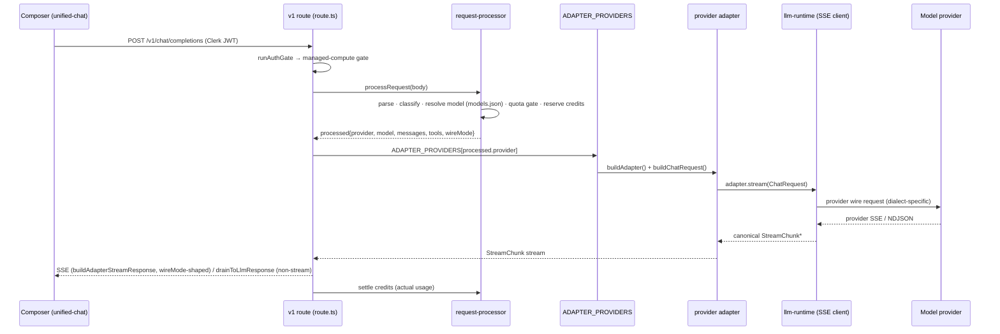

# 3. AI Runtime, Prompt Pipeline & Model Routing

Status: Current
Owner: Platform lead
Last updated: 2026-07-10

This file traces a chat request from the composer to the model and back, for both runtimes. The central design fact: there is **one TS provider path** (`packages/providers` + `llm-runtime` + `llm-normalize`) shared by the public v1 route, the api-gateway proxy, and satellite surfaces; and **one Rust engine** (`agiworkforce-{agent-core,llm,mcp}`) for CLI (and, staged, desktop). Both decode into the same canonical `StreamChunk` vocabulary (area 4).

## 3.1 The Cloud request flow (web v1 route)

The public **OpenAI-compatible Chat Completions** endpoint is:

```
apps/web/app/api/llm/v1/chat/completions/route.ts     →  POST /v1/chat/completions (api.agiworkforce.com)
apps/web/app/api/llm/v1/chat/completions/lib/*        →  the pipeline modules
```

(Note: `apps/web/app/api/v1/providers/*` is a *separate* provider-catalog/stream API, not the OpenAI-compat chat route.)

Flow (`handleChatCompletions`):



### Provider dispatch is a table, not a factory

Dispatch is entirely table-driven via **`ADAPTER_PROVIDERS`** in `lib/adapter-providers.ts`:

```ts
Record<string, { buildAdapter; buildChatRequest; mapError; wireMode: 'legacy-web' | 'openai-passthrough' }>
```

- **12 providers** in the table: `anthropic` + `google` with `wireMode: 'legacy-web'`; `openai` + 9 OpenAI-compatible (`groq`, `mistral`, `moonshot`, `zhipu`, `qwen`, `openrouter`, `deepseek`, `xai`, `perplexity`) with `wireMode: 'openai-passthrough'`.
- `anthropic`/`google`/`openai` have dedicated `buildChatRequest`; the 9 compat providers share `toCanonicalChatRequest`.
- There is **no `LLMProviderFactory` fallback** — that module (the old 4,721-LOC `apps/web/lib/llm-providers`) was deleted. An unlisted `processed.provider` is an explicit unsupported-provider failure (credit refund + typed error), documented as unreachable.

### `wireMode` and the byte-stable contract

`wireMode` selects the downstream SSE assembler:

- **`legacy-web`** — the reverse-engineered `OpenAIWireAssembler` mode. The public wire was originally emitted by hand-written code; the migration to adapters must remain **byte-for-byte identical** to that legacy wire, proven by per-provider golden byte-parity tests. This is the load-bearing "byte-stable v1 contract" (area 10).
- **`openai-passthrough`** — pass the provider's OpenAI-shaped SSE through.

`wireMode` is passed into `buildAdapterStreamResponse(...)` (streaming) and `drainToLlmResponse(...)` (non-streaming).

### Supporting `lib/` modules

`adapter-providers.ts` (the table), `adapter-factory.ts`, `adapter-response.ts`, `stream-transform.ts`, `response-builder.ts`, `request-processor.ts`, `auth-gate.ts`, `tool-loop.ts`, `tool-loop-anthropic.ts`, `adapter-errors.ts`.

## 3.2 Provider dialects

Three request-build dialects, all normalized by `@agiworkforce/llm-normalize` and decoded to canonical `StreamChunk`:

| Dialect | Providers | Notes |
| ------- | --------- | ----- |
| **Anthropic** | anthropic | Messages API via `@anthropic-ai/sdk`; `cache_control` cache-token accounting; thinking blocks. |
| **OpenAI-compat** | openai + 9 compat leaves | `openai` SDK; Responses/Chat Completions payload policy in `llm-normalize`; `include_usage`, `logprobs` fidelity preserved. |
| **Google** | google | No vendor SDK; native Gemini wire, with `finish_reason` mapping fixed during migration. |

`ChatRequest.rawVendorTools` carries provider-native built-in tools. Additive `StreamChunk` variants (server-tool, citation, response-meta) preserve wire fidelity across dialects (area 4).

## 3.3 The tool loop and MCP approve → resume

When a request carries tools, the route runs an **agentic tool-loop** instead of a single pass. Trigger: MCP tools (`loadMcpToolDefs` + per-user `loadUserConnectorToolDefs`) or E2B execution tools present, and not a free-trial request. `runToolLoop` (`lib/tool-loop.ts`, `lib/tool-loop-anthropic.ts`) drives a generator-backed SSE stream using the **same `ADAPTER_PROVIDERS` table per step**.

Approval mode:

- **`manual`** when MCP tools exist — the loop pauses, emits a tool-approval event, and waits. The web route exposes an `approve` subroute (`apps/web/app/api/llm/v1/chat/completions/approve/`) to resume. This is the MCP **approve → resume** cycle: untrusted tool output is never auto-executed; the user (or policy) confirms, then the loop resumes with the tool result appended.
- **`auto`** for E2B-only execution tools (sandboxed code execution has its own isolation).

This matches the platform rule: *require explicit approval for destructive, external, privileged, or expensive agent actions; treat tool output as data, not instructions.*

For the **Rust** runtime (CLI/desktop), the equivalent turn loop is `agiworkforce-agent-core`: it drives the model stream, schedules sequential + parallel read-only tool calls, enforces runaway/iteration/budget guards, and emits turn events; the host implements `TurnHost`. MCP transport/OAuth is `agiworkforce-mcp`.

## 3.4 Model-id → apiModelId resolution

Model IDs are catalog-owned (locked rule): UI selectors, route defaults, adapters, and tests all read `packages/types/src/models.json` + `model-catalog.ts` + capability metadata. Never invent/hardcode a current model ID.

- `processRequest` resolves the user-facing model id to the provider + the provider's `apiModelId` from the catalog.
- Capability flags (tool use, vision, image gen, search, code exec, reasoning/effort) gate which controls the composer showed and which request fields are legal.
- `@agiworkforce/routing` supplies pure heuristics for auto-routing (local task classifier, sticky context pivot, token estimation) and effective input/output pricing.

**Tracked drift:** hardcoded model-id drift still exists in some tests/providers (`WEB-PROVIDER-DRIFT-01`, `MODELS-CURATION-DRIFT-01` — "Fixed, RECURRED once, re-fixed"). `models.json` currently tops out at gpt-5.5; GPT-5.6 GA IDs are pending primary-source verification before any catalog change (SSOT rule). Treat model catalog currency as a live gap.

## 3.5 Cost / credit accounting

- The route **reserves credits** during `processRequest` (before the model call) and **settles** against actual usage after the stream completes — including cache-token accounting for providers that report cached input tokens (Anthropic `cache_control`, OpenAI cached input).
- `@agiworkforce/routing` computes effective input/output pricing per model.
- Money-path correctness was hardened during the provider migration (fixed a "200-on-failure" bug that let failed calls escape refund). Durability of the deduct path under public-alpha load is a tracked hardening item: `BILLING-DEDUCT-DURABILITY-01` (Open — public-alpha GA hardening).

## 3.6 The Local / Desktop path

- **CLI:** runs `agiworkforce-llm` directly — per-dialect request serialization + SSE/NDJSON decode + tool-call delta assembly, byte-identical JSONL vs the old CLI implementation. Turn loop is `agiworkforce-agent-core`.
- **Desktop:** today the Rust `src-tauri/src/core/llm/*` engine still does provider streaming (the `DirectApiProvider`-style path). Wave 5 replaces it with the shared `agiworkforce-llm` crate; that adoption (stages c2/c3/c4) is **live-gated** — it needs live-provider + desktop-device verification the CI/dev environment cannot run, so the shared crate is the frozen contract and desktop migration is staged as tracked PRs. Until then, desktop provider decode is documented as *in-progress-migration*, not duplicated-by-choice.
- **Mobile Local:** `packages/local-llm` tier selector runs on-device (Apple/Gemini Nano → executorch → llama.rn); no account, no egress.

## 3.7 What's fully documented vs flagged

- Cloud v1 route, provider table, dialects, tool-loop, MCP approve→resume, cost accounting: **fully documented** and code-verified.
- Desktop Rust provider decode via the shared crate: **in progress / live-gated** (`docs/plans/rust-engine-extraction-2026-07-09.md`; `DESKTOP-CLI-HARNESS-FRAGMENTATION-01`).
- Model catalog currency (GPT-5.6, drift): **tracked gap** (`WEB-PROVIDER-DRIFT-01`, `MODELS-CURATION-DRIFT-01`).
