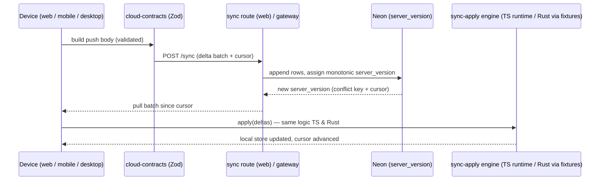

# 5. Data & Sync

Status: Current
Owner: Backend/data lead
Last updated: 2026-07-10

This file covers persistence and cross-device sync: the Zod wire contracts, the cross-language sync-apply engine, the Neon RLS boundary, and the server-authoritative delta-sync pattern. The governing principle (shared-packages decision log R3): **conversation persistence is deliberately per-surface** (Neon / Tauri SQLite / expo-sqlite), joined by a single wire truth + a single shared apply engine — *not* one cross-surface database.

## 5.1 Cross-surface data ownership

Who may write/read what is fixed (`docs/current/technical-architecture.md`):

| Data class | Source of truth | Writes | Sync rule |
| ---------- | --------------- | ------ | --------- |
| Projects | `packages/types` contract + per-surface persistence | Web, Desktop, Mobile | synced app data |
| App chat conversations | per-surface conversation stores + shared sync contracts | Web, Desktop, Mobile | normal chat-sync boundary |
| Developer sessions | CLI session store | CLI, VS Code, Chrome | **not** synced to app chats without explicit handoff |
| Artifacts / generated files | `ComputeSession` / `GeneratedFile` / `ArtifactManifest` in `packages/types` | Desktop first, Web managed later, Mobile as requester | carry privacy mode, owner session, checksum, TTL |
| Memory | Local/BYOK/Managed stores keyed by privacy mode | surface that collected consent | Local memory cannot promote to BYOK/Managed without preview + approval |
| Billing / usage | API gateway + provider-cost ledger | backend services only | no client invents quota/credit values |

Normal chat sync spans only Web/Mobile/Desktop. CLI/VS Code/Chrome stay workspace/task-scoped.

## 5.2 The wire truth: `cloud-contracts` (Zod)

`packages/services/src/cloud-contracts/` is the **one wire truth** — canonical per-endpoint Zod schemas + an offline verifier:

- `me.ts` — the `/me` account/entitlement contract.
- `sync.ts` — the push/pull sync envelope schemas (request bodies, delta batches, cursors).
- `org-policy.ts` — organization/enterprise policy contract.
- `__fixtures__/` + `__tests__/` — canonical fixtures and the contract tests.

**Enforcement anchor:** the web sync routes and the auth store *derive* from these schemas, and web **route contract tests** are the enforcement point — a wire drift breaks a test, not production silently. Mobile consumes the same schemas at runtime. (Gotchas from `docs/agent-context` cloud-contracts notes: `mockReset` and vitest-glob quirks in the contract tests.)

## 5.3 The apply engine: `sync-apply` (cross-language)

`packages/services/src/sync-apply/` holds the **pure delta apply + bigint-cursor logic**, shared so every surface applies deltas identically:

- Per-domain apply modules: `conversations.ts`, `messages.ts`, `projects.ts`, `memory.ts`, `settings.ts`, plus `cursor.ts` (the bigint cursor compare/advance).
- `__fixtures__/` holds the **golden fixtures**: `pull-apply.json`, `push-body.json`, `cursor-compare.json`.

**Cross-language pin (the load-bearing part):** mobile consumes this TS engine at runtime; **desktop's Rust apply is pinned to the same golden fixtures**. `apps/desktop/src-tauri/src/data/cloud_sync.rs` (~line 2823, "Wave 4 — shared sync-apply extraction") `include_str!`s the exact JSON files (`../../../../../packages/services/src/sync-apply/__fixtures__/pull-apply.json`, `cursor-compare.json`) and replays them through the Rust apply, asserting byte/semantic parity with the TS engine. If the fixtures move, that hardcoded path must update. This is how TS and Rust stay behaviorally identical without sharing code.

## 5.4 The delta-sync pattern (migrations 0038–0042)

Cross-device sync is **server-authoritative delta sync** keyed on a monotonic `server_version`, introduced by migration `0038_cloud_sync_versioning.sql` (the "0038 pattern") and extended per data class:

| Migration | Adds cloud sync to |
| --------- | ------------------ |
| `0038_cloud_sync_versioning.sql` | chat conversations/messages — the foundation: server-authoritative monotonic `server_version` (delta cursor + conflict key) + message tombstone/updated columns |
| `0039_artifact_cloud_sync.sql` | artifacts |
| `0040_memory_cloud_sync.sql` | memory |
| `0041_projects_cloud_sync.sql` | projects |
| `0042_settings_cloud_sync.sql` | settings (account settings; device settings stay per-surface) |

Key facts encoded in 0038:

- `web_conversations.id` / `web_messages.id` (uuid) **are** the canonical cloud IDs. Mobile already matches. Desktop maps its INTEGER PK to a UUIDv7 `cloud_id` on its own side (`packages/utils` `./uuidv7`).
- Migrations are **additive-only and idempotent** (`IF NOT EXISTS` / guarded backfill / `OR REPLACE`), applied on a Neon branch first, then production via the Neon workflow.
- 0038 explicitly must **not** touch RLS policies (owned by a separate workstream); the new columns are not user-scoping columns.

Design origin: `docs/plans/cross-device-cloud-sync-design-2026-06-20.md`. The same primitives are reused across chat/artifact/memory/projects/settings — the "reuse 0038 primitives" mandate.

## 5.5 Neon RLS boundary

`apps/web/db/neon` is the canonical migration home. Row-Level Security enforces per-user isolation:

- `0037_rls_user_isolation.sql` established RLS `WITH CHECK` user isolation.
- The **api-gateway** runs real Postgres RLS through `@agiworkforce/data-layer`: `services/api-gateway/src/lib/neonClients.ts` builds a pooled, RLS-capable `DatabaseAdapter` (applicationName `agi-gateway-rls`) over a Neon serverless WebSocket pool. A pre-deploy `app_rls` probe gate guards it.

**Tracked gap:** not every table is on the RLS client yet. Gap tables stay on an explicit `getServiceClient` with `RLS-GAP` markers — `SVC-GATEWAY-RLS-NOOP-01` in known-flaws. Treat the gateway RLS coverage as partial, not complete. Related: `AUDIT-IMMUT-01` (audit immutability migration 0043 drafted, pending Neon apply+verify).

## 5.6 What's fully documented vs flagged

- cloud-contracts, sync-apply + cross-language fixture pin, the 0038–0042 delta-sync pattern, canonical-ID mapping: **fully documented**, code-verified.
- Gateway RLS coverage: **partial** (`SVC-GATEWAY-RLS-NOOP-01`); audit immutability pending (`AUDIT-IMMUT-01`); billing deduct durability under alpha load (`BILLING-DEDUCT-DURABILITY-01`).
- Settings sync is account-settings only; device settings remain per-surface (decision log R4).
