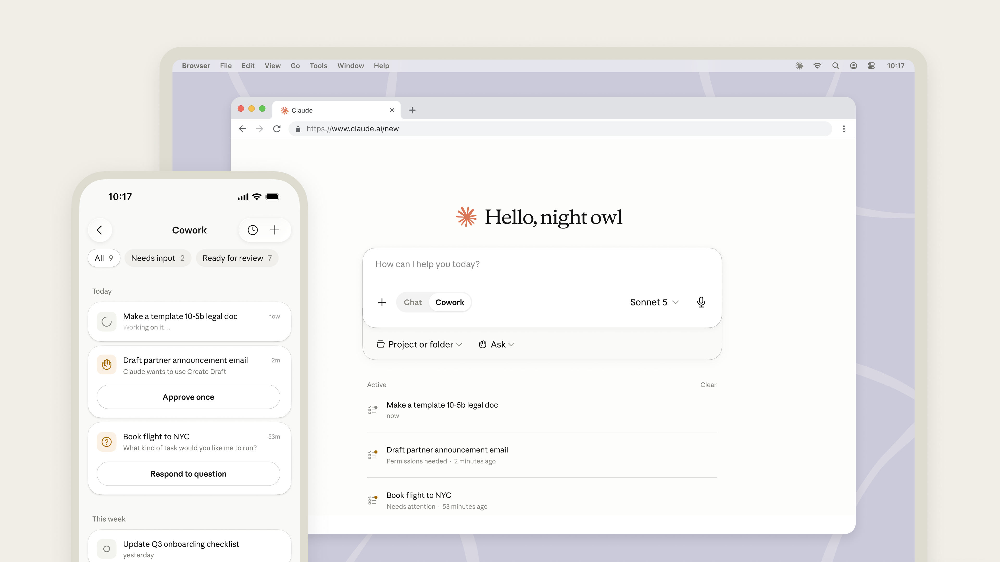
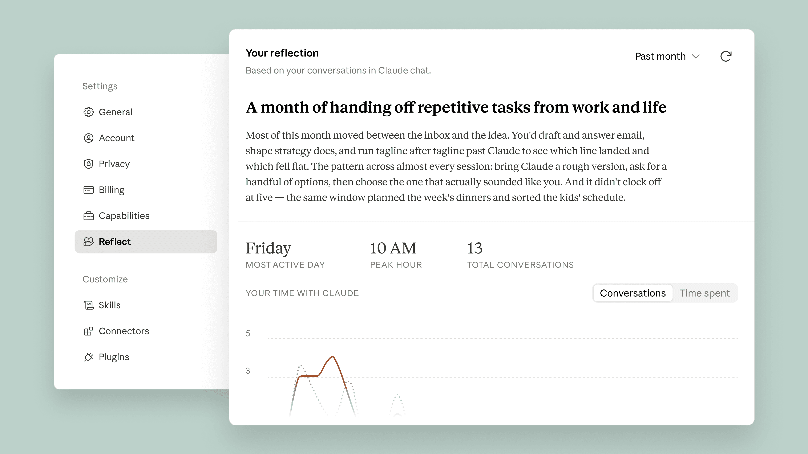
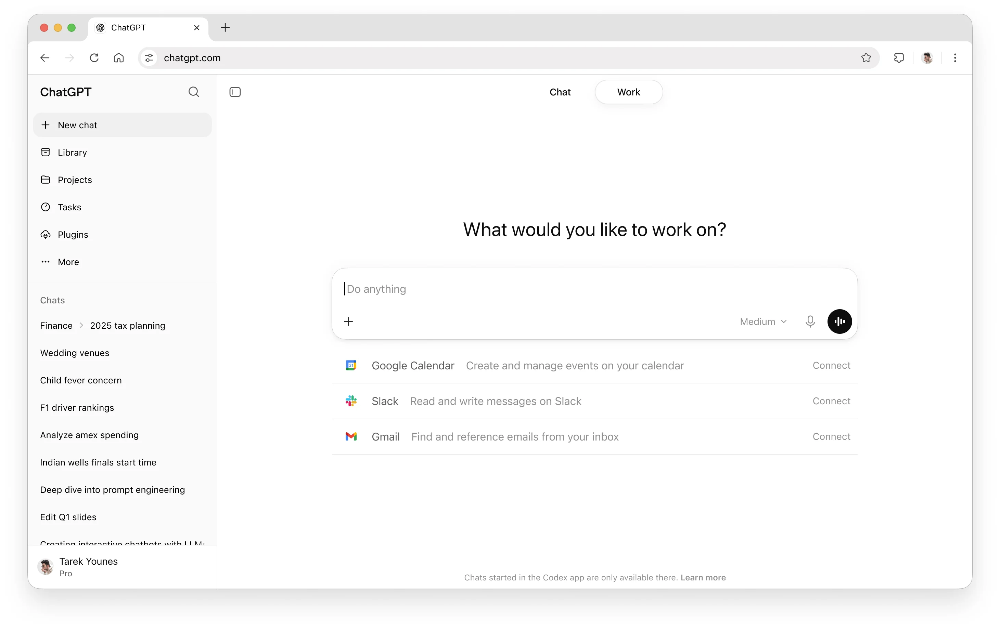
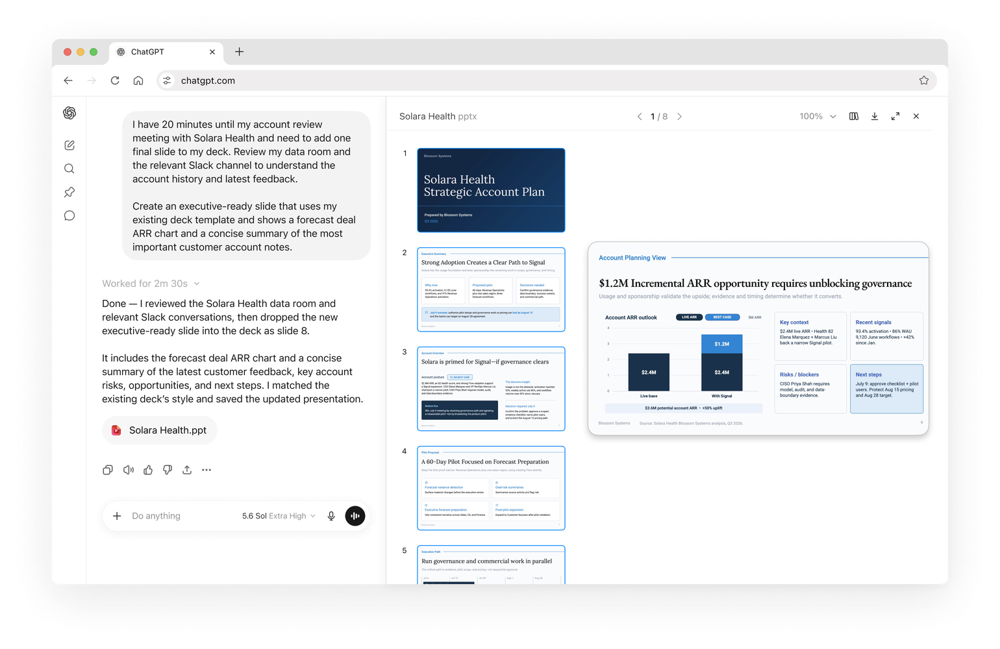
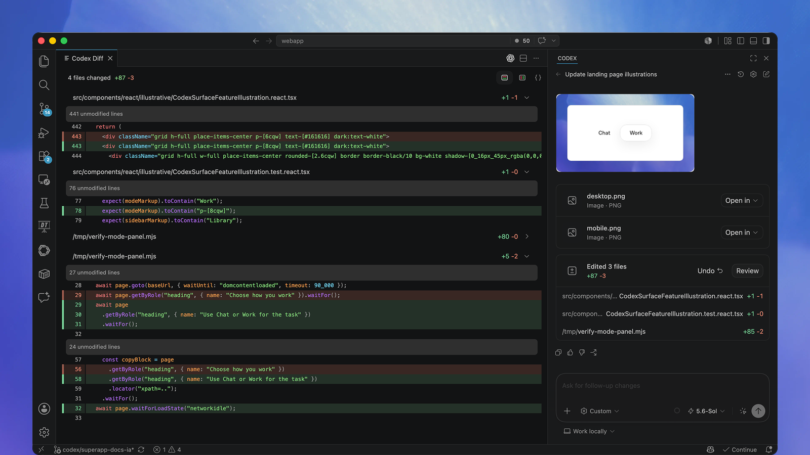

# UI/UX Frontend Reference: Claude and ChatGPT/OpenAI

**Evidence cutoff:** 2026-07-16  
**Requested surfaces:** WebApp, iOSApp, AndroidApp, macOSApp, WindowsApp, LinuxApp, IDE Extension, Browser Extension  
**Companion files:** component status ledger JSON and source registry JSON

> Scope note: The uploaded inventory is used as the verification checklist, not as proof that a listed component is shipped. “Harness/Claude” is treated as the Claude reference implementation because the inventory defines ClaudeSuite and no separate Harness app section.

## Executive findings

1. **Agent work is now a top-level product mode in both suites.** Claude exposes Chat/Cowork; ChatGPT exposes Chat/Work and unifies Chat/Work/Codex on desktop.
2. **Cross-device continuity is real but not uniform.** Claude remote Cowork sessions are account-based, while local files/browser/computer access still depends on an open desktop host. ChatGPT Chat syncs broadly, but Work has launch-time local/cloud synchronization boundaries and Codex mobile remotes only to Mac/Windows hosts.
3. **The largest platform gap is Linux.** Claude has a native Debian-family beta with explicit limitations; ChatGPT has no confirmed first-party native unified desktop app.
4. **July changes are interaction-architecture changes, not published token redesigns.** Public evidence confirms new modes, search, schedules, task states, settings, and deliverable panes; neither company publishes its internal core app design tokens.
5. **Mobile parity is semantic, not pixel-identical.** iOS and Android share product capabilities, but Android-specific public visual evidence is limited and platform-native behavior must be verified independently.

## Evidence and confidence method

- Cutoff: public evidence available through July 16, 2026 (America/Chicago date context).
- First-party release notes and help/product documentation determine whether a feature is shipped, phased, conditional, retired, or absent.
- Official screenshots and videos are used to describe visible hierarchy and interaction placement, but not to invent exact pixel values or internal tokens.
- App Store and Google Play listings confirm current public builds and platform availability. Generic version notes do not establish a specific UI change.
- Community sources are used only for discoverability, naming, rollout, or QA discrepancy signals and are labeled low-confidence.
- The uploaded inventory is a checklist, not proof. Items with no independent public evidence are explicitly marked unverified.
- TikTok and private Discord content could not be reliably retrieved as stable public evidence. No high-confidence conclusion depends on either source.
- “Harness/Claude” is treated as the Claude reference implementation because the uploaded taxonomy defines ClaudeSuite and contains no separate Harness app section. Harness.io is not audited here.

**Confidence:** HIGH = explicit first-party behavior or availability; MEDIUM = first-party feature plus limited visual detail or careful visual inference; LOW = unverified discrete control, community-only signal, or outside detailed audit.

## July 2026 change timeline

| Date       | Suite          | Change                                                                                                                                                                                                                                                                  | Surfaces                                  | Sources                                                                                                                                                                                                                                                                                                                                                                                                                                                                                                                                                                                                                                                      |
| ---------- | -------------- | ----------------------------------------------------------------------------------------------------------------------------------------------------------------------------------------------------------------------------------------------------------------------- | ----------------------------------------- | ------------------------------------------------------------------------------------------------------------------------------------------------------------------------------------------------------------------------------------------------------------------------------------------------------------------------------------------------------------------------------------------------------------------------------------------------------------------------------------------------------------------------------------------------------------------------------------------------------------------------------------------------------------ |
| 2026-07-07 | Claude         | Cowork expands to web and mobile. Remote sessions follow the account, can continue in the background, and schedules are no longer tied to the device that created them.                                                                                                 | Web, iOS, Android, Desktop                | [ANT-RN-2026-07](https://support.claude.com/en/articles/12138966-release-notes) (2026-07-09 (latest relevant entry); Web, iOS, Android, macOS, Windows, Linux) [ANT-COWORK-BLOG-2026-07-07](https://claude.com/blog/cowork-web-mobile) (2026-07-07; Web, iOS, Android, Desktop) [ANT-COWORK-HELP-2026-07](https://support.claude.com/en/articles/15520349-use-claude-cowork-on-web-desktop-and-mobile) (2026-07 (retrieved 2026-07-16); Web, iOS, Android, macOS, Windows, Linux)                                                                                                                                                                      |
| 2026-07-08 | ChatGPT/OpenAI | GPT-Live-1 voice launches inside Chat with simultaneous speech and streamed text, widgets, web search, memory, and text/image context; video and screen sharing are excluded from this launch path.                                                                     | Web, iOS, Android                         | [OAI-RN-2026-07](https://help.openai.com/en/articles/6825453-chatgpt-release-notes) (2026-07-15 (latest entry at cutoff); Web, iOS, Android, macOS, Windows)                                                                                                                                                                                                                                                                                                                                                                                                                                                                                                 |
| 2026-07-09 | Claude         | Reflect and Time and focus launch. Reflect provides a memory-based recap dashboard; break reminders and quiet hours are configured on web/desktop and apply across devices.                                                                                             | Web, Desktop; effects on Mobile           | [ANT-RN-2026-07](https://support.claude.com/en/articles/12138966-release-notes) (2026-07-09 (latest relevant entry); Web, iOS, Android, macOS, Windows, Linux) [ANT-REFLECT-ANN-2026-07-09](https://www.anthropic.com/news/reflect-with-claude) (2026-07-09; Web, macOS, Windows, Linux) [ANT-REFLECT-HELP-2026-07](https://support.claude.com/en/articles/15672559-see-your-monthly-recap) (2026-07-09; Web, Desktop) [ANT-FOCUS-HELP-2026-07](https://support.claude.com/en/articles/15672868-set-break-reminders-and-quiet-hours) (2026-07-09; Web, iOS, Android, Desktop)                                                                       |
| 2026-07-09 | ChatGPT/OpenAI | Work launches with connected apps/files, progress, questions, steering, approvals, finished deliverables, and scheduled tasks. The macOS/Windows app unifies Chat, Work, and Codex; Sites enters public beta; Atlas retirement and group-chat retirement are announced. | Web, iOS, Android, macOS, Windows, Chrome | [OAI-RN-2026-07](https://help.openai.com/en/articles/6825453-chatgpt-release-notes) (2026-07-15 (latest entry at cutoff); Web, iOS, Android, macOS, Windows) [OAI-WORK-ANN-2026-07-09](https://openai.com/index/chatgpt-for-your-most-ambitious-work/) (2026-07-09; Web, iOS, Android, macOS, Windows) [OAI-DESKTOP-MIGRATION-2026-07](https://help.openai.com/en/articles/20001276) (2026-07 (retrieved 2026-07-16); macOS, Windows) [OAI-SITES-2026-07](https://help.openai.com/en/articles/20001339) (2026-07-09; Web, macOS, Windows) [OAI-ATLAS-2026-07](https://help.openai.com/en/articles/20001371) (2026-07-09; macOS, Windows, Chrome) |
| 2026-07-13 | ChatGPT/OpenAI | Codex iOS receives inline visualizations, task links, improved tool-progress styling, clearer file-opening feedback, keyboard-safe composer controls for long prompts/large text, and restored Fast selection.                                                          | iOS                                       | [OAI-CODEX-CHANGELOG-2026-07](https://learn.chatgpt.com/docs/changelog) (2026-07-13 (latest relevant entry); iOS, macOS, Windows, IDE)                                                                                                                                                                                                                                                                                                                                                                                                                                                                                                                       |
| 2026-07-14 | ChatGPT/OpenAI | Unified search across chats, projects, images, and documents becomes available from one sidebar entry with content filters and direct result opening.                                                                                                                   | Web, iOS, Android                         | [OAI-RN-2026-07](https://help.openai.com/en/articles/6825453-chatgpt-release-notes) (2026-07-15 (latest entry at cutoff); Web, iOS, Android, macOS, Windows)                                                                                                                                                                                                                                                                                                                                                                                                                                                                                                 |
| 2026-07-15 | ChatGPT/OpenAI | Custom-instruction capacity increases to 5,000 characters for Plus, Pro, Enterprise, Business, and Education users.                                                                                                                                                     | Account personalization                   | [OAI-RN-2026-07](https://help.openai.com/en/articles/6825453-chatgpt-release-notes) (2026-07-15 (latest entry at cutoff); Web, iOS, Android, macOS, Windows)                                                                                                                                                                                                                                                                                                                                                                                                                                                                                                 |

## Requested-surface coverage matrix

| Suite          | Surface           | Status                    | Key boundary                                                                                  | Confidence  | Sources                                                                                                                                                                                                                                                                                                                                              |
| -------------- | ----------------- | ------------------------- | --------------------------------------------------------------------------------------------- | ----------- | ---------------------------------------------------------------------------------------------------------------------------------------------------------------------------------------------------------------------------------------------------------------------------------------------------------------------------------------------------- |
| Claude         | WebApp            | Shipped                   | Cowork web, Reflect, Time and focus; local resource access requires an open desktop host.     | HIGH        | [ANT-COWORK-HELP-2026-07](https://support.claude.com/en/articles/15520349-use-claude-cowork-on-web-desktop-and-mobile) (2026-07 (retrieved 2026-07-16); Web, iOS, Android, macOS, Windows, Linux) [ANT-REFLECT-HELP-2026-07](https://support.claude.com/en/articles/15672559-see-your-monthly-recap) (2026-07-09; Web, Desktop)                   |
| Claude         | iOSApp            | Shipped                   | Task-centric Cowork remote control; no native Reflect dashboard confirmed.                    | HIGH/MEDIUM | [ANT-COWORK-IMG-2026-07](https://cdn.prod.website-files.com/68a44d4040f98a4adf2207b6/6a4c2a3e7ccd1da1a8961f94_Cowork-Web-Mobile-Blog-Cowork-1920x1080.png) (2026-07-07; Web, iOS) [ANT-IOS-STORE-2026-07](https://apps.apple.com/us/app/claude-by-anthropic/id6473753684) (Version 1.260709.0; listed 2026-07-14; iOS, iPadOS)                    |
| Claude         | AndroidApp        | Shipped                   | Behavioral Cowork parity; Android-specific visual parity not documented.                      | MEDIUM      | [ANT-COWORK-HELP-2026-07](https://support.claude.com/en/articles/15520349-use-claude-cowork-on-web-desktop-and-mobile) (2026-07 (retrieved 2026-07-16); Web, iOS, Android, macOS, Windows, Linux) [ANT-ANDROID-STORE-2026-07](https://play.google.com/store/apps/details?hl=en_US&id=com.anthropic.claude) (Updated 2026-07-10; Android)          |
| Claude         | macOSApp          | Shipped / fullest surface | Full local Cowork, live artifacts, computer/browser use, extensions, Reflect, focus settings. | HIGH        | [ANT-DOWNLOAD-2026-07](https://claude.com/download) (Live page; retrieved 2026-07-16; macOS, Windows, Linux, iOS, Android, Chrome, IDE, Office) [ANT-COWORK-HELP-2026-07](https://support.claude.com/en/articles/15520349-use-claude-cowork-on-web-desktop-and-mobile) (2026-07 (retrieved 2026-07-16); Web, iOS, Android, macOS, Windows, Linux) |
| Claude         | WindowsApp        | Shipped / fullest surface | Functional desktop parity; exact Windows visual treatment not documented.                     | HIGH/MEDIUM | [ANT-DOWNLOAD-2026-07](https://claude.com/download) (Live page; retrieved 2026-07-16; macOS, Windows, Linux, iOS, Android, Chrome, IDE, Office) [ANT-COWORK-HELP-2026-07](https://support.claude.com/en/articles/15520349-use-claude-cowork-on-web-desktop-and-mobile) (2026-07 (retrieved 2026-07-16); Web, iOS, Android, macOS, Windows, Linux) |
| Claude         | LinuxApp          | Beta                      | Native Ubuntu/Debian app; no Computer Use or desktop dictation.                               | HIGH        | [ANT-LINUX-2026-07](https://code.claude.com/docs/en/desktop-linux) (Live page; retrieved 2026-07-16; Linux)                                                                                                                                                                                                                                          |
| Claude         | IDE Extension     | Shipped                   | Native VS Code panel/tabs, sessions, plan review, side-by-side diffs, context meter.          | HIGH        | [ANT-VSCODE-2026-07](https://code.claude.com/docs/en/vs-code) (Live page; retrieved 2026-07-16; VS Code, Cursor, Linux, macOS, Windows)                                                                                                                                                                                                              |
| Claude         | Browser Extension | Shipped / Chrome only     | Persistent side panel, tab groups, recording, schedules, developer diagnostics.               | HIGH        | [ANT-CHROME-2026-07](https://support.claude.com/en/articles/12012173-get-started-with-claude-in-chrome) (Live page; retrieved 2026-07-16; Chrome)                                                                                                                                                                                                    |
| ChatGPT/OpenAI | WebApp            | Shipped                   | Work, Sites, unified cross-content search, task/deliverable split views.                      | HIGH        | [OAI-RN-2026-07](https://help.openai.com/en/articles/6825453-chatgpt-release-notes) (2026-07-15 (latest entry at cutoff); Web, iOS, Android, macOS, Windows) [OAI-WEB-DOC-2026-07](https://learn.chatgpt.com/docs/web) (Undated live page; retrieved 2026-07-16; Web)                                                                             |
| ChatGPT/OpenAI | iOSApp            | Shipped                   | Work/search/voice/Codex Remote; July 13 Codex mobile UI refinements.                          | HIGH        | [OAI-RN-2026-07](https://help.openai.com/en/articles/6825453-chatgpt-release-notes) (2026-07-15 (latest entry at cutoff); Web, iOS, Android, macOS, Windows) [OAI-CODEX-CHANGELOG-2026-07](https://learn.chatgpt.com/docs/changelog) (2026-07-13 (latest relevant entry); iOS, macOS, Windows, IDE)                                               |
| ChatGPT/OpenAI | AndroidApp        | Shipped                   | Work/search/voice/Codex Remote; inline mentions and updated Plugins menu.                     | HIGH/MEDIUM | [OAI-RN-2026-07](https://help.openai.com/en/articles/6825453-chatgpt-release-notes) (2026-07-15 (latest entry at cutoff); Web, iOS, Android, macOS, Windows) [OAI-ANDROID-STORE-2026-07](https://play.google.com/store/apps/details?hl=en_US&id=com.openai.chatgpt) (Updated 2026-07-13; Android)                                                 |
| ChatGPT/OpenAI | macOSApp          | Shipped / unified app     | Chat, Work, Codex, local context, integrated browser, diffs, PR review, Sites.                | HIGH        | [OAI-DESKTOP-DOC-2026-07](https://learn.chatgpt.com/docs/app) (Undated live page; retrieved 2026-07-16; macOS, Windows) [OAI-DESKTOP-MIGRATION-2026-07](https://help.openai.com/en/articles/20001276) (2026-07 (retrieved 2026-07-16); macOS, Windows)                                                                                            |
| ChatGPT/OpenAI | WindowsApp        | Shipped / unified app     | Functional parity with macOS; Windows-specific visual tokens not published.                   | HIGH/MEDIUM | [OAI-DESKTOP-DOC-2026-07](https://learn.chatgpt.com/docs/app) (Undated live page; retrieved 2026-07-16; macOS, Windows)                                                                                                                                                                                                                              |
| ChatGPT/OpenAI | LinuxApp          | Not shipped               | No first-party native unified desktop app or documented Remote host.                          | HIGH        | [OAI-RN-2026-07](https://help.openai.com/en/articles/6825453-chatgpt-release-notes) (2026-07-15 (latest entry at cutoff); Web, iOS, Android, macOS, Windows) [OAI-DESKTOP-DOC-2026-07](https://learn.chatgpt.com/docs/app) (Undated live page; retrieved 2026-07-16; macOS, Windows)                                                              |
| ChatGPT/OpenAI | IDE Extension     | Shipped                   | Editor-centered diff/review plus right-side Codex panel; local/cloud handoff.                 | HIGH        | [OAI-CODEX-IDE-2026-07](https://learn.chatgpt.com/docs/codex/ide) (Undated live page; retrieved 2026-07-16; VS Code, Cursor, Windsurf, VS Code Insiders) [OAI-IDE-IMG-2026-07](https://learn.chatgpt.com/images/codex/ide-review.webp) (Retrieved 2026-07-16; VS Code family)                                                                     |
| ChatGPT/OpenAI | Browser Extension | Shipped / phased          | Tab groups, per-site approvals, allow/block; persistent sidebar availability varies.          | HIGH/MEDIUM | [OAI-CHROME-2026-07](https://learn.chatgpt.com/docs/chrome-extension) (Undated live page; retrieved 2026-07-16; Chrome) [OAI-ATLAS-2026-07](https://help.openai.com/en/articles/20001371) (2026-07-09; macOS, Windows, Chrome)                                                                                                                    |

## Official visual references

_Official Claude Cowork web/mobile launch image. Source: [ANT-COWORK-IMG-2026-07](https://cdn.prod.website-files.com/68a44d4040f98a4adf2207b6/6a4c2a3e7ccd1da1a8961f94_Cowork-Web-Mobile-Blog-Cowork-1920x1080.png) (2026-07-07; Web, iOS)_

_Official Claude Reflect dashboard. Source: [ANT-REFLECT-IMG-2026-07](https://www.anthropic.com/news/reflect-with-claude) (2026-07-09; Web, Desktop)_

_Official ChatGPT web interface. Source: [OAI-WEB-IMG-2026-07](https://learn.chatgpt.com/images/codex/chatgpt-web.webp) (Retrieved 2026-07-16; Web)_

_Official ChatGPT Work deliverable workflow. Source: [OAI-WORK-IMG-2026-07](https://learn.chatgpt.com/codex/get-started-with-work/create-presentation.webp) (Retrieved 2026-07-16; Web, macOS, Windows)_

_Official Codex IDE review workflow. Source: [OAI-IDE-IMG-2026-07](https://learn.chatgpt.com/images/codex/ide-review.webp) (Retrieved 2026-07-16; VS Code family)_

## Claude - WebApp

**Availability:** Shipped; Cowork web beta and Reflect available by July 2026.

A warm, content-first web shell centered on a large composer and a Chat/Cowork mode switch, with the persistent left navigation carrying chats, projects, artifacts, search, customization, and settings. July 2026 adds remote Cowork task continuity and new reflective/time-management settings rather than a documented wholesale visual redesign.

| Component / area                     | Latest confirmed UI and behavior                                                                                                                                                                                                                                                   | July 2026 delta                                                                                                                | Status / confidence                                            | Implementation note                                                                                                                             | Sources                                                                                                                                                                                                                                                                                                                                                                                                                                                                                                    |
| ------------------------------------ | ---------------------------------------------------------------------------------------------------------------------------------------------------------------------------------------------------------------------------------------------------------------------------------- | ------------------------------------------------------------------------------------------------------------------------------ | -------------------------------------------------------------- | ----------------------------------------------------------------------------------------------------------------------------------------------- | ---------------------------------------------------------------------------------------------------------------------------------------------------------------------------------------------------------------------------------------------------------------------------------------------------------------------------------------------------------------------------------------------------------------------------------------------------------------------------------------------------------- |
| AppShell / Sidebar / Home            | Persistent left navigation plus a wide main canvas. Official launch imagery shows a warm off-white surface, compact icon-and-label navigation, a centered serif greeting, and a large rounded composer. The web home can switch between Chat and Cowork without leaving the shell. | July 7 puts Cowork directly on web; July 9 adds Reflect and Time and focus entries under Settings.                             | SHIPPED / HIGH                                                 | Implement shell primitives independently from feature flags. Preserve room for mode-specific home content while keeping the sidebar stable.     | [ANT-COWORK-BLOG-2026-07-07](https://claude.com/blog/cowork-web-mobile) (2026-07-07; Web, iOS, Android, Desktop) [ANT-COWORK-IMG-2026-07](https://cdn.prod.website-files.com/68a44d4040f98a4adf2207b6/6a4c2a3e7ccd1da1a8961f94_Cowork-Web-Mobile-Blog-Cowork-1920x1080.png) (2026-07-07; Web, iOS) [ANT-REFLECT-HELP-2026-07](https://support.claude.com/en/articles/15672559-see-your-monthly-recap) (2026-07-09; Web, Desktop)                                                                     |
| Topbar / ModePicker                  | The primary mode switch is a compact segmented control labeled Chat and Cowork near the top of the main pane. The current model remains exposed near the composer rather than in a dominant page-level topbar.                                                                     | Cowork becomes a cross-surface mode instead of a desktop-only destination.                                                     | SHIPPED / HIGH                                                 | Treat Chat/Cowork as a product mode with route persistence, not as a decorative tab.                                                            | [ANT-COWORK-IMG-2026-07](https://cdn.prod.website-files.com/68a44d4040f98a4adf2207b6/6a4c2a3e7ccd1da1a8961f94_Cowork-Web-Mobile-Blog-Cowork-1920x1080.png) (2026-07-07; Web, iOS) [ANT-COWORK-HELP-2026-07](https://support.claude.com/en/articles/15520349-use-claude-cowork-on-web-desktop-and-mobile) (2026-07 (retrieved 2026-07-16); Web, iOS, Android, macOS, Windows, Linux)                                                                                                                     |
| Composer / PromptBox                 | Large multi-line rounded prompt box. Official imagery shows attachment/action controls along the lower-left edge and model/microphone/send controls on the lower-right. Cowork suggestions such as project/folder/ask appear as lightweight actions below or near the composer.    | Cowork accepts delegated tasks from web and can create remote sessions that continue after the originating device disconnects. | SHIPPED / HIGH                                                 | Composer should support mode-specific affordances without moving the core send target. Maintain a clear remote-vs-local capability explanation. | [ANT-COWORK-IMG-2026-07](https://cdn.prod.website-files.com/68a44d4040f98a4adf2207b6/6a4c2a3e7ccd1da1a8961f94_Cowork-Web-Mobile-Blog-Cowork-1920x1080.png) (2026-07-07; Web, iOS) [ANT-COWORK-BLOG-2026-07-07](https://claude.com/blog/cowork-web-mobile) (2026-07-07; Web, iOS, Android, Desktop) [ANT-COWORK-HELP-2026-07](https://support.claude.com/en/articles/15520349-use-claude-cowork-on-web-desktop-and-mobile) (2026-07 (retrieved 2026-07-16); Web, iOS, Android, macOS, Windows, Linux) |
| ModelPicker / Effort / Thinking      | A compact model label/dropdown is visible in the composer. Public sources confirm model and thinking controls at feature level, but Anthropic does not publish exact control dimensions, menus, or tokenized spacing.                                                              | No July-specific visual picker redesign was confirmed.                                                                         | SHIPPED; VISUAL TOKENS UNPUBLISHED / MEDIUM                    | Do not hard-code inventory model names without live entitlement data. Keep picker content server-configurable.                                  | [ANT-COWORK-IMG-2026-07](https://cdn.prod.website-files.com/68a44d4040f98a4adf2207b6/6a4c2a3e7ccd1da1a8961f94_Cowork-Web-Mobile-Blog-Cowork-1920x1080.png) (2026-07-07; Web, iOS) [ANT-GET-STARTED-2026](https://support.claude.com/en/articles/8114491-get-started-with-claude) (Live page; retrieved 2026-07-16; Web, Mobile, Desktop)                                                                                                                                                                |
| Conversation / Thread / ToolProgress | Chat remains turn-based; Cowork adds task progress, questions, approval prompts, and deliverable review in the conversation flow. Remote sessions can be opened on another surface to inspect progress, answer questions, or redirect work.                                        | July 7 establishes account-based remote-session continuity and background execution.                                           | SHIPPED / HIGH                                                 | Represent long-running work as an event stream with resumable checkpoints and explicit waiting-for-user states.                                 | [ANT-COWORK-BLOG-2026-07-07](https://claude.com/blog/cowork-web-mobile) (2026-07-07; Web, iOS, Android, Desktop) [ANT-COWORK-HELP-2026-07](https://support.claude.com/en/articles/15520349-use-claude-cowork-on-web-desktop-and-mobile) (2026-07 (retrieved 2026-07-16); Web, iOS, Android, macOS, Windows, Linux)                                                                                                                                                                                      |
| Cowork / Active tasks / Schedules    | The home presents active task cards below the composer. Remote Cowork sessions and schedules belong to the account and can be accessed from web, desktop, or mobile. Schedules no longer require the device that created them to remain the controlling device.                    | New July behavior: background continuation after laptop closure and device-independent schedules.                              | SHIPPED / HIGH                                                 | Surface task status, next run, origin, required host, and blocking approvals; otherwise cross-device state is ambiguous.                        | [ANT-COWORK-BLOG-2026-07-07](https://claude.com/blog/cowork-web-mobile) (2026-07-07; Web, iOS, Android, Desktop) [ANT-COWORK-HELP-2026-07](https://support.claude.com/en/articles/15520349-use-claude-cowork-on-web-desktop-and-mobile) (2026-07 (retrieved 2026-07-16); Web, iOS, Android, macOS, Windows, Linux) [ANT-RN-2026-07](https://support.claude.com/en/articles/12138966-release-notes) (2026-07-09 (latest relevant entry); Web, iOS, Android, macOS, Windows, Linux)                    |
| Artifacts / Drafts / FilePreview     | Artifacts remain a split or secondary creation surface for documents, code, diagrams, and interactive output. Web/mobile can view and work with outputs, but the Cowork parity table reserves live artifact creation in Cowork for desktop at the cutoff.                          | No confirmed July visual redesign of the Artifact pane; July primarily expands where Cowork sessions can be controlled.        | PARTIAL PARITY / HIGH                                          | Do not expose a live-artifact creation affordance in web Cowork unless the backend entitlement is available; use preview/download states.       | [ANT-ARTIFACTS-2026](https://support.claude.com/en/articles/9487310-what-are-artifacts-and-how-do-i-use-them) (Live page; retrieved 2026-07-16; Web, Desktop, Mobile) [ANT-COWORK-HELP-2026-07](https://support.claude.com/en/articles/15520349-use-claude-cowork-on-web-desktop-and-mobile) (2026-07 (retrieved 2026-07-16); Web, iOS, Android, macOS, Windows, Linux)                                                                                                                                 |
| Search / Projects / Memory           | Search, Projects, project files/chats, and memory are present across the Claude suite. Public sources do not confirm a July universal-search redesign comparable to ChatGPT’s July 14 launch, nor a single search index spanning every object type.                                | Reflect uses memory to generate personalized usage recaps; Cowork remote sessions follow the account.                          | SHIPPED AT FEATURE LEVEL; UNIVERSAL SEARCH UNVERIFIED / MEDIUM | Keep ChatSearch, ProjectSearch, and memory-derived recap data distinct until a unified information architecture is publicly verified.           | [ANT-COWORK-HELP-2026-07](https://support.claude.com/en/articles/15520349-use-claude-cowork-on-web-desktop-and-mobile) (2026-07 (retrieved 2026-07-16); Web, iOS, Android, macOS, Windows, Linux) [ANT-REFLECT-HELP-2026-07](https://support.claude.com/en/articles/15672559-see-your-monthly-recap) (2026-07-09; Web, Desktop) [ANT-DOWNLOAD-2026-07](https://claude.com/download) (Live page; retrieved 2026-07-16; macOS, Windows, Linux, iOS, Android, Chrome, IDE, Office)                      |
| Settings / Reflect                   | Settings adds a dedicated Reflect item. The screen uses a left settings rail and a large recap card with date-range dropdown, refresh action, narrative summary, three high-level metrics, chart controls, and topic breakdown.                                                    | Added July 9 for Free, Pro, and Max on web and desktop.                                                                        | SHIPPED / HIGH                                                 | Use a generated-state model: loading, unavailable memory, refreshed, and stale recap need explicit UI states.                                   | [ANT-REFLECT-ANN-2026-07-09](https://www.anthropic.com/news/reflect-with-claude) (2026-07-09; Web, macOS, Windows, Linux) [ANT-REFLECT-HELP-2026-07](https://support.claude.com/en/articles/15672559-see-your-monthly-recap) (2026-07-09; Web, Desktop) [ANT-REFLECT-IMG-2026-07](https://www.anthropic.com/news/reflect-with-claude) (2026-07-09; Web, Desktop)                                                                                                                                     |
| Settings / Time and focus            | Settings > Time and focus contains dropdown-configured break reminders and quiet-hours controls. When a reminder fires, the user can stop, snooze, or dismiss and continue. The controls are nudges, not hard locks.                                                               | Added July 9; configured on web/desktop and applied across web, desktop, and mobile.                                           | SHIPPED / HIGH                                                 | Synchronize preference state account-wide. A reminder modal/banner must never discard an in-progress prompt or task state.                      | [ANT-FOCUS-HELP-2026-07](https://support.claude.com/en/articles/15672868-set-break-reminders-and-quiet-hours) (2026-07-09; Web, iOS, Android, Desktop) [ANT-RN-2026-07](https://support.claude.com/en/articles/12138966-release-notes) (2026-07-09 (latest relevant entry); Web, iOS, Android, macOS, Windows, Linux)                                                                                                                                                                                   |
| Theme / Typography / Density         | Official July imagery confirms a warm-light Claude aesthetic, rounded containers, restrained borders, and serif display typography for greetings/recap titles with sans-serif controls. Exact font family, spacing scale, radii, and dark-mode deltas are not public.              | No first-party claim of a July-wide typography or dark/light redesign was found.                                               | VISUALLY CONFIRMED; TOKENS UNPUBLISHED / MEDIUM                | Match relationships and hierarchy before pixel values. Maintain token abstraction for light/dark and high-contrast variants.                    | [ANT-COWORK-IMG-2026-07](https://cdn.prod.website-files.com/68a44d4040f98a4adf2207b6/6a4c2a3e7ccd1da1a8961f94_Cowork-Web-Mobile-Blog-Cowork-1920x1080.png) (2026-07-07; Web, iOS) [ANT-REFLECT-IMG-2026-07](https://www.anthropic.com/news/reflect-with-claude) (2026-07-09; Web, Desktop)                                                                                                                                                                                                              |

**Platform-specific notes**

- Web can start, steer, and review remote Cowork tasks, but access to local files, local connectors, browser use, or computer use requires an open Claude Desktop host.
- Live Cowork artifact creation is documented as desktop-only at the cutoff; web should show outputs and downloads without implying full local execution parity.
- Reflect is a web/desktop settings screen; mobile receives the effects of Time and focus preferences but not the full Reflect dashboard.

**Missing, inconsistent, or unverified**

- No public component specification for Sidebar width, composer padding, typography tokens, responsive breakpoints, or dark-mode values.
- No confirmed July 2026 global semantic search spanning chats, projects, artifacts, files, and memory.
- MemorySearch and detailed result-filter interaction in the inventory were not independently verified as discrete shipped controls.

## Claude - iOSApp

**Availability:** Shipped; current App Store build 1.260709.0 listed July 14, 2026.

The July iOS Cowork experience is task-centric rather than a desktop pane compressed onto a phone: a compact top bar, filter chips, grouped task cards, contextual actions, and push-driven handoff. General chat retains mobile-native composer, voice, camera, photos, and file inputs.

| Component / area                     | Latest confirmed UI and behavior                                                                                                                                                                                                                           | July 2026 delta                                                              | Status / confidence                                | Implementation note                                                                                                        | Sources                                                                                                                                                                                                                                                                                                                                                                                                                                                   |
| ------------------------------------ | ---------------------------------------------------------------------------------------------------------------------------------------------------------------------------------------------------------------------------------------------------------- | ---------------------------------------------------------------------------- | -------------------------------------------------- | -------------------------------------------------------------------------------------------------------------------------- | --------------------------------------------------------------------------------------------------------------------------------------------------------------------------------------------------------------------------------------------------------------------------------------------------------------------------------------------------------------------------------------------------------------------------------------------------------- |
| AppShell / Navigation                | Mobile uses a single-column shell with compact top navigation and route-level screens for Chat, Cowork, Projects, Search, Files, Voice, and Settings. Official July Cowork imagery shows the task list as the primary Cowork landing state.                | Cowork becomes directly accessible on mobile July 7.                         | SHIPPED / HIGH                                     | Use native navigation stacks and preserve the task filter when drilling into a session.                                    | [ANT-COWORK-IMG-2026-07](https://cdn.prod.website-files.com/68a44d4040f98a4adf2207b6/6a4c2a3e7ccd1da1a8961f94_Cowork-Web-Mobile-Blog-Cowork-1920x1080.png) (2026-07-07; Web, iOS) [ANT-COWORK-BLOG-2026-07-07](https://claude.com/blog/cowork-web-mobile) (2026-07-07; Web, iOS, Android, Desktop) [ANT-IOS-STORE-2026-07](https://apps.apple.com/us/app/claude-by-anthropic/id6473753684) (Version 1.260709.0; listed 2026-07-14; iOS, iPadOS)     |
| Cowork task list / Filters           | Official imagery shows horizontal filter chips such as All, Needs input, and Ready for review, followed by grouped task cards under time headings such as Today and This week. Cards expose state, summary, and the next required user action.             | New July mobile control surface for remote Cowork.                           | SHIPPED / HIGH                                     | Model filters from normalized task states; keep action labels specific (answer, approve, review) rather than generic open. | [ANT-COWORK-IMG-2026-07](https://cdn.prod.website-files.com/68a44d4040f98a4adf2207b6/6a4c2a3e7ccd1da1a8961f94_Cowork-Web-Mobile-Blog-Cowork-1920x1080.png) (2026-07-07; Web, iOS) [ANT-COWORK-BLOG-2026-07-07](https://claude.com/blog/cowork-web-mobile) (2026-07-07; Web, iOS, Android, Desktop)                                                                                                                                                     |
| Composer / ModelPicker               | Chat uses a mobile composer with attachments, camera/photos/files, voice/dictation, send/stop, and a model control in the conversation chrome. Exact July iOS control placement is not documented in sufficient detail to claim pixel parity with Android. | No iOS-wide composer redesign was announced in July.                         | SHIPPED AT FEATURE LEVEL / MEDIUM                  | Keep composer controls reachable above the keyboard and Dynamic Type safe; do not mirror Android-only integrations.        | [ANT-IOS-STORE-2026-07](https://apps.apple.com/us/app/claude-by-anthropic/id6473753684) (Version 1.260709.0; listed 2026-07-14; iOS, iPadOS) [ANT-DOWNLOAD-2026-07](https://claude.com/download) (Live page; retrieved 2026-07-16; macOS, Windows, Linux, iOS, Android, Chrome, IDE, Office) [ANT-GET-STARTED-2026](https://support.claude.com/en/articles/8114491-get-started-with-claude) (Live page; retrieved 2026-07-16; Web, Mobile, Desktop) |
| Remote session detail / Progress     | A task can be started on any surface, opened on iOS, inspected for progress, answered, approved, or redirected, then resumed elsewhere. Push notifications surface completion or required input.                                                           | July 7 introduces account-based remote sessions and cross-device steering.   | SHIPPED / HIGH                                     | Persist deep links to the exact task and waiting event. Show whether local-resource access is currently available.         | [ANT-COWORK-HELP-2026-07](https://support.claude.com/en/articles/15520349-use-claude-cowork-on-web-desktop-and-mobile) (2026-07 (retrieved 2026-07-16); Web, iOS, Android, macOS, Windows, Linux) [ANT-COWORK-BLOG-2026-07-07](https://claude.com/blog/cowork-web-mobile) (2026-07-07; Web, iOS, Android, Desktop)                                                                                                                                     |
| Local files / Browser / Computer use | iOS can direct a remote session that uses local desktop files/browser/computer only while the paired desktop app is open. Closing the desktop does not stop the remote task, but it removes access to those local resources.                               | Clarified with July cross-surface Cowork launch.                             | CONDITIONAL / HIGH                                 | Expose host-online and capability-loss states; never imply that the phone itself grants desktop file-system access.        | [ANT-COWORK-HELP-2026-07](https://support.claude.com/en/articles/15520349-use-claude-cowork-on-web-desktop-and-mobile) (2026-07 (retrieved 2026-07-16); Web, iOS, Android, macOS, Windows, Linux)                                                                                                                                                                                                                                                         |
| Artifacts / Outputs                  | Mobile can receive documents, spreadsheets, presentations, PDFs, diagrams, and downloads from Cowork. The official parity matrix does not grant live Cowork artifact creation on mobile at cutoff.                                                         | July makes finished output available wherever the user picks up the session. | PARTIAL PARITY / HIGH                              | Use preview-first viewers with share/download actions and clear unsupported-edit states.                                   | [ANT-COWORK-HELP-2026-07](https://support.claude.com/en/articles/15520349-use-claude-cowork-on-web-desktop-and-mobile) (2026-07 (retrieved 2026-07-16); Web, iOS, Android, macOS, Windows, Linux) [ANT-COWORK-BLOG-2026-07-07](https://claude.com/blog/cowork-web-mobile) (2026-07-07; Web, iOS, Android, Desktop)                                                                                                                                     |
| Voice / Camera / Photos / Files      | The app publicly supports voice/dictation and visual/file input. Public July sources do not establish all inventory items such as continuous hands-free state, detailed interruption UI, health data, or screen-context capture as shipped iOS controls.   | No July-specific voice visual redesign confirmed.                            | PARTIAL / SOME INVENTORY ITEMS UNVERIFIED / MEDIUM | Gate device integrations by OS permission and documented entitlement; provide empty/denied/restricted states.              | [ANT-IOS-STORE-2026-07](https://apps.apple.com/us/app/claude-by-anthropic/id6473753684) (Version 1.260709.0; listed 2026-07-14; iOS, iPadOS) [ANT-DOWNLOAD-2026-07](https://claude.com/download) (Live page; retrieved 2026-07-16; macOS, Windows, Linux, iOS, Android, Chrome, IDE, Office)                                                                                                                                                           |
| Settings / Reflect                   | Reflect recap is documented for web and desktop, not as a native iOS dashboard.                                                                                                                                                                            | No July mobile Reflect screen confirmed.                                     | NOT SHIPPED ON THIS SURFACE / HIGH                 | A mobile entry should deep-link to a supported surface or be omitted until parity ships.                                   | [ANT-REFLECT-HELP-2026-07](https://support.claude.com/en/articles/15672559-see-your-monthly-recap) (2026-07-09; Web, Desktop)                                                                                                                                                                                                                                                                                                                             |
| Break reminders / Quiet hours        | Preferences are configured on web or desktop but apply on mobile. Reminder UI supports stop, snooze, or dismiss-and-continue behavior.                                                                                                                     | Added July 9.                                                                | SHIPPED EFFECT; CONFIGURATION ELSEWHERE / HIGH     | Mobile should render synchronized reminder state but avoid duplicate notifications across devices.                         | [ANT-FOCUS-HELP-2026-07](https://support.claude.com/en/articles/15672868-set-break-reminders-and-quiet-hours) (2026-07-09; Web, iOS, Android, Desktop)                                                                                                                                                                                                                                                                                                    |
| iOS-only integrations                | The inventory names Messages, Mail, Calendar, Maps, Location, Reminders, Shortcuts, Intents, Widgets, and Health. Public sources support a subset of device integrations broadly, but did not verify every named item or its exact July UI.                | No July source confirms a new iOS integration hub.                           | PARTIALLY VERIFIED / LOW                           | Treat each integration as separately shippable; do not present a single all-integrations screen without product evidence.  | [ANT-DOWNLOAD-2026-07](https://claude.com/download) (Live page; retrieved 2026-07-16; macOS, Windows, Linux, iOS, Android, Chrome, IDE, Office) [ANT-IOS-STORE-2026-07](https://apps.apple.com/us/app/claude-by-anthropic/id6473753684) (Version 1.260709.0; listed 2026-07-14; iOS, iPadOS)                                                                                                                                                           |

**Platform-specific notes**

- iOS is optimized around remote task monitoring and action cards, not the desktop split-pane workspace.
- The Reflect dashboard is absent from documented native mobile surfaces, while Time and focus effects are account-wide.
- Local resource execution belongs to an open desktop host, so mobile task UI needs host health and capability indicators.

**Missing, inconsistent, or unverified**

- No first-party July screenshots were found for the standard iOS Chat composer, model picker, dark mode, or artifact viewer.
- Health, Shortcuts, Intents, Widgets, screen context, and all listed device integrations could not be verified as discrete current UI surfaces.
- Exact camera behavior and autofocus issues are anecdotal outside first-party documentation.

## Claude - AndroidApp

**Availability:** Shipped; Google Play listing updated July 10, 2026.

Android receives the same account-level Cowork remote-session model and mobile task semantics as iOS, but public July evidence is much weaker for Android-specific visual treatment. Behavioral parity is high-confidence; exact Material component choices are not.

| Component / area                     | Latest confirmed UI and behavior                                                                                                                                                                                                                          | July 2026 delta                                      | Status / confidence                                 | Implementation note                                                                                 | Sources                                                                                                                                                                                                                                                                                                                                                                                                                                                                                 |
| ------------------------------------ | --------------------------------------------------------------------------------------------------------------------------------------------------------------------------------------------------------------------------------------------------------- | ---------------------------------------------------- | --------------------------------------------------- | --------------------------------------------------------------------------------------------------- | --------------------------------------------------------------------------------------------------------------------------------------------------------------------------------------------------------------------------------------------------------------------------------------------------------------------------------------------------------------------------------------------------------------------------------------------------------------------------------------- |
| AppShell / Navigation                | Single-column mobile navigation exposes Chat, Cowork, Projects, Search, Files, Voice, and Settings at feature level. No first-party July Android screenshot was found that establishes the exact navigation rail/drawer or topbar treatment.              | Cowork mobile rollout begins July 7.                 | SHIPPED; EXACT VISUAL UNVERIFIED / MEDIUM           | Use Android-native insets, back behavior, and responsive navigation rather than cloning iOS chrome. | [ANT-COWORK-BLOG-2026-07-07](https://claude.com/blog/cowork-web-mobile) (2026-07-07; Web, iOS, Android, Desktop) [ANT-COWORK-HELP-2026-07](https://support.claude.com/en/articles/15520349-use-claude-cowork-on-web-desktop-and-mobile) (2026-07 (retrieved 2026-07-16); Web, iOS, Android, macOS, Windows, Linux) [ANT-ANDROID-STORE-2026-07](https://play.google.com/store/apps/details?hl=en_US&id=com.anthropic.claude) (Updated 2026-07-10; Android)                         |
| Cowork task list / Status filters    | Behavioral model matches mobile Cowork: remote tasks, progress, questions, approvals, review, and push notifications. The iOS-styled launch montage is insufficient proof that chip dimensions, card spacing, icons, or typography match Android exactly. | New July task-control surface.                       | SHIPPED BEHAVIOR; VISUAL PARITY UNVERIFIED / MEDIUM | Implement shared state semantics with Android-specific components and accessibility roles.          | [ANT-COWORK-BLOG-2026-07-07](https://claude.com/blog/cowork-web-mobile) (2026-07-07; Web, iOS, Android, Desktop) [ANT-COWORK-HELP-2026-07](https://support.claude.com/en/articles/15520349-use-claude-cowork-on-web-desktop-and-mobile) (2026-07 (retrieved 2026-07-16); Web, iOS, Android, macOS, Windows, Linux) [ANT-ANDROID-STORE-2026-07](https://play.google.com/store/apps/details?hl=en_US&id=com.anthropic.claude) (Updated 2026-07-10; Android)                         |
| Composer / Inputs                    | Keyboard, voice/dictation, camera, photos, and files are supported broadly. Public sources do not verify every inventory item such as Health Connect or screen context as current UI.                                                                     | No July Android composer redesign confirmed.         | PARTIALLY VERIFIED / MEDIUM                         | Use permission-aware action sheets; distinguish camera capture from gallery and file picker.        | [ANT-ANDROID-STORE-2026-07](https://play.google.com/store/apps/details?hl=en_US&id=com.anthropic.claude) (Updated 2026-07-10; Android) [ANT-DOWNLOAD-2026-07](https://claude.com/download) (Live page; retrieved 2026-07-16; macOS, Windows, Linux, iOS, Android, Chrome, IDE, Office)                                                                                                                                                                                               |
| Remote sessions / Background         | Android can start or continue an account-based remote Cowork session, answer questions, steer, approve, and retrieve outputs. Sessions keep running in the background independent of the originating phone.                                               | Added July 7.                                        | SHIPPED / HIGH                                      | Ensure notification channels separate completion from approval-required and error states.           | [ANT-COWORK-BLOG-2026-07-07](https://claude.com/blog/cowork-web-mobile) (2026-07-07; Web, iOS, Android, Desktop) [ANT-COWORK-HELP-2026-07](https://support.claude.com/en/articles/15520349-use-claude-cowork-on-web-desktop-and-mobile) (2026-07 (retrieved 2026-07-16); Web, iOS, Android, macOS, Windows, Linux) [ANT-RN-2026-07](https://support.claude.com/en/articles/12138966-release-notes) (2026-07-09 (latest relevant entry); Web, iOS, Android, macOS, Windows, Linux) |
| Desktop-hosted local capabilities    | Local file, browser, computer, and local connector capabilities are reachable from Android only through an open Claude Desktop host.                                                                                                                      | Clarified by July Cowork parity documentation.       | CONDITIONAL / HIGH                                  | Display host name, online state, and capability loss with recoverable actions.                      | [ANT-COWORK-HELP-2026-07](https://support.claude.com/en/articles/15520349-use-claude-cowork-on-web-desktop-and-mobile) (2026-07 (retrieved 2026-07-16); Web, iOS, Android, macOS, Windows, Linux)                                                                                                                                                                                                                                                                                       |
| Outputs / Viewers                    | Finished files and visual outputs can be opened or downloaded on Android. Live artifact creation in Cowork is not documented as mobile parity.                                                                                                            | July enables cross-device pickup of finished output. | PARTIAL PARITY / HIGH                               | Use Android file providers and explicit open-with/share/download actions.                           | [ANT-COWORK-HELP-2026-07](https://support.claude.com/en/articles/15520349-use-claude-cowork-on-web-desktop-and-mobile) (2026-07 (retrieved 2026-07-16); Web, iOS, Android, macOS, Windows, Linux)                                                                                                                                                                                                                                                                                       |
| Reflect                              | No native Android Reflect dashboard is documented.                                                                                                                                                                                                        | Not part of the July 9 mobile rollout.               | NOT SHIPPED ON THIS SURFACE / HIGH                  | Do not show a nonfunctional Reflect route.                                                          | [ANT-REFLECT-HELP-2026-07](https://support.claude.com/en/articles/15672559-see-your-monthly-recap) (2026-07-09; Web, Desktop)                                                                                                                                                                                                                                                                                                                                                           |
| Time and focus                       | Break-reminder and quiet-hours preferences configured on web/desktop apply on Android; reminders permit stop, snooze, or continue.                                                                                                                        | Added July 9.                                        | SHIPPED EFFECT; CONFIGURATION ELSEWHERE / HIGH      | Respect Android notification and Do Not Disturb policies; avoid duplicate app and push prompts.     | [ANT-FOCUS-HELP-2026-07](https://support.claude.com/en/articles/15672868-set-break-reminders-and-quiet-hours) (2026-07-09; Web, iOS, Android, Desktop)                                                                                                                                                                                                                                                                                                                                  |
| Health Connect / device integrations | Health Connect, Android-specific intents/widgets, and all named integrations in the inventory were not verified in public first-party July sources.                                                                                                       | No July addition confirmed.                          | UNVERIFIED / LOW                                    | Keep out of parity acceptance criteria until independently confirmed.                               | [ANT-ANDROID-STORE-2026-07](https://play.google.com/store/apps/details?hl=en_US&id=com.anthropic.claude) (Updated 2026-07-10; Android) `INV-TAXONOMY-2026-07` (2026-07-16; All requested surfaces)                                                                                                                                                                                                                                                                                   |
| Theme / Typography                   | No public Android-specific July screenshots or design-token publication establish Material theme, spacing, type scale, or dark-mode differences.                                                                                                          | No confirmed July redesign.                          | UNVERIFIED VISUAL DETAILS / LOW                     | Validate on a physical Android build before claiming iOS parity.                                    | [ANT-ANDROID-STORE-2026-07](https://play.google.com/store/apps/details?hl=en_US&id=com.anthropic.claude) (Updated 2026-07-10; Android)                                                                                                                                                                                                                                                                                                                                                  |

**Platform-specific notes**

- Behavioral Cowork parity with iOS is documented; visual parity is not.
- Android should use platform-native back navigation, keyboard/inset handling, notification channels, and file-provider flows.
- Health Connect and other Android-only integrations remain unverified in this research set.

**Missing, inconsistent, or unverified**

- No official July Android Cowork screenshot comparable to the iOS launch image.
- No verified Android-specific model-picker, composer, voice, artifact-viewer, or dark-mode specification.
- Health Connect and screen-context inventory entries are not supported by first-party UI evidence.

## Claude - macOSApp

**Availability:** Shipped; full Claude Desktop experience.

macOS is the fullest Claude surface: Chat, Cowork, Code, projects, local files/apps/browser, live artifacts, schedules, remote sessions, extensions, quick entry, screenshots, dictation, and computer use. July expands remote continuity and adds Reflect/Time and focus inside the existing desktop settings architecture.

| Component / area                        | Latest confirmed UI and behavior                                                                                                                                                                                                                                       | July 2026 delta                                                                                                                  | Status / confidence                 | Implementation note                                                                                                                 | Sources                                                                                                                                                                                                                                                                                                                                                                                                                                                                                                                |
| --------------------------------------- | ---------------------------------------------------------------------------------------------------------------------------------------------------------------------------------------------------------------------------------------------------------------------- | -------------------------------------------------------------------------------------------------------------------------------- | ----------------------------------- | ----------------------------------------------------------------------------------------------------------------------------------- | ---------------------------------------------------------------------------------------------------------------------------------------------------------------------------------------------------------------------------------------------------------------------------------------------------------------------------------------------------------------------------------------------------------------------------------------------------------------------------------------------------------------------- |
| Unified desktop shell                   | Claude Desktop is presented as one app for Chat, Cowork, and Claude Code, with desktop-only access to local files/apps and extensions. The main shell supports persistent navigation and split work areas for conversation, task progress, files, artifacts, and code. | July 7 remote sessions now move across web/mobile/desktop; July 9 adds Reflect and Time and focus.                               | SHIPPED / HIGH                      | Use a common navigation model while preserving separate runtime/capability indicators for Chat, Cowork, and Code.                   | [ANT-DOWNLOAD-2026-07](https://claude.com/download) (Live page; retrieved 2026-07-16; macOS, Windows, Linux, iOS, Android, Chrome, IDE, Office) [ANT-COWORK-HELP-2026-07](https://support.claude.com/en/articles/15520349-use-claude-cowork-on-web-desktop-and-mobile) (2026-07 (retrieved 2026-07-16); Web, iOS, Android, macOS, Windows, Linux) [ANT-RN-2026-07](https://support.claude.com/en/articles/12138966-release-notes) (2026-07-09 (latest relevant entry); Web, iOS, Android, macOS, Windows, Linux) |
| Cowork local workspace                  | Desktop is the full Cowork surface, including local files, selected folders, browser, computer use, local connectors, parallel workstreams, questions, approvals, and deliverables.                                                                                    | Remote sessions can continue after the laptop closes, but local-resource access is unavailable while the desktop host is closed. | SHIPPED WITH HOST DEPENDENCY / HIGH | Separate remote agent state from host-backed resource state; display when a task is still running but local tools are disconnected. | [ANT-COWORK-HELP-2026-07](https://support.claude.com/en/articles/15520349-use-claude-cowork-on-web-desktop-and-mobile) (2026-07 (retrieved 2026-07-16); Web, iOS, Android, macOS, Windows, Linux) [ANT-COWORK-BLOG-2026-07-07](https://claude.com/blog/cowork-web-mobile) (2026-07-07; Web, iOS, Android, Desktop)                                                                                                                                                                                                  |
| Composer / Local context                | Desktop composer can attach files/folders, use voice/dictation, and invoke local/browser/computer capabilities with permission. Quick Entry provides a global entry point outside the main window.                                                                     | No documented July composer restyle; the major change is cross-device dispatch and continuity.                                   | SHIPPED / HIGH                      | Show attached local context as durable chips with source path, permission scope, and disconnect state.                              | [ANT-DOWNLOAD-2026-07](https://claude.com/download) (Live page; retrieved 2026-07-16; macOS, Windows, Linux, iOS, Android, Chrome, IDE, Office) [ANT-COWORK-HELP-2026-07](https://support.claude.com/en/articles/15520349-use-claude-cowork-on-web-desktop-and-mobile) (2026-07 (retrieved 2026-07-16); Web, iOS, Android, macOS, Windows, Linux)                                                                                                                                                                   |
| Split panes / Artifacts / File creation | Desktop has the richest pane model: conversation/task progress can coexist with live artifacts, file previews, and locally written deliverables. The Cowork parity table marks live artifact creation desktop-only.                                                    | No July pane geometry change publicly documented.                                                                                | SHIPPED / HIGH                      | Support resizable split panes and preserve active artifact/file selection per session.                                              | [ANT-COWORK-HELP-2026-07](https://support.claude.com/en/articles/15520349-use-claude-cowork-on-web-desktop-and-mobile) (2026-07 (retrieved 2026-07-16); Web, iOS, Android, macOS, Windows, Linux) [ANT-ARTIFACTS-2026](https://support.claude.com/en/articles/9487310-what-are-artifacts-and-how-do-i-use-them) (Live page; retrieved 2026-07-16; Web, Desktop, Mobile)                                                                                                                                             |
| Computer use / Chrome control           | Claude can use supported browser/computer surfaces with explicit permissions. Chrome can also be enabled as a connector so desktop tasks navigate, click, type, and fill forms.                                                                                        | Cross-device mobile/web steering can observe and direct a desktop-hosted task.                                                   | SHIPPED / HIGH                      | Require visible permission, active-target, action review, and stop controls. Avoid silent host takeover.                            | [ANT-DOWNLOAD-2026-07](https://claude.com/download) (Live page; retrieved 2026-07-16; macOS, Windows, Linux, iOS, Android, Chrome, IDE, Office) [ANT-COWORK-HELP-2026-07](https://support.claude.com/en/articles/15520349-use-claude-cowork-on-web-desktop-and-mobile) (2026-07 (retrieved 2026-07-16); Web, iOS, Android, macOS, Windows, Linux) [ANT-CHROME-2026-07](https://support.claude.com/en/articles/12012173-get-started-with-claude-in-chrome) (Live page; retrieved 2026-07-16; Chrome)              |
| Schedules / Background work             | Cowork schedules and remote sessions are account-based; desktop-host-dependent actions still require the app and host resources to be available.                                                                                                                       | July removes device-of-origin dependency for schedules and allows background continuation.                                       | SHIPPED / HIGH                      | Each schedule needs a dependency summary: remote-only, connector-backed, or host-required.                                          | [ANT-COWORK-BLOG-2026-07-07](https://claude.com/blog/cowork-web-mobile) (2026-07-07; Web, iOS, Android, Desktop) [ANT-COWORK-HELP-2026-07](https://support.claude.com/en/articles/15520349-use-claude-cowork-on-web-desktop-and-mobile) (2026-07 (retrieved 2026-07-16); Web, iOS, Android, macOS, Windows, Linux)                                                                                                                                                                                                  |
| Reflect dashboard                       | Settings > Reflect uses the same recap layout as web: date-range selector, refresh, narrative summary, metrics, chart, and topic breakdown.                                                                                                                            | Added July 9.                                                                                                                    | SHIPPED / HIGH                      | Desktop should share recap data and generation state with web, not compute a separate local recap.                                  | [ANT-REFLECT-HELP-2026-07](https://support.claude.com/en/articles/15672559-see-your-monthly-recap) (2026-07-09; Web, Desktop) [ANT-REFLECT-IMG-2026-07](https://www.anthropic.com/news/reflect-with-claude) (2026-07-09; Web, Desktop)                                                                                                                                                                                                                                                                              |
| Time and focus                          | Settings > Time and focus configures break-reminder thresholds and quiet hours; reminders support stop, snooze, and continue.                                                                                                                                          | Added July 9 and synchronized across devices.                                                                                    | SHIPPED / HIGH                      | Integrate with native notifications but keep an in-app recovery path when notifications are disabled.                               | [ANT-FOCUS-HELP-2026-07](https://support.claude.com/en/articles/15672868-set-break-reminders-and-quiet-hours) (2026-07-09; Web, iOS, Android, Desktop)                                                                                                                                                                                                                                                                                                                                                                 |
| Desktop extensions / MCP                | Desktop supports locally installed extensions/connectors and organization policy. Public sources confirm the extension category but not every inventory item or a complete extension-directory UI specification.                                                       | No July-wide extension UI redesign confirmed.                                                                                    | SHIPPED AT FEATURE LEVEL / MEDIUM   | Surface scope, publisher, permissions, and organization policy before enabling an extension.                                        | [ANT-DOWNLOAD-2026-07](https://claude.com/download) (Live page; retrieved 2026-07-16; macOS, Windows, Linux, iOS, Android, Chrome, IDE, Office) [ANT-PLUGINS-2026](https://support.claude.com/en/articles/13837440-use-plugins-in-claude) (Live page; retrieved 2026-07-16; Web, Desktop)                                                                                                                                                                                                                           |
| macOS-specific entry / capture          | Quick Entry, global hotkey, clipboard, screenshots/window capture, dictation, and native notifications are part of the desktop value proposition. Exact July control placements are not fully documented.                                                              | No July-specific macOS chrome redesign confirmed.                                                                                | SHIPPED AT FEATURE LEVEL / MEDIUM   | Respect macOS privacy permissions and show deterministic fallback when screen recording/accessibility permission is missing.        | [ANT-DOWNLOAD-2026-07](https://claude.com/download) (Live page; retrieved 2026-07-16; macOS, Windows, Linux, iOS, Android, Chrome, IDE, Office)                                                                                                                                                                                                                                                                                                                                                                        |
| Visual system                           | Desktop broadly follows the warm-light Claude visual language with rounded panes and restrained controls. Exact macOS titlebar integration, dark-mode tokens, sidebar width, and density changes are not publicly specified.                                           | No first-party claim of a July desktop visual-system rewrite.                                                                    | TOKENS UNPUBLISHED / MEDIUM         | Use platform titlebar conventions and a shared semantic token layer rather than copying a web screenshot literally.                 | [ANT-DOWNLOAD-2026-07](https://claude.com/download) (Live page; retrieved 2026-07-16; macOS, Windows, Linux, iOS, Android, Chrome, IDE, Office) [ANT-REFLECT-IMG-2026-07](https://www.anthropic.com/news/reflect-with-claude) (2026-07-09; Web, Desktop)                                                                                                                                                                                                                                                            |

**Platform-specific notes**

- macOS provides full local Cowork, live artifacts, computer use, dictation, Quick Entry, and desktop extensions.
- Remote sessions persist independently, but local-resource access stops when the desktop app/host is unavailable.
- Reflect and Time and focus are first-class desktop Settings screens.

**Missing, inconsistent, or unverified**

- No public exact dimensions, typography tokens, dark-mode values, or titlebar layout specification.
- The full Extension Directory and policy UI were not documented component-by-component.
- The inventory’s exhaustive local-app integration list cannot be treated as shipped without per-integration evidence.

## Claude - WindowsApp

**Availability:** Shipped; full Claude Desktop experience, including arm64 availability.

Windows is functionally aligned with macOS for the unified Claude Desktop shell and full Cowork capabilities. Public documentation emphasizes feature parity more than Windows-specific window chrome, typography, or control geometry.

| Component / area                   | Latest confirmed UI and behavior                                                                                                                                                     | July 2026 delta                                                           | Status / confidence                 | Implementation note                                                                                                            | Sources                                                                                                                                                                                                                                                                                                                                                                                                                                                                                                                |
| ---------------------------------- | ------------------------------------------------------------------------------------------------------------------------------------------------------------------------------------ | ------------------------------------------------------------------------- | ----------------------------------- | ------------------------------------------------------------------------------------------------------------------------------ | ---------------------------------------------------------------------------------------------------------------------------------------------------------------------------------------------------------------------------------------------------------------------------------------------------------------------------------------------------------------------------------------------------------------------------------------------------------------------------------------------------------------------- |
| Unified shell / Navigation         | Chat, Cowork, and Claude Code live in one desktop app with project/session navigation, settings, extensions, and remote-session access.                                              | July adds cross-device Cowork continuity and Reflect/Time and focus.      | SHIPPED / HIGH                      | Keep navigation/state model aligned with macOS, but use native Windows window controls and accessibility behavior.             | [ANT-DOWNLOAD-2026-07](https://claude.com/download) (Live page; retrieved 2026-07-16; macOS, Windows, Linux, iOS, Android, Chrome, IDE, Office) [ANT-COWORK-HELP-2026-07](https://support.claude.com/en/articles/15520349-use-claude-cowork-on-web-desktop-and-mobile) (2026-07 (retrieved 2026-07-16); Web, iOS, Android, macOS, Windows, Linux) [ANT-RN-2026-07](https://support.claude.com/en/articles/12138966-release-notes) (2026-07-09 (latest relevant entry); Web, iOS, Android, macOS, Windows, Linux) |
| Cowork / Local resources           | Full local files, selected folders, browser, computer use, connectors, live artifact creation, progress, approvals, and deliverables are available on desktop.                       | Remote tasks persist; local tools disconnect when the host app is closed. | SHIPPED WITH HOST DEPENDENCY / HIGH | Expose host availability and permission boundaries in task status.                                                             | [ANT-COWORK-HELP-2026-07](https://support.claude.com/en/articles/15520349-use-claude-cowork-on-web-desktop-and-mobile) (2026-07 (retrieved 2026-07-16); Web, iOS, Android, macOS, Windows, Linux)                                                                                                                                                                                                                                                                                                                      |
| Composer / Context attachment      | Desktop composer supports local file/folder context, voice/dictation, and mode/model controls at feature level. Exact Windows placement and keyboard behavior are not published.     | No confirmed July restyle.                                                | SHIPPED AT FEATURE LEVEL / MEDIUM   | Support Windows file pickers, drag/drop, IME, high-DPI scaling, and keyboard navigation.                                       | [ANT-DOWNLOAD-2026-07](https://claude.com/download) (Live page; retrieved 2026-07-16; macOS, Windows, Linux, iOS, Android, Chrome, IDE, Office)                                                                                                                                                                                                                                                                                                                                                                        |
| Artifacts / Split view             | Desktop supports conversation/task panes next to file/artifact output and local edits. Live Cowork artifact creation is desktop-only in the parity table.                            | No July geometry change confirmed.                                        | SHIPPED / HIGH                      | Use resizable panes and persist widths per workspace.                                                                          | [ANT-COWORK-HELP-2026-07](https://support.claude.com/en/articles/15520349-use-claude-cowork-on-web-desktop-and-mobile) (2026-07 (retrieved 2026-07-16); Web, iOS, Android, macOS, Windows, Linux) [ANT-ARTIFACTS-2026](https://support.claude.com/en/articles/9487310-what-are-artifacts-and-how-do-i-use-them) (Live page; retrieved 2026-07-16; Web, Desktop, Mobile)                                                                                                                                             |
| Computer use / Browser             | Windows can host browser/computer actions with explicit permissions; remote devices may steer the task while the host is online.                                                     | Cross-device reach added July 7.                                          | SHIPPED / HIGH                      | Show active window/website, permission scope, and abort controls.                                                              | [ANT-COWORK-HELP-2026-07](https://support.claude.com/en/articles/15520349-use-claude-cowork-on-web-desktop-and-mobile) (2026-07 (retrieved 2026-07-16); Web, iOS, Android, macOS, Windows, Linux) [ANT-CHROME-2026-07](https://support.claude.com/en/articles/12012173-get-started-with-claude-in-chrome) (Live page; retrieved 2026-07-16; Chrome)                                                                                                                                                                 |
| Schedules / Background             | Schedules follow the account and are not tied to the creating device, while local-resource steps remain host-dependent.                                                              | Added/expanded July 7.                                                    | SHIPPED / HIGH                      | Preflight scheduled jobs against host availability and connector authorization.                                                | [ANT-COWORK-BLOG-2026-07-07](https://claude.com/blog/cowork-web-mobile) (2026-07-07; Web, iOS, Android, Desktop) [ANT-COWORK-HELP-2026-07](https://support.claude.com/en/articles/15520349-use-claude-cowork-on-web-desktop-and-mobile) (2026-07 (retrieved 2026-07-16); Web, iOS, Android, macOS, Windows, Linux)                                                                                                                                                                                                  |
| Reflect / Time and focus           | Reflect recap and Time and focus settings are available in desktop Settings with the same documented behaviors as web.                                                               | Added July 9.                                                             | SHIPPED / HIGH                      | Share account state with web/mobile and honor Windows notification settings.                                                   | [ANT-REFLECT-HELP-2026-07](https://support.claude.com/en/articles/15672559-see-your-monthly-recap) (2026-07-09; Web, Desktop) [ANT-FOCUS-HELP-2026-07](https://support.claude.com/en/articles/15672868-set-break-reminders-and-quiet-hours) (2026-07-09; Web, iOS, Android, Desktop)                                                                                                                                                                                                                                |
| Extensions / Enterprise deployment | Desktop extensions, local connectors, and managed enterprise deployment are available. Public docs do not provide a full Windows-specific extension-management visual specification. | No July-wide management redesign confirmed.                               | SHIPPED AT FEATURE LEVEL / MEDIUM   | Show signed publisher, permission summary, organization policy, and install/update state.                                      | [ANT-DOWNLOAD-2026-07](https://claude.com/download) (Live page; retrieved 2026-07-16; macOS, Windows, Linux, iOS, Android, Chrome, IDE, Office) [ANT-PLUGINS-2026](https://support.claude.com/en/articles/13837440-use-plugins-in-claude) (Live page; retrieved 2026-07-16; Web, Desktop)                                                                                                                                                                                                                           |
| Windows/arm64                      | Anthropic publishes separate Windows and Windows arm64 downloads.                                                                                                                    | Availability confirmed at cutoff.                                         | SHIPPED / HIGH                      | Verify native architecture packaging, updater flow, and feature parity on arm64.                                               | [ANT-DOWNLOAD-2026-07](https://claude.com/download) (Live page; retrieved 2026-07-16; macOS, Windows, Linux, iOS, Android, Chrome, IDE, Office)                                                                                                                                                                                                                                                                                                                                                                        |
| Visual system / dark mode          | No public July source defines Windows titlebar composition, acrylic/backdrop use, exact type ramp, spacing scale, or dark-mode token deltas.                                         | No confirmed Windows-specific redesign.                                   | UNVERIFIED VISUAL DETAILS / LOW     | Use Windows-native focus, scaling, and contrast behavior; treat macOS screenshots as structural, not pixel-perfect references. | [ANT-DOWNLOAD-2026-07](https://claude.com/download) (Live page; retrieved 2026-07-16; macOS, Windows, Linux, iOS, Android, Chrome, IDE, Office)                                                                                                                                                                                                                                                                                                                                                                        |

**Platform-specific notes**

- Feature parity with macOS is high-confidence; Windows-specific visual parity is not documented.
- The separate arm64 download requires explicit packaging and QA coverage.
- Local resource and computer-use permissions need Windows-native security explanations.

**Missing, inconsistent, or unverified**

- No first-party Windows-specific July screenshots for the full shell, composer, Reflect, or Cowork split view.
- No public Windows design tokens or exact titlebar/dark-mode treatment.
- Extension management and enterprise policy UI remain feature-level rather than component-level documented.

## Claude - LinuxApp

**Availability:** Native desktop beta; Ubuntu 22.04+/Debian 12+, x64 and arm64.

Claude ships a native Debian-family Linux desktop beta with Chat, Cowork, and Code, but it intentionally lags macOS/Windows in computer use, desktop dictation, distribution support, and some Quick Entry behavior.

| Component / area         | Latest confirmed UI and behavior                                                                                                                                                                                      | July 2026 delta                                                                               | Status / confidence                               | Implementation note                                                                                                       | Sources                                                                                                                                                                                                                                                                                                                                                                                                |
| ------------------------ | --------------------------------------------------------------------------------------------------------------------------------------------------------------------------------------------------------------------- | --------------------------------------------------------------------------------------------- | ------------------------------------------------- | ------------------------------------------------------------------------------------------------------------------------- | ------------------------------------------------------------------------------------------------------------------------------------------------------------------------------------------------------------------------------------------------------------------------------------------------------------------------------------------------------------------------------------------------------ |
| Availability / Packaging | Native beta packages support Ubuntu 22.04+ and Debian 12+ on x64 and arm64. Fedora/RHEL are not supported at cutoff.                                                                                                  | Current July availability documented.                                                         | SHIPPED BETA / HIGH                               | Expose beta label and supported-distribution check before download/install.                                               | [ANT-LINUX-2026-07](https://code.claude.com/docs/en/desktop-linux) (Live page; retrieved 2026-07-16; Linux) [ANT-DOWNLOAD-2026-07](https://claude.com/download) (Live page; retrieved 2026-07-16; macOS, Windows, Linux, iOS, Android, Chrome, IDE, Office)                                                                                                                                         |
| Unified shell            | The Linux app includes Chat, Cowork, and Claude Code in the desktop shell.                                                                                                                                            | Cross-device remote sessions and July settings features apply where the account/plan permits. | SHIPPED BETA / HIGH                               | Share structural shell with other desktop platforms while isolating unavailable actions.                                  | [ANT-LINUX-2026-07](https://code.claude.com/docs/en/desktop-linux) (Live page; retrieved 2026-07-16; Linux) [ANT-DOWNLOAD-2026-07](https://claude.com/download) (Live page; retrieved 2026-07-16; macOS, Windows, Linux, iOS, Android, Chrome, IDE, Office)                                                                                                                                         |
| Cowork / Local files     | Cowork and local file workflows are available for eligible paid plans. Local-resource access still depends on the running desktop host.                                                                               | July remote Cowork continuity applies.                                                        | SHIPPED BETA / HIGH                               | Show filesystem scope and host-online state; test portals and sandbox behavior by desktop environment.                    | [ANT-LINUX-2026-07](https://code.claude.com/docs/en/desktop-linux) (Live page; retrieved 2026-07-16; Linux) [ANT-COWORK-HELP-2026-07](https://support.claude.com/en/articles/15520349-use-claude-cowork-on-web-desktop-and-mobile) (2026-07 (retrieved 2026-07-16); Web, iOS, Android, macOS, Windows, Linux)                                                                                       |
| Computer Use             | App and screen control is explicitly unavailable in the Linux beta.                                                                                                                                                   | Still missing as of July 16.                                                                  | NOT SHIPPED / HIGH                                | Hide or disable the control with an explanatory platform message; do not let generic capability flags leak it into Linux. | [ANT-LINUX-2026-07](https://code.claude.com/docs/en/desktop-linux) (Live page; retrieved 2026-07-16; Linux)                                                                                                                                                                                                                                                                                            |
| Desktop dictation        | Voice input/dictation is explicitly unavailable in the Linux desktop app; Anthropic points users to CLI voice dictation instead.                                                                                      | Still missing at cutoff.                                                                      | NOT SHIPPED / HIGH                                | Remove microphone affordance from desktop composer when unsupported; provide a CLI guidance link if appropriate.          | [ANT-LINUX-2026-07](https://code.claude.com/docs/en/desktop-linux) (Live page; retrieved 2026-07-16; Linux)                                                                                                                                                                                                                                                                                            |
| Quick Entry hotkey       | Quick Entry global hotkey works on X11; native Wayland requires the desktop environment GlobalShortcuts portal.                                                                                                       | Known beta limitation.                                                                        | PARTIAL / HIGH                                    | Detect session type and show setup guidance instead of silently failing.                                                  | [ANT-LINUX-2026-07](https://code.claude.com/docs/en/desktop-linux) (Live page; retrieved 2026-07-16; Linux)                                                                                                                                                                                                                                                                                            |
| Reflect / Time and focus | Anthropic categorizes Linux as Claude Desktop; Reflect and Time and focus are documented for web/Desktop. No Linux-specific screenshot was found, so exact visual parity is inferred rather than independently shown. | Added July 9.                                                                                 | LIKELY SHIPPED; VISUAL PARITY UNVERIFIED / MEDIUM | Verify feature flags on a current Linux build before acceptance.                                                          | [ANT-REFLECT-HELP-2026-07](https://support.claude.com/en/articles/15672559-see-your-monthly-recap) (2026-07-09; Web, Desktop) [ANT-FOCUS-HELP-2026-07](https://support.claude.com/en/articles/15672868-set-break-reminders-and-quiet-hours) (2026-07-09; Web, iOS, Android, Desktop) [ANT-LINUX-2026-07](https://code.claude.com/docs/en/desktop-linux) (Live page; retrieved 2026-07-16; Linux) |
| Extensions / Browser     | The desktop app supports the broader Claude desktop architecture, but public Linux docs do not confirm every extension/browser integration at parity with macOS/Windows.                                              | No July Linux-specific parity announcement.                                                   | PARTIAL / UNVERIFIED / LOW                        | Use capability discovery rather than assuming desktop parity.                                                             | [ANT-LINUX-2026-07](https://code.claude.com/docs/en/desktop-linux) (Live page; retrieved 2026-07-16; Linux) [ANT-DOWNLOAD-2026-07](https://claude.com/download) (Live page; retrieved 2026-07-16; macOS, Windows, Linux, iOS, Android, Chrome, IDE, Office)                                                                                                                                         |
| Window chrome / theme    | No public specification exists for GNOME/KDE titlebar treatment, Wayland/X11 differences, dark mode, scaling, or font fallback.                                                                                       | No July visual redesign confirmed.                                                            | UNVERIFIED VISUAL DETAILS / LOW                   | Test GNOME and KDE at 100/125/150/200% scale, light/dark, and keyboard-only interaction.                                  | [ANT-LINUX-2026-07](https://code.claude.com/docs/en/desktop-linux) (Live page; retrieved 2026-07-16; Linux)                                                                                                                                                                                                                                                                                            |

**Platform-specific notes**

- Linux is a real native surface, unlike ChatGPT’s desktop lineup at the same cutoff.
- Computer Use and desktop dictation are explicitly absent.
- Quick Entry differs by X11 versus Wayland; Fedora/RHEL are unsupported.

**Missing, inconsistent, or unverified**

- No Computer Use.
- No desktop dictation.
- No Fedora/RHEL packages; no public GNOME/KDE-specific visual reference or token specification.

## Claude - IDE Extension

**Availability:** Shipped for VS Code and compatible forks; JetBrains is an adjacent IDE surface.

Claude Code’s VS Code integration is a native graphical panel with multiple entry points, movable placement, full editor tabs/windows, session history, local/remote resume, file/line mentions, context meter, plan review, editable proposed diffs, permissions, and browser/terminal tools.

| Component / area                          | Latest confirmed UI and behavior                                                                                                                                                                                                                                                    | July 2026 delta                                              | Status / confidence               | Implementation note                                                                                                   | Sources                                                                                                                                                                                                                                                                                                                                      |
| ----------------------------------------- | ----------------------------------------------------------------------------------------------------------------------------------------------------------------------------------------------------------------------------------------------------------------------------------- | ------------------------------------------------------------ | --------------------------------- | --------------------------------------------------------------------------------------------------------------------- | -------------------------------------------------------------------------------------------------------------------------------------------------------------------------------------------------------------------------------------------------------------------------------------------------------------------------------------------- |
| Entry points / Shell                      | The Spark icon appears in the editor toolbar when a file is open; an always-visible Activity Bar icon opens the session list; a bottom-right status-bar entry works even without a file; commands are available from the Command Palette.                                           | Current July interface documented.                           | SHIPPED / HIGH                    | Provide all entry points and synchronize selected session across them.                                                | [ANT-VSCODE-2026-07](https://code.claude.com/docs/en/vs-code) (Live page; retrieved 2026-07-16; VS Code, Cursor, Linux, macOS, Windows)                                                                                                                                                                                                      |
| Panel placement / Tabs / Windows          | The graphical session can live in the right sidebar/panel or open as a full editor tab; multiple conversations can run in separate tabs or windows. Preferred location is configurable.                                                                                             | Current July state; no specific July restyle identified.     | SHIPPED / HIGH                    | Persist placement per workspace and respect editor group behavior.                                                    | [ANT-VSCODE-2026-07](https://code.claude.com/docs/en/vs-code) (Live page; retrieved 2026-07-16; VS Code, Cursor, Linux, macOS, Windows)                                                                                                                                                                                                      |
| Session list / History / Remote           | Activity Bar session list can open history, start new sessions, and resume cloud sessions from Claude.ai. Remote Control can be enabled for all new sessions.                                                                                                                       | Remote cross-surface workflow is part of the July ecosystem. | SHIPPED / HIGH                    | Clearly label local, cloud, and remotely controlled sessions and their workspace binding.                             | [ANT-VSCODE-2026-07](https://code.claude.com/docs/en/vs-code) (Live page; retrieved 2026-07-16; VS Code, Cursor, Linux, macOS, Windows) [ANT-COWORK-HELP-2026-07](https://support.claude.com/en/articles/15520349-use-claude-cowork-on-web-desktop-and-mobile) (2026-07 (retrieved 2026-07-16); Web, iOS, Android, macOS, Windows, Linux) |
| Composer / Context                        | Prompt box supports @-mentions for files/folders and selected line ranges, attachments/browser tools, mode controls, and a context-window indicator. Fuzzy matching helps locate context.                                                                                           | No July-specific composer redesign confirmed.                | SHIPPED / HIGH                    | Keep context chips inspectable/removable and expose compaction state before limits become surprising.                 | [ANT-VSCODE-2026-07](https://code.claude.com/docs/en/vs-code) (Live page; retrieved 2026-07-16; VS Code, Cursor, Linux, macOS, Windows)                                                                                                                                                                                                      |
| Plan mode / Plan preview                  | Users can review and edit Claude’s plans before accepting. Public docs describe plan review and editable plans, but do not publish exact plan-card spacing or typography.                                                                                                           | Current July interaction.                                    | SHIPPED / HIGH                    | Treat plan as an editable artifact with approve/revise/cancel states, not plain assistant text.                       | [ANT-VSCODE-2026-07](https://code.claude.com/docs/en/vs-code) (Live page; retrieved 2026-07-16; VS Code, Cursor, Linux, macOS, Windows)                                                                                                                                                                                                      |
| Inline diff / Approval                    | Proposed edits open as side-by-side original/proposed diffs. Users may accept, reject, instruct Claude, or directly edit the proposal; Claude is informed when the proposal is modified.                                                                                            | Current July interaction.                                    | SHIPPED / HIGH                    | Preserve provenance when the user edits a proposal; update approval state and downstream assumptions.                 | [ANT-VSCODE-2026-07](https://code.claude.com/docs/en/vs-code) (Live page; retrieved 2026-07-16; VS Code, Cursor, Linux, macOS, Windows)                                                                                                                                                                                                      |
| Checkpoints / Rewind / Fork               | Checkpoint rewind and multi-session workflows are part of Claude Code; some CLI-only commands remain unavailable in the graphical extension.                                                                                                                                        | No July-specific visual change confirmed.                    | PARTIAL GRAPHICAL PARITY / MEDIUM | Do not expose CLI-only controls as working buttons; offer terminal handoff where needed.                              | [ANT-VSCODE-2026-07](https://code.claude.com/docs/en/vs-code) (Live page; retrieved 2026-07-16; VS Code, Cursor, Linux, macOS, Windows)                                                                                                                                                                                                      |
| Permissions / Modes                       | Initial permission mode supports Manual/default, Plan, accept edits, or bypass permissions; mode is shown in the UI and configurable in settings.                                                                                                                                   | Current July state.                                          | SHIPPED / HIGH                    | Permission mode must remain visible near the composer and changeable without leaving task context.                    | [ANT-VSCODE-2026-07](https://code.claude.com/docs/en/vs-code) (Live page; retrieved 2026-07-16; VS Code, Cursor, Linux, macOS, Windows)                                                                                                                                                                                                      |
| Terminal / Background processes / Browser | The extension can include terminal output, monitor background processes, use MCP, and invoke Chrome browser tools through attachments. Some features depend on the separately installed CLI.                                                                                        | Current July state.                                          | SHIPPED WITH DEPENDENCIES / HIGH  | Show dependency health for CLI, MCP, and browser connector before tool invocation.                                    | [ANT-VSCODE-2026-07](https://code.claude.com/docs/en/vs-code) (Live page; retrieved 2026-07-16; VS Code, Cursor, Linux, macOS, Windows) [ANT-CHROME-2026-07](https://support.claude.com/en/articles/12012173-get-started-with-claude-in-chrome) (Live page; retrieved 2026-07-16; Chrome)                                                 |
| Onboarding / Sign-in / Settings           | First launch uses browser sign-in, then a dismissible Learn Claude Code checklist. Settings include preferred location, terminal mode, initial permission mode, autosave, send shortcut, onboarding visibility, gitignore respect, Python environment, variables, and login prompt. | Current July settings.                                       | SHIPPED / HIGH                    | Keep onboarding re-openable and settings searchable through standard VS Code settings.                                | [ANT-VSCODE-2026-07](https://code.claude.com/docs/en/vs-code) (Live page; retrieved 2026-07-16; VS Code, Cursor, Linux, macOS, Windows)                                                                                                                                                                                                      |
| Visual system                             | The extension intentionally inherits VS Code’s editor, diff, panel, tab, command-palette, and theme primitives. Anthropic does not publish a separate design-token package for the extension.                                                                                       | No July visual-system rewrite confirmed.                     | HOST-NATIVE / HIGH                | Use VS Code theme variables and accessibility APIs; avoid hard-coded Claude web colors inside editor-native surfaces. | [ANT-VSCODE-2026-07](https://code.claude.com/docs/en/vs-code) (Live page; retrieved 2026-07-16; VS Code, Cursor, Linux, macOS, Windows)                                                                                                                                                                                                      |

**Platform-specific notes**

- The Spark toolbar icon is conditional on an open file; Activity Bar and status-bar entries remain discoverable without one.
- Full editor tabs and multiple windows distinguish the IDE experience from a fixed chat sidebar.
- The graphical extension and CLI are not feature-identical; terminal handoff remains necessary for some commands.

**Missing, inconsistent, or unverified**

- Exact visual measurements and icon sizes are not published.
- JetBrains-specific layout was not audited in the same component depth as VS Code.
- Several inventory slash commands and CLI tools are not available as native extension controls.

## Claude - Browser Extension

**Availability:** Shipped for Google Chrome; not supported on other Chromium browsers or mobile.

Claude in Chrome is a persistent browser side panel with page and multi-tab context, visible permission controls, browser actions, recording, saved shortcuts, scheduled tasks, notifications, and developer diagnostics.

| Component / area                    | Latest confirmed UI and behavior                                                                                                                                                                                           | July 2026 delta                         | Status / confidence               | Implementation note                                                                                            | Sources                                                                                                                                           |
| ----------------------------------- | -------------------------------------------------------------------------------------------------------------------------------------------------------------------------------------------------------------------------- | --------------------------------------- | --------------------------------- | -------------------------------------------------------------------------------------------------------------- | ------------------------------------------------------------------------------------------------------------------------------------------------- |
| Shell / Side panel                  | Clicking the Claude toolbar icon opens a side panel that stays visible while browsing. It sits next to the active page rather than replacing the browser tab.                                                              | Current July state.                     | SHIPPED / HIGH                    | Use Chrome side-panel APIs and preserve conversation/task state as active tabs change.                         | [ANT-CHROME-2026-07](https://support.claude.com/en/articles/12012173-get-started-with-claude-in-chrome) (Live page; retrieved 2026-07-16; Chrome) |
| Composer / Page context             | The side-panel composer works against current page, selected/highlighted context, screenshots/images, and grouped tabs. Exact model-picker and composer geometry are not publicly specified.                               | No July-specific restyle confirmed.     | SHIPPED AT FEATURE LEVEL / MEDIUM | Show which tabs/pages are in context and let users remove them before send.                                    | [ANT-CHROME-2026-07](https://support.claude.com/en/articles/12012173-get-started-with-claude-in-chrome) (Live page; retrieved 2026-07-16; Chrome) |
| Browser actions                     | Claude can read, click, type, navigate, scroll, fill forms, manage tabs, and take screenshots after permissions are granted.                                                                                               | Current July capability.                | SHIPPED / HIGH                    | Render action previews and require confirmation for sensitive actions.                                         | [ANT-CHROME-2026-07](https://support.claude.com/en/articles/12012173-get-started-with-claude-in-chrome) (Live page; retrieved 2026-07-16; Chrome) |
| Permissions / Allowlist / Blocklist | Installation requests Chrome permissions; organization controls and site restrictions govern what Claude can access. The public help page explains permissions but not a complete July visual spec for every prompt state. | No broad redesign confirmed.            | SHIPPED / HIGH                    | Keep current origin, requested capability, persistence choice, and admin policy visible in permission prompts. | [ANT-CHROME-2026-07](https://support.claude.com/en/articles/12012173-get-started-with-claude-in-chrome) (Live page; retrieved 2026-07-16; Chrome) |
| Multi-tab / Tab group               | Tabs can be dragged into Claude’s designated tab group so Claude can view and act across all grouped tabs simultaneously.                                                                                                  | Current July multi-tab workflow.        | SHIPPED / HIGH                    | Use a distinct group color/label and show the number of contextual tabs in the side panel.                     | [ANT-CHROME-2026-07](https://support.claude.com/en/articles/12012173-get-started-with-claude-in-chrome) (Live page; retrieved 2026-07-16; Chrome) |
| Plan / Progress / Notifications     | Longer tasks use plan/progress states in the panel and can notify the user when work completes or input is needed. Exact stepper/timeline design is not publicly tokenized.                                                | Current July state.                     | SHIPPED AT FEATURE LEVEL / MEDIUM | Persist progress across page navigation and distinguish waiting, running, blocked, failed, and complete.       | [ANT-CHROME-2026-07](https://support.claude.com/en/articles/12012173-get-started-with-claude-in-chrome) (Live page; retrieved 2026-07-16; Chrome) |
| Workflow recording / Shortcuts      | A record icon starts workflow capture; users perform steps, stop recording, and save the workflow as a shortcut.                                                                                                           | Current July interaction.               | SHIPPED / HIGH                    | Display recording state persistently and allow redaction/review before save.                                   | [ANT-CHROME-2026-07](https://support.claude.com/en/articles/12012173-get-started-with-claude-in-chrome) (Live page; retrieved 2026-07-16; Chrome) |
| Scheduled tasks                     | Saved Chrome shortcuts can run daily, weekly, monthly, or annually. A clock icon in the upper-right of the extension panel opens scheduling.                                                                               | Current July behavior.                  | SHIPPED / HIGH                    | Show next run, required browser/session state, and notification behavior.                                      | [ANT-CHROME-2026-07](https://support.claude.com/en/articles/12012173-get-started-with-claude-in-chrome) (Live page; retrieved 2026-07-16; Chrome) |
| Developer diagnostics               | Claude can read console output, errors, network requests, and DOM state for debugging without leaving the browser.                                                                                                         | Current July developer mode.            | SHIPPED / HIGH                    | Separate read-only diagnostics from active page mutation and make sensitive request data reviewable.           | [ANT-CHROME-2026-07](https://support.claude.com/en/articles/12012173-get-started-with-claude-in-chrome) (Live page; retrieved 2026-07-16; Chrome) |
| Chrome-only limitation              | Anthropic explicitly states Claude in Chrome is not supported on other Chromium-based browsers or mobile devices.                                                                                                          | Still true at cutoff.                   | LIMITED AVAILABILITY / HIGH       | Do not label generic BrowserExtension parity unless Chrome is the tested host.                                 | [ANT-CHROME-2026-07](https://support.claude.com/en/articles/12012173-get-started-with-claude-in-chrome) (Live page; retrieved 2026-07-16; Chrome) |
| Design system                       | The side panel inherits Chrome constraints while using Claude-branded controls. Exact spacing, type scale, dark-mode adaptation, and responsive behavior are not published.                                                | No July design-token publication found. | TOKENS UNPUBLISHED / LOW          | Build with browser-theme and accessibility resilience; validate at narrow panel widths.                        | [ANT-CHROME-2026-07](https://support.claude.com/en/articles/12012173-get-started-with-claude-in-chrome) (Live page; retrieved 2026-07-16; Chrome) |

**Platform-specific notes**

- This is a Chrome side-panel product, not a general Chromium or mobile extension.
- Multi-tab context is explicit through a designated tab group.
- Workflow recording and scheduling are browser-extension-specific interaction patterns.

**Missing, inconsistent, or unverified**

- No public exact component measurements or dark-mode token specification.
- The inventory’s PlanApproval and all organization policy sub-screens were not visually documented in detail.
- Cross-browser parity is not shipped.

## ChatGPT/OpenAI - WebApp

**Availability:** Shipped; Work and Sites rolled out July 9, unified cross-content search July 14.

The July web shell uses a persistent left sidebar, a centered Chat/Work mode switch, and a large rounded composer. Work adds an agent/task workflow and deliverable panes; July 14 replaces chat-only retrieval with a single search entry spanning chats, projects, images, and documents.

| Component / area                               | Latest confirmed UI and behavior                                                                                                                                                                                                                                                       | July 2026 delta                                                                                                               | Status / confidence                             | Implementation note                                                                                                        | Sources                                                                                                                                                                                                                                                                                                                                                                                                               |
| ---------------------------------------------- | -------------------------------------------------------------------------------------------------------------------------------------------------------------------------------------------------------------------------------------------------------------------------------------- | ----------------------------------------------------------------------------------------------------------------------------- | ----------------------------------------------- | -------------------------------------------------------------------------------------------------------------------------- | --------------------------------------------------------------------------------------------------------------------------------------------------------------------------------------------------------------------------------------------------------------------------------------------------------------------------------------------------------------------------------------------------------------------- |
| AppShell / Sidebar                             | Official July imagery shows a persistent left sidebar with Search, New chat, Library, Projects, Tasks, Plugins, More, recent history, and account access. The main canvas stays visually sparse until a chat or task is active.                                                        | July 9 adds Work, Sites, and the Plugin Directory; July 14 expands the sidebar search entry to multiple content types.        | SHIPPED / HIGH                                  | Make navigation entries server-configurable and entitlement-aware; preserve sidebar selection when switching Chat/Work.    | [OAI-WEB-DOC-2026-07](https://learn.chatgpt.com/docs/web) (Undated live page; retrieved 2026-07-16; Web) [OAI-WEB-IMG-2026-07](https://learn.chatgpt.com/images/codex/chatgpt-web.webp) (Retrieved 2026-07-16; Web) [OAI-RN-2026-07](https://help.openai.com/en/articles/6825453-chatgpt-release-notes) (2026-07-15 (latest entry at cutoff); Web, iOS, Android, macOS, Windows)                                |
| Topbar / Chat-Work switch                      | A centered segmented control labeled Chat and Work sits above the main composer in the official web screenshot, functioning as the primary product-mode switch.                                                                                                                        | Work becomes a top-level web mode July 9.                                                                                     | SHIPPED / HIGH                                  | Treat the control as route/state, not a transient filter. Preserve draft prompts when switching if safe.                   | [OAI-WEB-IMG-2026-07](https://learn.chatgpt.com/images/codex/chatgpt-web.webp) (Retrieved 2026-07-16; Web) [OAI-WORK-ANN-2026-07-09](https://openai.com/index/chatgpt-for-your-most-ambitious-work/) (2026-07-09; Web, iOS, Android, macOS, Windows)                                                                                                                                                               |
| Composer / PromptBox                           | The large rounded composer is centered in the empty state. Official imagery shows a plus/attachment control at lower left and model/effort, microphone/voice, and circular send/voice controls at lower right. Connected-app suggestions may appear inside or below the composer area. | Work reuses the composer for outcome-oriented tasks and connected-app/file context.                                           | SHIPPED / HIGH                                  | Use one composer primitive with mode-specific controls, validation, and task-intent copy.                                  | [OAI-WEB-IMG-2026-07](https://learn.chatgpt.com/images/codex/chatgpt-web.webp) (Retrieved 2026-07-16; Web) [OAI-WEB-DOC-2026-07](https://learn.chatgpt.com/docs/web) (Undated live page; retrieved 2026-07-16; Web) [OAI-WORK-ANN-2026-07-09](https://openai.com/index/chatgpt-for-your-most-ambitious-work/) (2026-07-09; Web, iOS, Android, macOS, Windows)                                                   |
| ModelPicker / EffortPicker                     | On web, the simplified model/effort picker appears directly in the composer. Public options include Instant, Medium, High, Extra High, Pro Standard, and Pro Extended, subject to plan. Mobile places the picker at the top of the conversation instead.                               | The simplified picker shipped June 10 and remains the July baseline.                                                          | SHIPPED / HIGH                                  | Drive labels and availability from entitlements; do not bind UI to speculative model code names from the inventory.        | [OAI-RN-2026-07](https://help.openai.com/en/articles/6825453-chatgpt-release-notes) (2026-07-15 (latest entry at cutoff); Web, iOS, Android, macOS, Windows)                                                                                                                                                                                                                                                          |
| Conversation / Messages / Branching            | Chat remains turn-based with edit, retry/regenerate, copy, feedback, sharing, archive/delete/rename/move, and branch workflows. Long conversations may expose a table of contents; highlighted response text can start writing or be saved to Library.                                 | No July-wide message-card redesign confirmed; Work adds task progress and approvals beside conversation content.              | SHIPPED / HIGH                                  | Keep chat actions contextual and accessible from keyboard; distinguish conversational branches from Work task checkpoints. | [OAI-RN-2026-07](https://help.openai.com/en/articles/6825453-chatgpt-release-notes) (2026-07-15 (latest entry at cutoff); Web, iOS, Android, macOS, Windows) [OAI-WEB-DOC-2026-07](https://learn.chatgpt.com/docs/web) (Undated live page; retrieved 2026-07-16; Web)                                                                                                                                              |
| Work / Progress / Questions / Approvals        | Work can research, analyze, use connected apps/files, create finished documents/spreadsheets/presentations/reports/Sites, show progress, ask questions, accept steering, and request approval for important actions.                                                                   | Added July 9 on web and mobile paid plans.                                                                                    | SHIPPED / HIGH                                  | Use explicit task-state transitions and a durable event timeline. Keep questions/approvals pinned above nonblocking logs.  | [OAI-RN-2026-07](https://help.openai.com/en/articles/6825453-chatgpt-release-notes) (2026-07-15 (latest entry at cutoff); Web, iOS, Android, macOS, Windows) [OAI-WORK-ANN-2026-07-09](https://openai.com/index/chatgpt-for-your-most-ambitious-work/) (2026-07-09; Web, iOS, Android, macOS, Windows) [OAI-WEB-DOC-2026-07](https://learn.chatgpt.com/docs/web) (Undated live page; retrieved 2026-07-16; Web) |
| Work deliverable / Split view                  | Official Work imagery shows a narrow icon rail, a left conversation/progress pane, and a large right deliverable viewer with its own toolbar and navigation, such as slide thumbnails for presentations.                                                                               | Introduced with Work July 9.                                                                                                  | SHIPPED / HIGH                                  | Use resizable panes and preserve deliverable selection independently from conversation scroll.                             | [OAI-WORK-IMG-2026-07](https://learn.chatgpt.com/codex/get-started-with-work/create-presentation.webp) (Retrieved 2026-07-16; Web, macOS, Windows) [OAI-WORK-ANN-2026-07-09](https://openai.com/index/chatgpt-for-your-most-ambitious-work/) (2026-07-09; Web, iOS, Android, macOS, Windows)                                                                                                                       |
| Scheduled Tasks / Task page                    | Scheduled Tasks can run once, repeat by schedule or trigger, or monitor for changes. A sidebar Scheduled/Tasks page lists active tasks, next runs, and controls to pause, resume, edit, or delete.                                                                                     | Work launch highlights one-off, recurring, trigger-based, and monitoring tasks; the dedicated Scheduled page shipped June 17. | SHIPPED / HIGH                                  | Separate definition, next-run, run history, notification, and pause states. Show frequency/limit constraints.              | [OAI-RN-2026-07](https://help.openai.com/en/articles/6825453-chatgpt-release-notes) (2026-07-15 (latest entry at cutoff); Web, iOS, Android, macOS, Windows) [OAI-WEB-DOC-2026-07](https://learn.chatgpt.com/docs/web) (Undated live page; retrieved 2026-07-16; Web)                                                                                                                                              |
| Universal Search                               | A single sidebar search now queries chats, projects, images, and documents. Filters narrow by content type, and selecting a result opens the underlying chat, project, or file directly.                                                                                               | Added July 14 on web, iOS, and Android for all plans globally.                                                                | SHIPPED / HIGH                                  | Index object type and source context; preserve filter state and support direct deep-link opening.                          | [OAI-RN-2026-07](https://help.openai.com/en/articles/6825453-chatgpt-release-notes) (2026-07-15 (latest entry at cutoff); Web, iOS, Android, macOS, Windows)                                                                                                                                                                                                                                                          |
| Sites                                          | Sites are created from Work on web, then privately previewed, refined, published, and shared by URL. Business/Enterprise can publish publicly subject to admin policy; rollout and region restrictions apply.                                                                          | Public beta launched July 9.                                                                                                  | SHIPPED BETA / PHASED / HIGH                    | Use explicit draft/private-preview/published states, URL/visibility settings, and admin-policy messaging.                  | [OAI-RN-2026-07](https://help.openai.com/en/articles/6825453-chatgpt-release-notes) (2026-07-15 (latest entry at cutoff); Web, iOS, Android, macOS, Windows) [OAI-SITES-2026-07](https://help.openai.com/en/articles/20001339) (2026-07-09; Web, macOS, Windows)                                                                                                                                                   |
| Library / Images / Files / Writing blocks      | Sidebar/library surfaces hold saved documents and generated media. Long-form writing can open in a focused full-screen editor with wider layout, title, table of contents, save/download, undo/redo, and clearer loading states.                                                       | July universal search now indexes images and documents alongside chats/projects.                                              | SHIPPED / HIGH                                  | Use consistent object cards and metadata so Library and Search results resolve to the same canonical object.               | [OAI-RN-2026-07](https://help.openai.com/en/articles/6825453-chatgpt-release-notes) (2026-07-15 (latest entry at cutoff); Web, iOS, Android, macOS, Windows) [OAI-WEB-DOC-2026-07](https://learn.chatgpt.com/docs/web) (Undated live page; retrieved 2026-07-16; Web)                                                                                                                                              |
| Voice / GPT-Live-1                             | Voice now runs inside the chat with spoken output and simultaneously streamed text. It can use web search and memory, render supported widgets, and work with text/images in the same thread. GPT-Live-1 does not support video or screen sharing at launch.                           | Added July 8 on web/iOS/Android consumer plans in supported regions.                                                          | SHIPPED / VIDEO-SCREEN SHARE GAP / HIGH         | Keep voice transport state visible and do not expose video/screen-share buttons in the GPT-Live-1 path.                    | [OAI-RN-2026-07](https://help.openai.com/en/articles/6825453-chatgpt-release-notes) (2026-07-15 (latest entry at cutoff); Web, iOS, Android, macOS, Windows)                                                                                                                                                                                                                                                          |
| Personalization / Custom instructions / Memory | Personalization includes custom instructions, memory summary/sources/corrections, personalities, and Temporary Chat. Custom instructions expand from 1,500 to 5,000 characters for specified paid/work plans.                                                                          | Custom instruction limit increased July 15.                                                                                   | SHIPPED / PHASED BY PLAN / HIGH                 | Add character count, validation, save state, and plan-aware limit messaging.                                               | [OAI-RN-2026-07](https://help.openai.com/en/articles/6825453-chatgpt-release-notes) (2026-07-15 (latest entry at cutoff); Web, iOS, Android, macOS, Windows)                                                                                                                                                                                                                                                          |
| Theme / Typography / Density                   | Official July imagery shows a neutral white/light canvas, dark left rail, rounded composer, restrained borders, compact sans-serif controls, and black circular primary actions. Exact spacing scale, font tokens, radii, and dark-mode values are not public.                         | No first-party claim of a July-wide visual token rewrite.                                                                     | VISUALLY CONFIRMED; TOKENS UNPUBLISHED / MEDIUM | Match hierarchy and interaction before pixel measurements; maintain semantic theme tokens.                                 | [OAI-WEB-IMG-2026-07](https://learn.chatgpt.com/images/codex/chatgpt-web.webp) (Retrieved 2026-07-16; Web) [OAI-WORK-IMG-2026-07](https://learn.chatgpt.com/codex/get-started-with-work/create-presentation.webp) (Retrieved 2026-07-16; Web, macOS, Windows)                                                                                                                                                      |

**Platform-specific notes**

- Web places the model/effort picker in the composer; iOS/Android place it at the top of the conversation.
- Work and Sites are top-level modes/workflows, while Codex is not a selectable web product mode at desktop-launch cutoff.
- July 14 search is explicitly cross-content on web/iOS/Android, but desktop documentation does not claim the same launch-day search parity.

**Missing, inconsistent, or unverified**

- No public core design-system tokens, exact responsive breakpoints, or full dark-mode specification.
- The inventory’s Finances, Ads, GPTs, Apps, and every settings sub-surface were not all revalidated component-by-component for July.
- Group-chat creation is retired; existing groups remain temporarily accessible rather than representing a current collaboration surface.

## ChatGPT/OpenAI - iOSApp

**Availability:** Shipped; App Store version 1.2026.188 listed July 14, 2026.

iOS combines mobile Chat, Work, universal search, Library/media, voice, files, and Codex Remote. July 13 Codex changes focus on keeping composer controls visible above the keyboard, improved progress presentation, file-opening feedback, and inline visualizations.

| Component / area                               | Latest confirmed UI and behavior                                                                                                                                                                                                        | July 2026 delta                                                                          | Status / confidence                     | Implementation note                                                                                                                       | Sources                                                                                                                                                                                                                                                                                                                                                                                                                                  |
| ---------------------------------------------- | --------------------------------------------------------------------------------------------------------------------------------------------------------------------------------------------------------------------------------------- | ---------------------------------------------------------------------------------------- | --------------------------------------- | ----------------------------------------------------------------------------------------------------------------------------------------- | ---------------------------------------------------------------------------------------------------------------------------------------------------------------------------------------------------------------------------------------------------------------------------------------------------------------------------------------------------------------------------------------------------------------------------------------- |
| AppShell / Navigation                          | Mobile exposes Chat, Work, Projects, Search, Library, Images/Files, Voice, Codex Remote, and Settings through a compact single-column shell. Exact route placement can be phased by entitlement.                                        | Work reaches mobile July 9; unified search reaches iOS July 14.                          | SHIPPED / PHASED / HIGH                 | Use server-driven navigation and preserve route state through background/resume.                                                          | [OAI-RN-2026-07](https://help.openai.com/en/articles/6825453-chatgpt-release-notes) (2026-07-15 (latest entry at cutoff); Web, iOS, Android, macOS, Windows) [OAI-IOS-STORE-2026-07](https://apps.apple.com/us/app/chatgpt/id6448311069) (Version 1.2026.188; listed 2026-07-14; iOS, iPadOS) [OAI-DESKTOP-MIGRATION-2026-07](https://help.openai.com/en/articles/20001276) (2026-07 (retrieved 2026-07-16); macOS, Windows)       |
| Composer / Keyboard behavior                   | The mobile composer supports text, attachments, camera/photos/files, microphone/voice, send/stop, and contextual tools. In Codex mobile, controls remain visible above the keyboard for long prompts and large text sizes.              | Codex iOS composer visibility improved July 13.                                          | SHIPPED / HIGH                          | Use keyboard-safe area and Dynamic Type tests; never let attachment/model/send controls scroll behind the keyboard.                       | [OAI-CODEX-CHANGELOG-2026-07](https://learn.chatgpt.com/docs/changelog) (2026-07-13 (latest relevant entry); iOS, macOS, Windows, IDE) [OAI-IOS-STORE-2026-07](https://apps.apple.com/us/app/chatgpt/id6448311069) (Version 1.2026.188; listed 2026-07-14; iOS, iPadOS)                                                                                                                                                               |
| ModelPicker / One-off model                    | The main picker is at the top of the conversation. Paid users can long-press Send to choose a model for one message without changing the default.                                                                                       | Top-of-conversation picker is the June/July baseline; one-off long-press shipped June 8. | SHIPPED / HIGH                          | Provide haptic/visual discovery for long-press and indicate the one-off model on the outgoing message.                                    | [OAI-RN-2026-07](https://help.openai.com/en/articles/6825453-chatgpt-release-notes) (2026-07-15 (latest entry at cutoff); Web, iOS, Android, macOS, Windows)                                                                                                                                                                                                                                                                             |
| Work / Task detail                             | Users can start Work tasks, follow progress, answer questions, steer, approve actions, and receive finished deliverables on mobile. Local desktop files/apps are not native phone capabilities.                                         | Added July 9 for eligible paid plans.                                                    | SHIPPED / PHASED / HIGH                 | Use compact progress cards and bottom-sheet actions; show when a task needs desktop/browser capabilities.                                 | [OAI-RN-2026-07](https://help.openai.com/en/articles/6825453-chatgpt-release-notes) (2026-07-15 (latest entry at cutoff); Web, iOS, Android, macOS, Windows) [OAI-WORK-ANN-2026-07-09](https://openai.com/index/chatgpt-for-your-most-ambitious-work/) (2026-07-09; Web, iOS, Android, macOS, Windows)                                                                                                                                |
| Universal Search                               | Search spans chats, projects, images, and documents with content-type filters and direct opening.                                                                                                                                       | Added July 14 globally across plans.                                                     | SHIPPED / HIGH                          | Optimize for mobile result grouping, preview, and back-navigation restoration.                                                            | [OAI-RN-2026-07](https://help.openai.com/en/articles/6825453-chatgpt-release-notes) (2026-07-15 (latest entry at cutoff); Web, iOS, Android, macOS, Windows)                                                                                                                                                                                                                                                                             |
| Codex Remote / Pairing                         | Codex Remote uses authenticated one-to-one QR pairing with a Mac or Windows host. From iOS, users can start/continue work, switch hosts, inspect progress/terminal output/diffs/tests, answer follow-ups, steer, and approve actions.   | GA June 25; July 13 improves mobile presentation and controls.                           | SHIPPED / HIGH                          | Show host identity, online state, workspace, active task, and pairing revocation.                                                         | [OAI-RN-2026-07](https://help.openai.com/en/articles/6825453-chatgpt-release-notes) (2026-07-15 (latest entry at cutoff); Web, iOS, Android, macOS, Windows) [OAI-DESKTOP-MIGRATION-2026-07](https://help.openai.com/en/articles/20001276) (2026-07 (retrieved 2026-07-16); macOS, Windows) [OAI-CODEX-CHANGELOG-2026-07](https://learn.chatgpt.com/docs/changelog) (2026-07-13 (latest relevant entry); iOS, macOS, Windows, IDE) |
| Codex progress / File opening / Visualizations | Codex mobile adds inline visualizations, task links, improved tool-progress styling, clearer file-opening feedback, and restored Fast selection.                                                                                        | Added July 13 on iOS.                                                                    | SHIPPED / HIGH                          | Use progressive disclosure for tool logs and show deterministic file-open success/failure.                                                | [OAI-CODEX-CHANGELOG-2026-07](https://learn.chatgpt.com/docs/changelog) (2026-07-13 (latest relevant entry); iOS, macOS, Windows, IDE)                                                                                                                                                                                                                                                                                                   |
| Voice / GPT-Live-1                             | Voice operates within the chat with full-duplex speech and streamed text, web search, memory, widgets, and text/image context. GPT-Live-1 launch path excludes video and screen sharing.                                                | Added July 8.                                                                            | SHIPPED / VIDEO-SCREEN SHARE GAP / HIGH | Keep transcript and playback synchronized; clearly distinguish GPT-Live-1 from legacy Advanced Voice when video/screen share is required. | [OAI-RN-2026-07](https://help.openai.com/en/articles/6825453-chatgpt-release-notes) (2026-07-15 (latest entry at cutoff); Web, iOS, Android, macOS, Windows)                                                                                                                                                                                                                                                                             |
| Camera / Photo upload                          | Camera and photo upload are first-class composer actions. June updates made uploads faster and immediate image previews clearer. A Reddit autofocus complaint exists but is a single-user report.                                       | No July-wide camera UI change confirmed.                                                 | SHIPPED; QA SIGNAL / MEDIUM             | Test focus, PiP, rotation, image preview, permission denial, and attachment editing on current devices.                                   | [OAI-RN-2026-07](https://help.openai.com/en/articles/6825453-chatgpt-release-notes) (2026-07-15 (latest entry at cutoff); Web, iOS, Android, macOS, Windows) [OAI-REDDIT-IOS-CAMERA-2026-06](https://www.reddit.com/r/ChatGPT/comments/1u871on/no_auto_focus_for_the_new_camera_pip_ui_with/) (2026-06; iOS)                                                                                                                          |
| Message editing with attachments               | Users can edit prompts containing attachments instead of restarting, and image previews appear immediately after send.                                                                                                                  | June baseline still relevant in July.                                                    | SHIPPED / HIGH                          | Preserve attachment identity/version when editing and make resend implications explicit.                                                  | [OAI-RN-2026-07](https://help.openai.com/en/articles/6825453-chatgpt-release-notes) (2026-07-15 (latest entry at cutoff); Web, iOS, Android, macOS, Windows)                                                                                                                                                                                                                                                                             |
| Settings / Personalization                     | Custom instructions, memory, personality, data controls, voice, notifications, scheduled tasks, apps/plugins, accessibility, and other settings are present at feature level. Exact July iOS settings hierarchy is not fully published. | Custom-instruction limit rises July 15 for specified plans.                              | SHIPPED AT FEATURE LEVEL / MEDIUM       | Keep settings searchable and entitlement-aware; use native toggles and disclosure rows.                                                   | [OAI-RN-2026-07](https://help.openai.com/en/articles/6825453-chatgpt-release-notes) (2026-07-15 (latest entry at cutoff); Web, iOS, Android, macOS, Windows)                                                                                                                                                                                                                                                                             |
| Theme / Accessibility                          | No official July iOS screenshot set documents exact light/dark tokens, Dynamic Type layout, composer spacing, or VoiceOver order. App Store confirms the current build but uses generic notes.                                          | No documented July visual-system rewrite.                                                | UNVERIFIED VISUAL DETAILS / LOW         | Run physical-device QA at largest text sizes, VoiceOver, light/dark, landscape, and keyboard/pointer on iPad.                             | [OAI-IOS-STORE-2026-07](https://apps.apple.com/us/app/chatgpt/id6448311069) (Version 1.2026.188; listed 2026-07-14; iOS, iPadOS)                                                                                                                                                                                                                                                                                                         |

**Platform-specific notes**

- Model picker sits at the top of the conversation, unlike web’s in-composer placement.
- Codex is reached through Remote/mobile workflows rather than as the full desktop Codex workspace.
- July 13 Codex UI changes are explicitly iOS; they should not be assumed on Android without separate evidence.

**Missing, inconsistent, or unverified**

- No first-party July screenshot set for standard iOS Chat, Work task detail, universal search, or settings.
- Video and screen sharing are not available in the GPT-Live-1 launch path.
- Camera autofocus concern is anecdotal and requires direct build verification.

## ChatGPT/OpenAI - AndroidApp

**Availability:** Shipped; Google Play listing updated July 13, 2026.

Android shares Chat, Work, universal search, files/media, voice, scheduled tasks, and Codex Remote, while retaining Android-specific composer behavior: inline mentions, an updated Plugins menu, and long-press Send for one-off model choice.

| Component / area                  | Latest confirmed UI and behavior                                                                                                                                                                | July 2026 delta                                                                            | Status / confidence                           | Implementation note                                                                                      | Sources                                                                                                                                                                                                                                                                                                   |
| --------------------------------- | ----------------------------------------------------------------------------------------------------------------------------------------------------------------------------------------------- | ------------------------------------------------------------------------------------------ | --------------------------------------------- | -------------------------------------------------------------------------------------------------------- | --------------------------------------------------------------------------------------------------------------------------------------------------------------------------------------------------------------------------------------------------------------------------------------------------------- |
| AppShell / Navigation             | Mobile single-column shell exposes Chat, Work, Projects, Search, Library/media/files, Voice, Codex Remote, and Settings, subject to rollout and plan.                                           | Work added July 9; unified search added July 14.                                           | SHIPPED / PHASED / HIGH                       | Use Android-native back navigation and preserve search/task state on activity recreation.                | [OAI-RN-2026-07](https://help.openai.com/en/articles/6825453-chatgpt-release-notes) (2026-07-15 (latest entry at cutoff); Web, iOS, Android, macOS, Windows) [OAI-ANDROID-STORE-2026-07](https://play.google.com/store/apps/details?hl=en_US&id=com.openai.chatgpt) (Updated 2026-07-13; Android)      |
| Composer / Mentions / Plugin menu | The Android composer has inline mentions and an updated Plugins tools menu. Attachment, image, voice, send/stop, and edit flows are supported.                                                  | This Android-specific composer update shipped June 18 and is the July baseline.            | SHIPPED / HIGH                                | Render mention chips inline with text and provide accessible removal/reordering.                         | [OAI-RN-2026-07](https://help.openai.com/en/articles/6825453-chatgpt-release-notes) (2026-07-15 (latest entry at cutoff); Web, iOS, Android, macOS, Windows)                                                                                                                                              |
| ModelPicker / Long-press Send     | The main picker is at the top of the conversation. Paid users can long-press Send to choose a model for a one-off message.                                                                      | Android one-off model action shipped June 18; simplified picker remains the July baseline. | SHIPPED / HIGH                                | Provide tooltip/onboarding for long-press and show the chosen one-off model in message metadata.         | [OAI-RN-2026-07](https://help.openai.com/en/articles/6825453-chatgpt-release-notes) (2026-07-15 (latest entry at cutoff); Web, iOS, Android, macOS, Windows)                                                                                                                                              |
| Work / Progress / Approvals       | Eligible users can start and steer Work tasks, answer questions, approve important actions, and receive documents, spreadsheets, presentations, reports, and Sites-related outputs.             | Added July 9.                                                                              | SHIPPED / PHASED / HIGH                       | Use resumable task detail with compact action cards and notification deep links.                         | [OAI-RN-2026-07](https://help.openai.com/en/articles/6825453-chatgpt-release-notes) (2026-07-15 (latest entry at cutoff); Web, iOS, Android, macOS, Windows) [OAI-WORK-ANN-2026-07-09](https://openai.com/index/chatgpt-for-your-most-ambitious-work/) (2026-07-09; Web, iOS, Android, macOS, Windows) |
| Universal Search                  | One search entry spans chats, projects, images, and documents; filters narrow content and results open directly.                                                                                | Added July 14 for all plans globally.                                                      | SHIPPED / HIGH                                | Use Android search affordances and preserve query/filter state across back navigation.                   | [OAI-RN-2026-07](https://help.openai.com/en/articles/6825453-chatgpt-release-notes) (2026-07-15 (latest entry at cutoff); Web, iOS, Android, macOS, Windows)                                                                                                                                              |
| Codex Remote                      | Mobile can pair with Mac/Windows hosts, start or continue tasks, inspect progress, and approve actions. Full local environment and desktop diff workspace remain on the host.                   | GA June 25; no July Android-specific Codex styling update was documented.                  | SHIPPED; VISUAL DETAILS UNVERIFIED / MEDIUM   | Mirror state semantics with iOS but use Android-native lists, sheets, notifications, and file opening.   | [OAI-RN-2026-07](https://help.openai.com/en/articles/6825453-chatgpt-release-notes) (2026-07-15 (latest entry at cutoff); Web, iOS, Android, macOS, Windows) [OAI-DESKTOP-MIGRATION-2026-07](https://help.openai.com/en/articles/20001276) (2026-07 (retrieved 2026-07-16); macOS, Windows)            |
| Voice / GPT-Live-1                | Full-duplex voice with streamed text, web search, memory, widgets, and text/image context is available in supported regions. Video/screen sharing is not supported by GPT-Live-1 at launch.     | Added July 8.                                                                              | SHIPPED / VIDEO-SCREEN SHARE GAP / HIGH       | Handle audio focus, interruptions, Bluetooth route changes, and foreground-service rules.                | [OAI-RN-2026-07](https://help.openai.com/en/articles/6825453-chatgpt-release-notes) (2026-07-15 (latest entry at cutoff); Web, iOS, Android, macOS, Windows)                                                                                                                                              |
| Edit-message flow                 | Android received a clearer edit-message flow in June, complementing attachment and composer changes.                                                                                            | Baseline remains current in July.                                                          | SHIPPED / HIGH                                | Use a visibly distinct editing state with cancel/save and original-message context.                      | [OAI-RN-2026-07](https://help.openai.com/en/articles/6825453-chatgpt-release-notes) (2026-07-15 (latest entry at cutoff); Web, iOS, Android, macOS, Windows)                                                                                                                                              |
| Scheduled tasks / Notifications   | Tasks can run once, recur, trigger, or monitor, with app notifications when there is something to report. The full management screen may be web-primary depending on rollout.                   | Work launch reinforces scheduled task types in July.                                       | SHIPPED / MANAGEMENT PARITY MAY VARY / MEDIUM | Deep-link notifications to run detail; make pause/resume and schedule edit discoverable where supported. | [OAI-RN-2026-07](https://help.openai.com/en/articles/6825453-chatgpt-release-notes) (2026-07-15 (latest entry at cutoff); Web, iOS, Android, macOS, Windows)                                                                                                                                              |
| Personalization / Settings        | Memory, custom instructions, personality, voice, notifications, data controls, apps/plugins, storage, and accessibility exist at feature level; exact Android settings layout is not published. | Custom instructions increase to 5,000 characters for specified plans July 15.              | SHIPPED AT FEATURE LEVEL / MEDIUM             | Use Android settings conventions and show plan/workspace policy constraints inline.                      | [OAI-RN-2026-07](https://help.openai.com/en/articles/6825453-chatgpt-release-notes) (2026-07-15 (latest entry at cutoff); Web, iOS, Android, macOS, Windows)                                                                                                                                              |
| Theme / Responsive behavior       | No official July Android screenshot set or token publication establishes Material component variants, spacing, dark-mode palette, large-text behavior, or foldable/tablet layout.               | No documented July visual-system rewrite.                                                  | UNVERIFIED VISUAL DETAILS / LOW               | Validate phones, tablets, foldables, IME resizing, TalkBack, and light/dark modes.                       | [OAI-ANDROID-STORE-2026-07](https://play.google.com/store/apps/details?hl=en_US&id=com.openai.chatgpt) (Updated 2026-07-13; Android)                                                                                                                                                                      |

**Platform-specific notes**

- Inline mentions and the updated Plugins menu are explicitly Android composer differences.
- July 13 Codex mobile presentation changes were documented for iOS, not Android.
- Model picker is conversation-top on mobile and one-off model selection is available by long-pressing Send.

**Missing, inconsistent, or unverified**

- No first-party July Android UI screenshot set for Work, universal search, Codex Remote, or settings.
- No evidence that the iOS July 13 Codex composer/progress improvements shipped simultaneously on Android.
- Foldable/tablet layouts and exact Material tokens are unverified.

## ChatGPT/OpenAI - macOSApp

**Availability:** Shipped; new unified ChatGPT desktop app combines Chat, Work, and Codex.

The July 9 macOS app is a product consolidation: Chat, Work, and Codex share one desktop shell, built-in browser, local files/apps, repositories, multi-repo projects, inline diffs, PR review, scheduling, plugins, and Sites. ChatGPT Classic may coexist during migration.

| Component / area                    | Latest confirmed UI and behavior                                                                                                                                                                                                                                 | July 2026 delta                                                                         | Status / confidence                             | Implementation note                                                                                           | Sources                                                                                                                                                                                                                                                                                                                                                                                                                           |
| ----------------------------------- | ---------------------------------------------------------------------------------------------------------------------------------------------------------------------------------------------------------------------------------------------------------------- | --------------------------------------------------------------------------------------- | ----------------------------------------------- | ------------------------------------------------------------------------------------------------------------- | --------------------------------------------------------------------------------------------------------------------------------------------------------------------------------------------------------------------------------------------------------------------------------------------------------------------------------------------------------------------------------------------------------------------------------- |
| Unified shell / Navigation          | The new desktop app combines Chat, Work, and Codex in one sidebar/shell. Navigation includes Search, New task/chat, Scheduled, Plugins, Sites, pull requests, pinned items, projects, and Settings, subject to entitlements.                                     | Launched July 9 globally for macOS and Windows.                                         | SHIPPED / HIGH                                  | Use shared identity/navigation with mode-specific workspaces and restore last-active mode/session.            | [OAI-RN-2026-07](https://help.openai.com/en/articles/6825453-chatgpt-release-notes) (2026-07-15 (latest entry at cutoff); Web, iOS, Android, macOS, Windows) [OAI-DESKTOP-DOC-2026-07](https://learn.chatgpt.com/docs/app) (Undated live page; retrieved 2026-07-16; macOS, Windows) [OAI-DESKTOP-MIGRATION-2026-07](https://help.openai.com/en/articles/20001276) (2026-07 (retrieved 2026-07-16); macOS, Windows)         |
| Chat / Work / Codex mode model      | Chat handles conversation, Work handles longer professional tasks/deliverables, and Codex handles software-development workflows. These are visibly distinct modes inside one app.                                                                               | Unified July 9.                                                                         | SHIPPED / HIGH                                  | Keep terminology consistent in the mode switch, sidebar, task creation, and status notifications.             | [OAI-RN-2026-07](https://help.openai.com/en/articles/6825453-chatgpt-release-notes) (2026-07-15 (latest entry at cutoff); Web, iOS, Android, macOS, Windows) [OAI-DESKTOP-MIGRATION-2026-07](https://help.openai.com/en/articles/20001276) (2026-07 (retrieved 2026-07-16); macOS, Windows)                                                                                                                                    |
| Composer / Local context            | Desktop can attach local files, use local apps/open files/selections/screenshots, and work across repositories. Work and Codex add environment/project context beyond regular Chat.                                                                              | Unified desktop makes local context available in the new shell July 9.                  | SHIPPED / HIGH                                  | Represent local context with permission scope, source app/path, staleness, and detach controls.               | [OAI-RN-2026-07](https://help.openai.com/en/articles/6825453-chatgpt-release-notes) (2026-07-15 (latest entry at cutoff); Web, iOS, Android, macOS, Windows) [OAI-DESKTOP-DOC-2026-07](https://learn.chatgpt.com/docs/app) (Undated live page; retrieved 2026-07-16; macOS, Windows)                                                                                                                                           |
| Work split view / Deliverables      | Work pairs a task conversation/progress pane with a large deliverable viewer/editor for documents, spreadsheets, presentations, reports, and Sites.                                                                                                              | Added July 9.                                                                           | SHIPPED / HIGH                                  | Persist pane sizes, selected deliverable, and edit/review state per task.                                     | [OAI-WORK-IMG-2026-07](https://learn.chatgpt.com/codex/get-started-with-work/create-presentation.webp) (Retrieved 2026-07-16; Web, macOS, Windows) [OAI-WORK-ANN-2026-07-09](https://openai.com/index/chatgpt-for-your-most-ambitious-work/) (2026-07-09; Web, iOS, Android, macOS, Windows) [OAI-DESKTOP-DOC-2026-07](https://learn.chatgpt.com/docs/app) (Undated live page; retrieved 2026-07-16; macOS, Windows)        |
| Codex / Diff / PR review            | Codex adds direct Markdown/code editing, inline annotations, selected-revision workflows, inline editing within diffs, pull-request review in a side panel, tests/terminal, worktrees, and multiple repositories in one project.                                 | Desktop changes shipped July 9.                                                         | SHIPPED / HIGH                                  | Keep proposal, applied state, review comments, and repository/worktree identity explicit.                     | [OAI-RN-2026-07](https://help.openai.com/en/articles/6825453-chatgpt-release-notes) (2026-07-15 (latest entry at cutoff); Web, iOS, Android, macOS, Windows) [OAI-CODEX-CHANGELOG-2026-07](https://learn.chatgpt.com/docs/changelog) (2026-07-13 (latest relevant entry); iOS, macOS, Windows, IDE) [OAI-DESKTOP-DOC-2026-07](https://learn.chatgpt.com/docs/app) (Undated live page; retrieved 2026-07-16; macOS, Windows) |
| Built-in browser                    | The app includes an integrated browser with tabs, downloads, navigation, account logins, and agentic actions. It carries forward selected Atlas concepts but is not an automatic data migration.                                                                 | Positioned as the Atlas successor July 9.                                               | SHIPPED / TRANSITIONAL / HIGH                   | Separate browser navigation chrome from agent permission/approval chrome; show active site and action target. | [OAI-RN-2026-07](https://help.openai.com/en/articles/6825453-chatgpt-release-notes) (2026-07-15 (latest entry at cutoff); Web, iOS, Android, macOS, Windows) [OAI-ATLAS-2026-07](https://help.openai.com/en/articles/20001371) (2026-07-09; macOS, Windows, Chrome) [OAI-DESKTOP-DOC-2026-07](https://learn.chatgpt.com/docs/app) (Undated live page; retrieved 2026-07-16; macOS, Windows)                                 |
| Atlas migration / Classic           | Atlas retires August 9; bookmarks, open tabs, and history do not transfer automatically. Cookies/passwords can be exported to the desktop app and bookmarks to Chrome. Previous ChatGPT desktop may remain as ChatGPT Classic.                                   | Transition announced July 9.                                                            | DEPRECATED / MIGRATION REQUIRED / HIGH          | Provide migration checklist and make Classic/new-app identity unmistakable.                                   | [OAI-RN-2026-07](https://help.openai.com/en/articles/6825453-chatgpt-release-notes) (2026-07-15 (latest entry at cutoff); Web, iOS, Android, macOS, Windows) [OAI-ATLAS-2026-07](https://help.openai.com/en/articles/20001371) (2026-07-09; macOS, Windows, Chrome) [OAI-DESKTOP-MIGRATION-2026-07](https://help.openai.com/en/articles/20001276) (2026-07 (retrieved 2026-07-16); macOS, Windows)                          |
| Work state synchronization boundary | Chat syncs across devices. At launch, some cloud Work created elsewhere may not appear in desktop Work, and local-file Work remains local. Codex is not selectable on web/mobile; mobile uses Remote workflows.                                                  | Documented launch limitation July 9.                                                    | PARTIAL SYNC / HIGH                             | Label local versus cloud tasks and avoid promising universal task lists until backend parity exists.          | [OAI-DESKTOP-MIGRATION-2026-07](https://help.openai.com/en/articles/20001276) (2026-07 (retrieved 2026-07-16); macOS, Windows)                                                                                                                                                                                                                                                                                                    |
| Scheduled Tasks / Background        | Work supports one-off, recurring, trigger, and monitoring tasks; desktop provides local/browser execution where permissions permit.                                                                                                                              | Prominent July 9 Work launch feature.                                                   | SHIPPED / DEPENDENCY-AWARE / HIGH               | Show host/connector dependencies, next run, approval policy, and background status.                           | [OAI-RN-2026-07](https://help.openai.com/en/articles/6825453-chatgpt-release-notes) (2026-07-15 (latest entry at cutoff); Web, iOS, Android, macOS, Windows) [OAI-WORK-ANN-2026-07-09](https://openai.com/index/chatgpt-for-your-most-ambitious-work/) (2026-07-09; Web, iOS, Android, macOS, Windows)                                                                                                                         |
| Sites                               | Sites can be created in Work or Codex, privately previewed, refined, and published/shared according to plan, region, and admin policy.                                                                                                                           | Public beta July 9.                                                                     | SHIPPED BETA / PHASED / HIGH                    | Use preview/publish visibility states and preserve source task/project linkage.                               | [OAI-SITES-2026-07](https://help.openai.com/en/articles/20001339) (2026-07-09; Web, macOS, Windows) [OAI-RN-2026-07](https://help.openai.com/en/articles/6825453-chatgpt-release-notes) (2026-07-15 (latest entry at cutoff); Web, iOS, Android, macOS, Windows)                                                                                                                                                               |
| Plugins / Settings                  | Plugin management moves to Settings in the July desktop release; the Plugin Directory replaces the App Directory across web/desktop.                                                                                                                             | Changed July 9.                                                                         | SHIPPED / HIGH                                  | Provide searchable plugin catalog, installed/enabled state, permission summary, and workspace policy.         | [OAI-RN-2026-07](https://help.openai.com/en/articles/6825453-chatgpt-release-notes) (2026-07-15 (latest entry at cutoff); Web, iOS, Android, macOS, Windows) [OAI-CODEX-CHANGELOG-2026-07](https://learn.chatgpt.com/docs/changelog) (2026-07-13 (latest relevant entry); iOS, macOS, Windows, IDE)                                                                                                                            |
| Classic desktop features            | Companion window/chat bar, global hotkey, Work with Apps, Record Mode, meeting transcription, screenshots, and voice notes belong to the prior/classic desktop lineage; availability inside the new unified app may vary.                                        | Migration creates coexistence rather than guaranteed one-for-one feature parity.        | TRANSITIONAL / VERIFY PER BUILD / MEDIUM        | Do not mark legacy features complete in the unified app without direct build verification.                    | [OAI-DESKTOP-MIGRATION-2026-07](https://help.openai.com/en/articles/20001276) (2026-07 (retrieved 2026-07-16); macOS, Windows) [OAI-DESKTOP-DOC-2026-07](https://learn.chatgpt.com/docs/app) (Undated live page; retrieved 2026-07-16; macOS, Windows)                                                                                                                                                                         |
| Visual system                       | Official materials show a dark compact sidebar/icon rail, bright content workspaces, rounded composer/task cards, split panes, editor-native diffs, and restrained monochrome actions. Exact macOS titlebar, spacing, type, and dark-mode tokens are not public. | July is a shell/product consolidation; a complete token specification is not published. | VISUALLY CONFIRMED; TOKENS UNPUBLISHED / MEDIUM | Preserve native macOS window behavior and use semantic tokens shared across Chat/Work/Codex.                  | [OAI-WEB-IMG-2026-07](https://learn.chatgpt.com/images/codex/chatgpt-web.webp) (Retrieved 2026-07-16; Web) [OAI-WORK-IMG-2026-07](https://learn.chatgpt.com/codex/get-started-with-work/create-presentation.webp) (Retrieved 2026-07-16; Web, macOS, Windows) [OAI-IDE-IMG-2026-07](https://learn.chatgpt.com/images/codex/ide-review.webp) (Retrieved 2026-07-16; VS Code family)                                          |

**Platform-specific notes**

- macOS and Windows share the unified shell, but classic features and native integrations can differ by operating system.
- Some Work state is local or not yet synchronized at launch; Chat history sync is broader.
- Codex desktop is a full workspace; mobile only remotes into supported hosts.

**Missing, inconsistent, or unverified**

- No native Linux version of this unified app at cutoff.
- No guarantee that every ChatGPT Classic feature exists in the new unified app.
- Exact titlebar, spacing, dark-mode, and responsive split-pane tokens are unpublished.

## ChatGPT/OpenAI - WindowsApp

**Availability:** Shipped; new unified ChatGPT desktop app combines Chat, Work, and Codex.

Windows has the same July 9 product consolidation as macOS, with Chat/Work/Codex, local context, integrated browser, repositories, diffs, PR review, scheduling, plugins, and Sites. Public documentation does not expose Windows-specific visual tokens or all parity differences.

| Component / area                  | Latest confirmed UI and behavior                                                                                                                                  | July 2026 delta                              | Status / confidence                    | Implementation note                                                                                                     | Sources                                                                                                                                                                                                                                                                                                                                                                                                                                                         |
| --------------------------------- | ----------------------------------------------------------------------------------------------------------------------------------------------------------------- | -------------------------------------------- | -------------------------------------- | ----------------------------------------------------------------------------------------------------------------------- | --------------------------------------------------------------------------------------------------------------------------------------------------------------------------------------------------------------------------------------------------------------------------------------------------------------------------------------------------------------------------------------------------------------------------------------------------------------- |
| Unified shell / Navigation        | Chat, Work, and Codex share one desktop app and sidebar/navigation model.                                                                                         | Launched July 9 globally.                    | SHIPPED / HIGH                         | Use Windows-native window controls, scaling, focus, and accessibility while preserving shared information architecture. | [OAI-RN-2026-07](https://help.openai.com/en/articles/6825453-chatgpt-release-notes) (2026-07-15 (latest entry at cutoff); Web, iOS, Android, macOS, Windows) [OAI-DESKTOP-DOC-2026-07](https://learn.chatgpt.com/docs/app) (Undated live page; retrieved 2026-07-16; macOS, Windows) [OAI-DESKTOP-MIGRATION-2026-07](https://help.openai.com/en/articles/20001276) (2026-07 (retrieved 2026-07-16); macOS, Windows)                                       |
| Composer / Local files and apps   | Desktop Work can use local files and desktop apps with permission; Codex adds repository/environment context.                                                     | Unified in the July app.                     | SHIPPED / HIGH                         | Show permission state and source provenance for each local context item.                                                | [OAI-RN-2026-07](https://help.openai.com/en/articles/6825453-chatgpt-release-notes) (2026-07-15 (latest entry at cutoff); Web, iOS, Android, macOS, Windows) [OAI-DESKTOP-DOC-2026-07](https://learn.chatgpt.com/docs/app) (Undated live page; retrieved 2026-07-16; macOS, Windows)                                                                                                                                                                         |
| Work / Deliverables / Progress    | Work includes progress, questions, steering, approvals, and split-pane deliverables for documents, spreadsheets, presentations, reports, and Sites.               | Added July 9.                                | SHIPPED / HIGH                         | Use resizable panes and maintain task-event ordering under background execution.                                        | [OAI-WORK-ANN-2026-07-09](https://openai.com/index/chatgpt-for-your-most-ambitious-work/) (2026-07-09; Web, iOS, Android, macOS, Windows) [OAI-WORK-IMG-2026-07](https://learn.chatgpt.com/codex/get-started-with-work/create-presentation.webp) (Retrieved 2026-07-16; Web, macOS, Windows) [OAI-RN-2026-07](https://help.openai.com/en/articles/6825453-chatgpt-release-notes) (2026-07-15 (latest entry at cutoff); Web, iOS, Android, macOS, Windows) |
| Codex / Repositories / Diffs      | Inline editing within diffs, selected revisions, annotations, PR review sidebar, terminal/tests/worktrees, and multi-repository projects are available.           | July 9 desktop update.                       | SHIPPED / HIGH                         | Surface active repo/worktree and prevent cross-repo ambiguity in apply/revert actions.                                  | [OAI-CODEX-CHANGELOG-2026-07](https://learn.chatgpt.com/docs/changelog) (2026-07-13 (latest relevant entry); iOS, macOS, Windows, IDE) [OAI-RN-2026-07](https://help.openai.com/en/articles/6825453-chatgpt-release-notes) (2026-07-15 (latest entry at cutoff); Web, iOS, Android, macOS, Windows)                                                                                                                                                          |
| Built-in browser                  | Integrated browser supports tabs, navigation, downloads, logins, and agentic actions; it is the strategic successor to Atlas.                                     | Announced July 9.                            | SHIPPED / TRANSITIONAL / HIGH          | Use explicit website approval, allow/block, and sensitive-action confirmation.                                          | [OAI-ATLAS-2026-07](https://help.openai.com/en/articles/20001371) (2026-07-09; macOS, Windows, Chrome) [OAI-DESKTOP-DOC-2026-07](https://learn.chatgpt.com/docs/app) (Undated live page; retrieved 2026-07-16; macOS, Windows) [OAI-RN-2026-07](https://help.openai.com/en/articles/6825453-chatgpt-release-notes) (2026-07-15 (latest entry at cutoff); Web, iOS, Android, macOS, Windows)                                                               |
| Atlas / Classic migration         | Atlas stops August 9 and does not automatically transfer bookmarks, open tabs, or history. Prior ChatGPT desktop can remain installed as ChatGPT Classic.         | Transition starts July 9.                    | DEPRECATED / MIGRATION REQUIRED / HIGH | Offer migration status and clear app naming/icons to avoid launching the wrong product.                                 | [OAI-ATLAS-2026-07](https://help.openai.com/en/articles/20001371) (2026-07-09; macOS, Windows, Chrome) [OAI-DESKTOP-MIGRATION-2026-07](https://help.openai.com/en/articles/20001276) (2026-07 (retrieved 2026-07-16); macOS, Windows)                                                                                                                                                                                                                        |
| Work sync boundary                | Some cloud Work may not appear in desktop at launch; local-file Work stays local. Chat sync remains broader.                                                      | Launch limitation documented in July.        | PARTIAL SYNC / HIGH                    | Label local/cloud origin and show unsupported cross-device state rather than empty lists.                               | [OAI-DESKTOP-MIGRATION-2026-07](https://help.openai.com/en/articles/20001276) (2026-07 (retrieved 2026-07-16); macOS, Windows)                                                                                                                                                                                                                                                                                                                                  |
| Scheduled tasks / Sites / Plugins | One-off/recurring/trigger/monitor tasks, Sites creation/preview/publish, and the Plugin Directory are part of the unified product, with plan/admin/region gating. | Expanded July 9.                             | SHIPPED / PHASED / HIGH                | Centralize entitlement and policy explanations; do not silently hide disabled admin-controlled features.                | [OAI-RN-2026-07](https://help.openai.com/en/articles/6825453-chatgpt-release-notes) (2026-07-15 (latest entry at cutoff); Web, iOS, Android, macOS, Windows) [OAI-SITES-2026-07](https://help.openai.com/en/articles/20001339) (2026-07-09; Web, macOS, Windows) [OAI-WORK-ADMIN-2026-07](https://learn.chatgpt.com/docs/enterprise/work-admin-faq) (Live page; retrieved 2026-07-16; Admin Console, Web, Desktop)                                        |
| Remote host role                  | Windows can serve as a Codex Remote host paired to iOS/Android through authenticated QR pairing.                                                                  | GA June 25 and relevant to July unified app. | SHIPPED / HIGH                         | Show pairing list, active connections, revocation, and host availability.                                               | [OAI-RN-2026-07](https://help.openai.com/en/articles/6825453-chatgpt-release-notes) (2026-07-15 (latest entry at cutoff); Web, iOS, Android, macOS, Windows)                                                                                                                                                                                                                                                                                                    |
| Windows-specific visual behavior  | No first-party source defines Windows titlebar composition, Mica/acrylic use, high-DPI behavior, font fallback, or exact dark-mode tokens.                        | No Windows-specific July token publication.  | UNVERIFIED VISUAL DETAILS / LOW        | Test 100-250% scaling, high contrast, keyboard-only, touch, and multi-monitor window restoration.                       | [OAI-DESKTOP-DOC-2026-07](https://learn.chatgpt.com/docs/app) (Undated live page; retrieved 2026-07-16; macOS, Windows)                                                                                                                                                                                                                                                                                                                                         |

**Platform-specific notes**

- Functional parity with macOS is strong, but native chrome and legacy-feature parity require direct Windows build testing.
- Windows is a supported Codex Remote host.
- The new app may coexist with ChatGPT Classic during migration.

**Missing, inconsistent, or unverified**

- No public Windows-specific screenshot or design-token reference for the July unified app.
- Legacy/classic features are not guaranteed to have moved into the unified app.
- Cloud/local Work synchronization remains incomplete at launch.

## ChatGPT/OpenAI - LinuxApp

**Availability:** No first-party native ChatGPT unified desktop app confirmed as of July 16, 2026.

OpenAI’s first-party desktop availability in the July launch is macOS and Windows. Linux users have web, CLI, and IDE surfaces, but the requested native ChatGPT AppShell/Work/Codex/browser desktop experience is a missing surface.

| Component / area                        | Latest confirmed UI and behavior                                                                                                                    | July 2026 delta                                   | Status / confidence                 | Implementation note                                                                                   | Sources                                                                                                                                                                                                                                                                                                                                                                                                                   |
| --------------------------------------- | --------------------------------------------------------------------------------------------------------------------------------------------------- | ------------------------------------------------- | ----------------------------------- | ----------------------------------------------------------------------------------------------------- | ------------------------------------------------------------------------------------------------------------------------------------------------------------------------------------------------------------------------------------------------------------------------------------------------------------------------------------------------------------------------------------------------------------------------- |
| Native desktop availability             | OpenAI’s July release notes and desktop documentation name macOS and Windows; no first-party Linux desktop download or help page was found.         | Still absent after July 9 unified desktop launch. | NOT SHIPPED / HIGH                  | Do not present community wrappers as official parity.                                                 | [OAI-RN-2026-07](https://help.openai.com/en/articles/6825453-chatgpt-release-notes) (2026-07-15 (latest entry at cutoff); Web, iOS, Android, macOS, Windows) [OAI-DESKTOP-DOC-2026-07](https://learn.chatgpt.com/docs/app) (Undated live page; retrieved 2026-07-16; macOS, Windows) [OAI-DESKTOP-MIGRATION-2026-07](https://help.openai.com/en/articles/20001276) (2026-07 (retrieved 2026-07-16); macOS, Windows) |
| AppShell / Sidebar / Composer           | The native unified AppShell, sidebar, local-context composer, and Chat/Work/Codex mode switch are not available as a first-party Linux desktop app. | Missing in July launch.                           | NOT SHIPPED / HIGH                  | Use web for Chat/Work and IDE/CLI for coding until an official app ships.                             | [OAI-RN-2026-07](https://help.openai.com/en/articles/6825453-chatgpt-release-notes) (2026-07-15 (latest entry at cutoff); Web, iOS, Android, macOS, Windows) [OAI-DESKTOP-DOC-2026-07](https://learn.chatgpt.com/docs/app) (Undated live page; retrieved 2026-07-16; macOS, Windows)                                                                                                                                   |
| Work local files/apps                   | No official Linux desktop Work host for local files and apps is documented.                                                                         | Missing at cutoff.                                | NOT SHIPPED / HIGH                  | Do not imply web file upload equals desktop local-app access.                                         | [OAI-DESKTOP-DOC-2026-07](https://learn.chatgpt.com/docs/app) (Undated live page; retrieved 2026-07-16; macOS, Windows)                                                                                                                                                                                                                                                                                                   |
| Codex desktop / Remote host             | The full Codex desktop workspace and authenticated mobile Remote host are documented for Mac/Windows, not Linux.                                    | Missing at cutoff.                                | NOT SHIPPED / HIGH                  | Linux coding should route to Codex CLI/IDE/cloud tasks and clearly disclose differences.              | [OAI-RN-2026-07](https://help.openai.com/en/articles/6825453-chatgpt-release-notes) (2026-07-15 (latest entry at cutoff); Web, iOS, Android, macOS, Windows) [OAI-DESKTOP-MIGRATION-2026-07](https://help.openai.com/en/articles/20001276) (2026-07 (retrieved 2026-07-16); macOS, Windows)                                                                                                                            |
| Built-in browser / Computer use         | No integrated ChatGPT desktop browser or first-party desktop computer-use shell is confirmed on Linux.                                              | Missing after Atlas transition.                   | NOT SHIPPED / HIGH                  | Use Chrome extension where available, subject to its own support requirements.                        | [OAI-ATLAS-2026-07](https://help.openai.com/en/articles/20001371) (2026-07-09; macOS, Windows, Chrome) [OAI-DESKTOP-DOC-2026-07](https://learn.chatgpt.com/docs/app) (Undated live page; retrieved 2026-07-16; macOS, Windows)                                                                                                                                                                                         |
| Scheduled local tasks / Sites authoring | Scheduled tasks and Sites can be managed through web, but there is no Linux native desktop execution/authoring shell matching macOS/Windows.        | Partial web alternative exists.                   | WEB-ONLY ALTERNATIVE / HIGH         | Label surface as web, not Linux desktop parity.                                                       | [OAI-RN-2026-07](https://help.openai.com/en/articles/6825453-chatgpt-release-notes) (2026-07-15 (latest entry at cutoff); Web, iOS, Android, macOS, Windows) [OAI-SITES-2026-07](https://help.openai.com/en/articles/20001339) (2026-07-09; Web, macOS, Windows)                                                                                                                                                       |
| CLI / IDE alternatives                  | Codex CLI and IDE extension are the first-party developer surfaces applicable on Linux; they are separate from the requested desktop app.           | Available at cutoff.                              | ALTERNATIVE SURFACES SHIPPED / HIGH | Maintain separate parity targets for CLI/IDE rather than treating them as a desktop-shell substitute. | [OAI-CODEX-IDE-2026-07](https://learn.chatgpt.com/docs/codex/ide) (Undated live page; retrieved 2026-07-16; VS Code, Cursor, Windsurf, VS Code Insiders) [OAI-CODEX-MARKETPLACE-2026-07](https://marketplace.visualstudio.com/items?itemName=openai.chatgpt) (Retrieved 2026-07-16; VS Code)                                                                                                                           |
| Visual system                           | There is no first-party native Linux ChatGPT design to document.                                                                                    | Not applicable.                                   | NOT SHIPPED / HIGH                  | Avoid inventing GNOME/KDE chrome or porting Windows/macOS screenshots as an official reference.       | [OAI-DESKTOP-DOC-2026-07](https://learn.chatgpt.com/docs/app) (Undated live page; retrieved 2026-07-16; macOS, Windows)                                                                                                                                                                                                                                                                                                   |

**Platform-specific notes**

- This is the largest platform asymmetry between the two suites: Claude has a native Linux beta; ChatGPT does not have a confirmed native Linux app.
- Web, Codex CLI, and Codex IDE cover different workflows but do not supply the unified desktop shell/local browser/app integration.
- Mobile Codex Remote cannot pair to a documented Linux host.

**Missing, inconsistent, or unverified**

- Entire native Linux AppShell and unified Chat/Work/Codex experience.
- Local files/apps Work host, integrated browser, desktop computer use, and Codex Remote host.
- Native Linux visual system, updater, deep links, global hotkeys, and notification behavior.

## ChatGPT/OpenAI - IDE Extension

**Availability:** Shipped as Codex extension for VS Code and compatible editors.

Codex uses an editor-adjacent right panel for conversation/composer and an editor-centered diff/review workflow. It supports open-file/selection/repository context, local and cloud tasks, approvals, terminal/tests/git/worktrees, and handoff between local IDE and cloud/desktop workflows.

| Component / area                      | Latest confirmed UI and behavior                                                                                                                                                                                                                   | July 2026 delta                                                                        | Status / confidence                      | Implementation note                                                                                     | Sources                                                                                                                                                                                                                                                                                                                                                                                                                 |
| ------------------------------------- | -------------------------------------------------------------------------------------------------------------------------------------------------------------------------------------------------------------------------------------------------- | -------------------------------------------------------------------------------------- | ---------------------------------------- | ------------------------------------------------------------------------------------------------------- | ----------------------------------------------------------------------------------------------------------------------------------------------------------------------------------------------------------------------------------------------------------------------------------------------------------------------------------------------------------------------------------------------------------------------- |
| Shell / Codex icon / Sidebar          | Codex installs as a native editor extension with a Codex sidebar/panel, thread list, composer, and Command Palette entry. Official imagery places the active Codex panel on the right beside the editor.                                           | Current July interface.                                                                | SHIPPED / HIGH                           | Use editor-native panel APIs and persist active thread per workspace.                                   | [OAI-CODEX-IDE-2026-07](https://learn.chatgpt.com/docs/codex/ide) (Undated live page; retrieved 2026-07-16; VS Code, Cursor, Windsurf, VS Code Insiders) [OAI-CODEX-MARKETPLACE-2026-07](https://marketplace.visualstudio.com/items?itemName=openai.chatgpt) (Retrieved 2026-07-16; VS Code) [OAI-IDE-IMG-2026-07](https://learn.chatgpt.com/images/codex/ide-review.webp) (Retrieved 2026-07-16; VS Code family) |
| Composer / Context                    | Composer accepts open files, selection, mentions, repository/editor/terminal context, attachments, model/effort, permissions, and environment controls. Official screenshot shows bottom-positioned composer controls inside the right panel.      | No July-specific IDE composer redesign was singled out.                                | SHIPPED / HIGH                           | Make context provenance visible and removable; reflect local/cloud environment before send.             | [OAI-CODEX-IDE-2026-07](https://learn.chatgpt.com/docs/codex/ide) (Undated live page; retrieved 2026-07-16; VS Code, Cursor, Windsurf, VS Code Insiders) [OAI-IDE-IMG-2026-07](https://learn.chatgpt.com/images/codex/ide-review.webp) (Retrieved 2026-07-16; VS Code family)                                                                                                                                        |
| Diff pane / Review                    | Proposed changes are reviewed in the main editor diff, while the Codex panel summarizes changed files and exposes Undo/Review or approval actions. This keeps code comparison in the host editor rather than rendering a custom mini-diff in chat. | Current July layout.                                                                   | SHIPPED / HIGH                           | Synchronize selected changed file between summary and editor diff; preserve comment/annotation state.   | [OAI-IDE-IMG-2026-07](https://learn.chatgpt.com/images/codex/ide-review.webp) (Retrieved 2026-07-16; VS Code family) [OAI-CODEX-IDE-2026-07](https://learn.chatgpt.com/docs/codex/ide) (Undated live page; retrieved 2026-07-16; VS Code, Cursor, Windsurf, VS Code Insiders)                                                                                                                                        |
| Local tasks / Cloud tasks / Handoff   | Tasks can run locally or in cloud environments, and users can hand work off between environments while continuing the thread.                                                                                                                      | Current July workflow.                                                                 | SHIPPED / HIGH                           | Keep environment badge, repo/branch, permissions, and sync state visible in every task.                 | [OAI-CODEX-IDE-2026-07](https://learn.chatgpt.com/docs/codex/ide) (Undated live page; retrieved 2026-07-16; VS Code, Cursor, Windsurf, VS Code Insiders)                                                                                                                                                                                                                                                                |
| Approvals / Sandbox                   | Controls expose permissions, approvals, sandbox, local/cloud environment, and action review. Exact menu names vary with host and rollout.                                                                                                          | Current July state.                                                                    | SHIPPED / HIGH                           | Treat permission mode as a persistent task property and show pending approvals above logs.              | [OAI-CODEX-IDE-2026-07](https://learn.chatgpt.com/docs/codex/ide) (Undated live page; retrieved 2026-07-16; VS Code, Cursor, Windsurf, VS Code Insiders)                                                                                                                                                                                                                                                                |
| Terminal / Tests / Git / Worktrees    | Codex can use terminal, run tests, inspect git, work with branches/worktrees, and support pull-request workflows.                                                                                                                                  | Desktop/IDE July ecosystem adds richer review and multi-repo work.                     | SHIPPED / HIGH                           | Render command/test events with status, duration, output expansion, and cancel/retry.                   | [OAI-CODEX-IDE-2026-07](https://learn.chatgpt.com/docs/codex/ide) (Undated live page; retrieved 2026-07-16; VS Code, Cursor, Windsurf, VS Code Insiders) [OAI-CODEX-CHANGELOG-2026-07](https://learn.chatgpt.com/docs/changelog) (2026-07-13 (latest relevant entry); iOS, macOS, Windows, IDE)                                                                                                                      |
| Checkpoints / Forks / Review workflow | Local/cloud workflows support checkpoints, worktrees, reviews, pull requests, delegation, and handoffs at feature level. Public UI docs do not show every inventory action as a discrete button.                                                   | No single July visual change covers all controls.                                      | SHIPPED AT FEATURE LEVEL / MEDIUM        | Do not overpopulate the primary panel; use command menu/contextual actions for advanced workflow steps. | [OAI-CODEX-IDE-2026-07](https://learn.chatgpt.com/docs/codex/ide) (Undated live page; retrieved 2026-07-16; VS Code, Cursor, Windsurf, VS Code Insiders)                                                                                                                                                                                                                                                                |
| MCP / Plugins / Skills / Hooks        | Tool integrations include MCP, plugins, skills, hooks, memories, computer use, and web search depending on entitlement and environment. A complete per-tool UI specification is not public.                                                        | Plugin management moved to Settings in desktop; IDE availability is feature-dependent. | PARTIAL / ENTITLEMENT DEPENDENT / MEDIUM | Use a capability registry and explain unavailable tools rather than rendering dead controls.            | [OAI-CODEX-IDE-2026-07](https://learn.chatgpt.com/docs/codex/ide) (Undated live page; retrieved 2026-07-16; VS Code, Cursor, Windsurf, VS Code Insiders) [OAI-CODEX-CHANGELOG-2026-07](https://learn.chatgpt.com/docs/changelog) (2026-07-13 (latest relevant entry); iOS, macOS, Windows, IDE)                                                                                                                      |
| Editor integrations                   | Official docs cover VS Code-family integration; the inventory names Cursor, Windsurf, VS Code Insiders, Xcode, and JetBrains. Public component-level parity for Xcode/JetBrains was not established in this audit.                                 | No July universal IDE shell confirmed.                                                 | PARTIAL COVERAGE / MEDIUM                | Maintain host-specific acceptance matrices; do not claim identical panels across all IDEs.              | [OAI-CODEX-IDE-2026-07](https://learn.chatgpt.com/docs/codex/ide) (Undated live page; retrieved 2026-07-16; VS Code, Cursor, Windsurf, VS Code Insiders) [OAI-CODEX-MARKETPLACE-2026-07](https://marketplace.visualstudio.com/items?itemName=openai.chatgpt) (Retrieved 2026-07-16; VS Code)                                                                                                                         |
| Visual system                         | The extension inherits host editor typography, colors, diff rendering, focus, and keyboard commands. OpenAI branding is limited to the Codex icon/panel controls; core OpenAI design tokens are not published.                                     | No July token publication.                                                             | HOST-NATIVE / HIGH                       | Use VS Code theme variables and test light/dark/high-contrast themes.                                   | [OAI-IDE-IMG-2026-07](https://learn.chatgpt.com/images/codex/ide-review.webp) (Retrieved 2026-07-16; VS Code family) [OAI-CODEX-IDE-2026-07](https://learn.chatgpt.com/docs/codex/ide) (Undated live page; retrieved 2026-07-16; VS Code, Cursor, Windsurf, VS Code Insiders)                                                                                                                                        |

**Platform-specific notes**

- The diff belongs in the host editor, while the Codex right panel holds thread, context, summaries, and controls.
- Local/cloud environment identity is a first-class UI distinction.
- Component parity beyond VS Code-family hosts remains unverified.

**Missing, inconsistent, or unverified**

- No complete visual audit for JetBrains, Xcode, or every listed editor host.
- No published exact panel dimensions, spacing, or OpenAI-specific IDE theme tokens.
- Not every CLI command or advanced workflow item exists as a native graphical control.

## ChatGPT/OpenAI - Browser Extension

**Availability:** Shipped/available where enabled for Chrome; connected from desktop Work or Codex.

The ChatGPT/Codex Chrome surface uses a browser panel/connector with colored task tab groups, current-page and multi-tab context, agent actions, per-site approval choices, and allow/block lists. Availability and persistent sidebar presentation are phased rather than universally documented.

| Component / area                | Latest confirmed UI and behavior                                                                                                                                                                                             | July 2026 delta                                                | Status / confidence               | Implementation note                                                                                | Sources                                                                                                                                                                                                                                                                                                                                                                                           |
| ------------------------------- | ---------------------------------------------------------------------------------------------------------------------------------------------------------------------------------------------------------------------------- | -------------------------------------------------------------- | --------------------------------- | -------------------------------------------------------------------------------------------------- | ------------------------------------------------------------------------------------------------------------------------------------------------------------------------------------------------------------------------------------------------------------------------------------------------------------------------------------------------------------------------------------------------- |
| Setup / Connected state         | The extension is connected from desktop Work or Codex; the desktop UI shows a Connected state when the browser connector is ready.                                                                                           | Part of July integrated browser transition.                    | SHIPPED / PHASED / HIGH           | Show extension installed, browser connected, account/workspace, and permission health separately.  | [OAI-CHROME-2026-07](https://learn.chatgpt.com/docs/chrome-extension) (Undated live page; retrieved 2026-07-16; Chrome) [OAI-ATLAS-2026-07](https://help.openai.com/en/articles/20001371) (2026-07-09; macOS, Windows, Chrome)                                                                                                                                                                 |
| Shell / Sidebar                 | OpenAI refers to a Chrome extension or sidebar where available. Product docs center the connector/task workflow, but do not prove one persistent side-panel layout across every rollout cohort.                              | Atlas transition points users to the extension/sidebar July 9. | PARTIAL / PHASED / HIGH           | Feature-detect side-panel availability and provide toolbar/desktop-bridge fallback.                | [OAI-RN-2026-07](https://help.openai.com/en/articles/6825453-chatgpt-release-notes) (2026-07-15 (latest entry at cutoff); Web, iOS, Android, macOS, Windows) [OAI-ATLAS-2026-07](https://help.openai.com/en/articles/20001371) (2026-07-09; macOS, Windows, Chrome) [OAI-CHROME-2026-07](https://learn.chatgpt.com/docs/chrome-extension) (Undated live page; retrieved 2026-07-16; Chrome) |
| Composer / Page context         | The extension can work with signed-in page context, browser state, tabs, cookies/sessions, and screenshots as allowed. Exact composer/model-picker layout is not publicly specified.                                         | No July-specific control restyle confirmed.                    | SHIPPED AT FEATURE LEVEL / MEDIUM | Show active origin/tab-group context and avoid silently including unrelated tabs.                  | [OAI-CHROME-2026-07](https://learn.chatgpt.com/docs/chrome-extension) (Undated live page; retrieved 2026-07-16; Chrome)                                                                                                                                                                                                                                                                           |
| Task tab groups                 | Browser work opens or groups task tabs with a visible group identity/color so the agent and user share the same working set.                                                                                                 | Current integrated browser/extension workflow.                 | SHIPPED / HIGH                    | Expose group ownership, tab count, and close/ungroup behavior.                                     | [OAI-CHROME-2026-07](https://learn.chatgpt.com/docs/chrome-extension) (Undated live page; retrieved 2026-07-16; Chrome)                                                                                                                                                                                                                                                                           |
| Website approval prompt         | For a site, users can allow the current action/session, allow always, or decline; allow/block lists persist policy choices.                                                                                                  | Current July permission pattern.                               | SHIPPED / HIGH                    | Prompt must include origin, requested action class, persistence scope, and workspace/admin policy. | [OAI-CHROME-2026-07](https://learn.chatgpt.com/docs/chrome-extension) (Undated live page; retrieved 2026-07-16; Chrome)                                                                                                                                                                                                                                                                           |
| Browser actions                 | The agent can read, click, type, navigate, scroll, manage tabs, and capture screenshots within granted permissions. Sensitive actions require approval controls.                                                             | Current July capability.                                       | SHIPPED / HIGH                    | Show action previews/progress and a persistent stop control.                                       | [OAI-CHROME-2026-07](https://learn.chatgpt.com/docs/chrome-extension) (Undated live page; retrieved 2026-07-16; Chrome)                                                                                                                                                                                                                                                                           |
| Background work / Notifications | Longer browser tasks can continue through Work/Codex with progress and notification states, subject to host/browser availability.                                                                                            | Integrated into July Work/browser strategy.                    | SHIPPED AT FEATURE LEVEL / MEDIUM | Distinguish extension-connected, desktop-hosted, and cloud-only task execution.                    | [OAI-CHROME-2026-07](https://learn.chatgpt.com/docs/chrome-extension) (Undated live page; retrieved 2026-07-16; Chrome) [OAI-WORK-ANN-2026-07-09](https://openai.com/index/chatgpt-for-your-most-ambitious-work/) (2026-07-09; Web, iOS, Android, macOS, Windows)                                                                                                                              |
| Developer mode / CDP            | Codex browser Developer Mode can use controlled Chrome DevTools Protocol access for performance profiling, console/network inspection, DOM/applied styles, and live debugging; it is off by default and enabled in settings. | Shipped June 11 and remains the July baseline.                 | SHIPPED / OPT-IN / HIGH           | Use an unmistakable developer-mode indicator and warn about sensitive page/network data.           | [OAI-RN-2026-07](https://help.openai.com/en/articles/6825453-chatgpt-release-notes) (2026-07-15 (latest entry at cutoff); Web, iOS, Android, macOS, Windows)                                                                                                                                                                                                                                      |
| Atlas relationship              | Atlas is being retired, and its bookmarks/open tabs/history do not automatically become extension state. The extension is a help-while-browsing surface, while deeper work is directed to the desktop app.                   | Transition announced July 9; retirement August 9.              | TRANSITIONAL / HIGH               | Do not imply full-browser replacement or data migration.                                           | [OAI-ATLAS-2026-07](https://help.openai.com/en/articles/20001371) (2026-07-09; macOS, Windows, Chrome) [OAI-RN-2026-07](https://help.openai.com/en/articles/6825453-chatgpt-release-notes) (2026-07-15 (latest entry at cutoff); Web, iOS, Android, macOS, Windows)                                                                                                                            |
| Design system                   | The surface inherits Chrome UI constraints and OpenAI task/permission patterns. Exact panel width, typography, spacing, dark-mode adaptation, and responsive states are not public.                                          | No July design-token publication.                              | TOKENS UNPUBLISHED / LOW          | Use browser-native focus/navigation and test narrow side-panel widths, zoom, and high contrast.    | [OAI-CHROME-2026-07](https://learn.chatgpt.com/docs/chrome-extension) (Undated live page; retrieved 2026-07-16; Chrome)                                                                                                                                                                                                                                                                           |

**Platform-specific notes**

- The extension/sidebar is explicitly “where available”; do not assume universal persistent-side-panel rollout.
- OpenAI’s browser workflow is tied closely to desktop Work/Codex and the Atlas migration.
- Developer Mode/CDP is an opt-in coding/debugging path, not the default consumer browsing UI.

**Missing, inconsistent, or unverified**

- No public exact visual specification for all Chrome rollout variants.
- No independent confirmation that every listed BrowserExtension component is available outside Codex/Work contexts.
- Atlas bookmarks, tabs, and history do not migrate automatically.

## Cross-product component comparison

| Component                | Claude                                                                                                               | ChatGPT/OpenAI                                                                                                                     | Implementation consequence                                                                                   |
| ------------------------ | -------------------------------------------------------------------------------------------------------------------- | ---------------------------------------------------------------------------------------------------------------------------------- | ------------------------------------------------------------------------------------------------------------ |
| Primary mode switch      | Chat/Cowork segmented control on web; Chat, Cowork, Code unified on desktop.                                         | Chat/Work segmented control on web; Chat, Work, Codex unified on desktop.                                                          | Both products promote agent work to a peer mode, not a hidden tool.                                          |
| Sidebar / navigation     | Warm, content-first navigation for Chats, Projects, Artifacts, Search, Customize/Settings.                           | Denser productivity rail for Search, New chat/task, Library, Projects, Tasks/Scheduled, Plugins, Sites, history.                   | Build separate IA maps; superficial visual parity will not preserve object semantics.                        |
| Composer                 | Large rounded composer with attachments/action controls left and model/mic/send right; Cowork suggestions nearby.    | Large rounded composer with plus left and model/effort, mic/voice, send right; Work uses the same primitive for outcomes.          | Share a robust composer architecture, but mode-specific intent and capability disclosure differ.             |
| Model / effort placement | Compact composer-adjacent picker on web; IDE shows mode/context; public exact mobile placement not fully documented. | Web picker is in composer; iOS/Android picker is at top of conversation; one-off model via long-press Send on mobile.              | Do not force one picker placement across platforms.                                                          |
| Long-running task UI     | Cowork tasks, progress, questions, approvals, active-task cards, cross-device remote sessions.                       | Work tasks, progress, questions, steering, approvals, Scheduled page, deliverables, monitoring tasks.                              | Use explicit event-state models and distinguish remote agent state from host/tool state.                     |
| Cross-device persistence | Remote sessions follow account; local desktop resources require the desktop host to remain open.                     | Chat syncs broadly; Work has launch-time local/cloud sync boundaries; Codex mobile remotes to Mac/Windows.                         | Cross-device labels must state what persists and which device still owns execution.                          |
| Artifacts / deliverables | Artifacts and files; live Cowork artifact creation documented as desktop-only.                                       | Work deliverable viewer/editor for docs, sheets, slides, reports, Sites on web/desktop; mobile reviews outputs.                    | Use capability-based creation/edit/preview states instead of one generic artifact component.                 |
| Search                   | Chat/project/memory search exist, but no July universal cross-object redesign verified.                              | July 14 unified search across chats, projects, images, and documents on web/iOS/Android.                                           | ChatGPT has the clearer verified cross-object information architecture at cutoff.                            |
| Personalization          | Reflect dashboard plus Time and focus, memory, styles, instructions, incognito.                                      | Memory summary/sources/correction, custom instructions, personalities, Temporary Chat; 5,000-char instructions on specified plans. | Settings need account-wide sync and plan/surface capability messaging.                                       |
| Browser surface          | Persistent Chrome side panel, designated tab groups, workflow recording, recurring shortcut schedules.               | Chrome extension/sidebar tied to Work/Codex, task tab groups, per-site approvals, allow/block, optional CDP developer mode.        | Both require visible page scope and permissions; Claude documents side-panel persistence more explicitly.    |
| IDE extension            | Spark entry points, movable panel/full editor tabs, editable plans, side-by-side proposed diffs.                     | Right-side Codex panel with editor-centered diff/review, changed-file summary, local/cloud environment controls.                   | Inherit host editor primitives rather than importing web-shell components.                                   |
| Linux                    | Native beta for Debian-family distributions; no Computer Use or desktop dictation.                                   | No native first-party unified desktop app.                                                                                         | Treat Linux as a separate parity program, not a shared desktop checkbox.                                     |
| Design system            | No public core token library; visual inference from screenshots and host-native controls.                            | Public Apps SDK UI guidance applies to embedded apps, not proof of the private core shell tokens.                                  | Build an internal semantic token layer and tag every pixel match as inferred until verified on a live build. |

## Design-system assessment

### Core tokens

No public first-party package exposes the internal core ChatGPT or Claude color, typography, spacing, radius, elevation, motion, breakpoint, or z-index tokens.

**July:** No July 2026 token publication found.  
**Status / confidence:** PUBLICLY UNVERIFIED / MEDIUM  
**Implementation:** Create semantic tokens (surface, text, border, accent, danger, focus, radius, spacing, typography, motion) and record visual provenance per release.  
**Sources:** [OAI-APPS-GUIDE-2026](https://developers.openai.com/apps-sdk/concepts/ui-guidelines) (Live page; retrieved 2026-07-16; ChatGPT embedded apps) [OAI-WEB-IMG-2026-07](https://learn.chatgpt.com/images/codex/chatgpt-web.webp) (Retrieved 2026-07-16; Web) [ANT-COWORK-IMG-2026-07](https://cdn.prod.website-files.com/68a44d4040f98a4adf2207b6/6a4c2a3e7ccd1da1a8961f94_Cowork-Web-Mobile-Blog-Cowork-1920x1080.png) (2026-07-07; Web, iOS)

### OpenAI Apps SDK components

OpenAI publishes UI construction and guideline material for apps embedded in ChatGPT, including responsive layouts, action patterns, states, and accessibility. This is an extension ecosystem contract, not evidence of the private core ChatGPT component library.

**July:** Current July developer guidance.  
**Status / confidence:** PUBLIC EMBEDDED-APP SYSTEM SHIPPED / HIGH  
**Implementation:** Use these guidelines for plugin/app widgets; keep core-shell primitives separately versioned.  
**Sources:** [OAI-APPS-UI-2026](https://developers.openai.com/apps-sdk/build/chatgpt-ui) (Live page; retrieved 2026-07-16; ChatGPT embedded apps) [OAI-APPS-GUIDE-2026](https://developers.openai.com/apps-sdk/concepts/ui-guidelines) (Live page; retrieved 2026-07-16; ChatGPT embedded apps)

### Host-native IDE systems

Both IDE extensions rely on VS Code/editor-native panels, tabs, diff viewers, command palettes, status bars, focus behavior, and theme variables.

**July:** Current July baseline.  
**Status / confidence:** HOST-NATIVE / HIGH  
**Implementation:** Adopt host theme tokens and accessibility APIs; brand only the agent-specific controls.  
**Sources:** [ANT-VSCODE-2026-07](https://code.claude.com/docs/en/vs-code) (Live page; retrieved 2026-07-16; VS Code, Cursor, Linux, macOS, Windows) [OAI-CODEX-IDE-2026-07](https://learn.chatgpt.com/docs/codex/ide) (Undated live page; retrieved 2026-07-16; VS Code, Cursor, Windsurf, VS Code Insiders) [OAI-IDE-IMG-2026-07](https://learn.chatgpt.com/images/codex/ide-review.webp) (Retrieved 2026-07-16; VS Code family)

### Mobile platform systems

Feature parity does not establish pixel parity between iOS and Android. Public evidence is especially thin for Android-specific July screenshots.

**July:** No common mobile token publication.  
**Status / confidence:** PLATFORM-NATIVE / VERIFY LIVE / HIGH  
**Implementation:** Share semantics/state machines but implement native navigation, keyboard, typography, permission, and notification behavior.  
**Sources:** [ANT-ANDROID-STORE-2026-07](https://play.google.com/store/apps/details?hl=en_US&id=com.anthropic.claude) (Updated 2026-07-10; Android) [OAI-ANDROID-STORE-2026-07](https://play.google.com/store/apps/details?hl=en_US&id=com.openai.chatgpt) (Updated 2026-07-13; Android) [ANT-COWORK-IMG-2026-07](https://cdn.prod.website-files.com/68a44d4040f98a4adf2207b6/6a4c2a3e7ccd1da1a8961f94_Cowork-Web-Mobile-Blog-Cowork-1920x1080.png) (2026-07-07; Web, iOS)

### Accessible state requirements

Agentic surfaces introduce critical nonvisual states: running, backgrounded, waiting for input, approval required, host disconnected, tool unavailable, scheduled, paused, failed, retried, completed, and partially completed.

**July:** July launches make these states central across Work and Cowork.  
**Status / confidence:** IMPLEMENTATION REQUIREMENT / HIGH  
**Implementation:** Expose state in text and accessibility semantics, not color alone. Persist stop/retry/recover controls.  
**Sources:** [ANT-COWORK-HELP-2026-07](https://support.claude.com/en/articles/15520349-use-claude-cowork-on-web-desktop-and-mobile) (2026-07 (retrieved 2026-07-16); Web, iOS, Android, macOS, Windows, Linux) [OAI-WORK-ANN-2026-07-09](https://openai.com/index/chatgpt-for-your-most-ambitious-work/) (2026-07-09; Web, iOS, Android, macOS, Windows) [OAI-RN-2026-07](https://help.openai.com/en/articles/6825453-chatgpt-release-notes) (2026-07-15 (latest entry at cutoff); Web, iOS, Android, macOS, Windows)

## Implementation backlog and explicit gaps

| Priority | Suite          | Surface                | Component                              | Issue                                                                                                                 | Verification                                                                 | Recommendation                                                                                                  | Sources                                                                                                                                                                                                                                                                                                                                                                                                                                                                                                                                                                                  |
| -------- | -------------- | ---------------------- | -------------------------------------- | --------------------------------------------------------------------------------------------------------------------- | ---------------------------------------------------------------------------- | --------------------------------------------------------------------------------------------------------------- | ---------------------------------------------------------------------------------------------------------------------------------------------------------------------------------------------------------------------------------------------------------------------------------------------------------------------------------------------------------------------------------------------------------------------------------------------------------------------------------------------------------------------------------------------------------------------------------------- |
| P0       | ChatGPT/OpenAI | LinuxApp               | Entire native desktop surface          | No first-party Linux unified Chat/Work/Codex app is shipped.                                                          | Official July desktop documentation lists only macOS and Windows.            | Mark native Linux parity as not shipped; use web/CLI/IDE as separately scoped alternatives.                     | [OAI-RN-2026-07](https://help.openai.com/en/articles/6825453-chatgpt-release-notes) (2026-07-15 (latest entry at cutoff); Web, iOS, Android, macOS, Windows) [OAI-DESKTOP-DOC-2026-07](https://learn.chatgpt.com/docs/app) (Undated live page; retrieved 2026-07-16; macOS, Windows)                                                                                                                                                                                                                                                                                                  |
| P0       | Claude         | LinuxApp               | ComputerUse / Dictation                | Computer Use and desktop dictation are explicitly unavailable; Quick Entry differs on Wayland.                        | Linux beta documentation states the gaps directly.                           | Hide unsupported controls, display platform explanation, and add X11/Wayland capability checks.                 | [ANT-LINUX-2026-07](https://code.claude.com/docs/en/desktop-linux) (Live page; retrieved 2026-07-16; Linux)                                                                                                                                                                                                                                                                                                                                                                                                                                                                              |
| P0       | Claude         | Web/iOS/Android Cowork | Local-resource dependency state        | Remote tasks continue when desktop closes but lose local file/browser/computer access.                                | Cowork parity help documents the open-desktop requirement.                   | Add host-online, capability-degraded, and reconnect states to every remote task view.                           | [ANT-COWORK-HELP-2026-07](https://support.claude.com/en/articles/15520349-use-claude-cowork-on-web-desktop-and-mobile) (2026-07 (retrieved 2026-07-16); Web, iOS, Android, macOS, Windows, Linux)                                                                                                                                                                                                                                                                                                                                                                                        |
| P0       | ChatGPT/OpenAI | Desktop Work           | Local/cloud synchronization            | Some cloud Work may not appear in desktop Work at launch; local-file Work remains local.                              | Desktop migration article documents the launch boundary.                     | Label task origin and synchronization scope; avoid presenting a misleading universal task list.                 | [OAI-DESKTOP-MIGRATION-2026-07](https://help.openai.com/en/articles/20001276) (2026-07 (retrieved 2026-07-16); macOS, Windows)                                                                                                                                                                                                                                                                                                                                                                                                                                                           |
| P0       | ChatGPT/OpenAI | Desktop/Browser        | Atlas migration                        | Atlas retires August 9; bookmarks, open tabs, and history do not auto-transfer.                                       | Atlas migration help article.                                                | Provide a time-bounded migration checklist, export status, and explicit non-transfer warning.                   | [OAI-ATLAS-2026-07](https://help.openai.com/en/articles/20001371) (2026-07-09; macOS, Windows, Chrome)                                                                                                                                                                                                                                                                                                                                                                                                                                                                                   |
| P1       | Claude         | iOS/Android            | Reflect                                | Reflect is documented only on web and desktop.                                                                        | Reflect help article entry path excludes mobile.                             | Do not render a native mobile Reflect dashboard until shipped; optionally deep-link to web.                     | [ANT-REFLECT-HELP-2026-07](https://support.claude.com/en/articles/15672559-see-your-monthly-recap) (2026-07-09; Web, Desktop)                                                                                                                                                                                                                                                                                                                                                                                                                                                            |
| P1       | Claude         | Web/iOS/Android Cowork | Live artifact creation                 | Cowork live artifact creation is desktop-only in the parity table.                                                    | Cowork feature matrix.                                                       | Use preview/download states on non-desktop surfaces and hide unsupported live-edit actions.                     | [ANT-COWORK-HELP-2026-07](https://support.claude.com/en/articles/15520349-use-claude-cowork-on-web-desktop-and-mobile) (2026-07 (retrieved 2026-07-16); Web, iOS, Android, macOS, Windows, Linux)                                                                                                                                                                                                                                                                                                                                                                                        |
| P1       | ChatGPT/OpenAI | Web/iOS/Android        | Universal Search parity                | July 14 search is confirmed on web/iOS/Android, not explicitly on the new desktop shell.                              | Release notes list only those three surfaces.                                | Feature-detect desktop search scope rather than assuming launch-day parity.                                     | [OAI-RN-2026-07](https://help.openai.com/en/articles/6825453-chatgpt-release-notes) (2026-07-15 (latest entry at cutoff); Web, iOS, Android, macOS, Windows)                                                                                                                                                                                                                                                                                                                                                                                                                             |
| P1       | ChatGPT/OpenAI | Web/iOS/Android        | Group chats                            | New group-chat creation/joining is retired; existing groups remain temporarily accessible.                            | July 9 release notes.                                                        | Remove create/invite affordances and add read-only/retirement states to existing conversations.                 | [OAI-RN-2026-07](https://help.openai.com/en/articles/6825453-chatgpt-release-notes) (2026-07-15 (latest entry at cutoff); Web, iOS, Android, macOS, Windows)                                                                                                                                                                                                                                                                                                                                                                                                                             |
| P1       | ChatGPT/OpenAI | Web/iOS/Android Voice  | Video / ScreenShare                    | GPT-Live-1 launch path does not support video or screen sharing.                                                      | July 8 release notes.                                                        | Keep these actions hidden/disabled in GPT-Live-1 and explain legacy Advanced Voice availability where relevant. | [OAI-RN-2026-07](https://help.openai.com/en/articles/6825453-chatgpt-release-notes) (2026-07-15 (latest entry at cutoff); Web, iOS, Android, macOS, Windows)                                                                                                                                                                                                                                                                                                                                                                                                                             |
| P1       | Both           | All                    | DesignSystem / ComponentLibrary        | Neither company publishes the internal core app token set. OpenAI’s public Apps SDK guidelines are for embedded apps. | Official screenshots plus developer guidelines; no core token package found. | Create semantic internal tokens and annotate inferred values with screenshot/build provenance.                  | [OAI-APPS-UI-2026](https://developers.openai.com/apps-sdk/build/chatgpt-ui) (Live page; retrieved 2026-07-16; ChatGPT embedded apps) [OAI-APPS-GUIDE-2026](https://developers.openai.com/apps-sdk/concepts/ui-guidelines) (Live page; retrieved 2026-07-16; ChatGPT embedded apps) [OAI-WEB-IMG-2026-07](https://learn.chatgpt.com/images/codex/chatgpt-web.webp) (Retrieved 2026-07-16; Web) [ANT-COWORK-IMG-2026-07](https://cdn.prod.website-files.com/68a44d4040f98a4adf2207b6/6a4c2a3e7ccd1da1a8961f94_Cowork-Web-Mobile-Blog-Cowork-1920x1080.png) (2026-07-07; Web, iOS) |
| P2       | Claude         | AndroidApp             | Android-specific visuals               | Behavior is documented, but no first-party July Android screenshot establishes exact card/chip/composer parity.       | App store and Cowork help without Android visual reference.                  | Run direct build capture before pixel-parity acceptance.                                                        | [ANT-ANDROID-STORE-2026-07](https://play.google.com/store/apps/details?hl=en_US&id=com.anthropic.claude) (Updated 2026-07-10; Android) [ANT-COWORK-HELP-2026-07](https://support.claude.com/en/articles/15520349-use-claude-cowork-on-web-desktop-and-mobile) (2026-07 (retrieved 2026-07-16); Web, iOS, Android, macOS, Windows, Linux)                                                                                                                                                                                                                                              |
| P2       | ChatGPT/OpenAI | Browser Extension      | Persistent sidebar                     | Official language says extension or sidebar “where available”; rollout presentation may vary.                         | Atlas transition and Chrome docs.                                            | Use capability detection and document toolbar/desktop-bridge fallback.                                          | [OAI-ATLAS-2026-07](https://help.openai.com/en/articles/20001371) (2026-07-09; macOS, Windows, Chrome) [OAI-CHROME-2026-07](https://learn.chatgpt.com/docs/chrome-extension) (Undated live page; retrieved 2026-07-16; Chrome)                                                                                                                                                                                                                                                                                                                                                        |
| P2       | Both           | Mobile                 | Exact typography / spacing / dark mode | Current public sources establish features but do not publish component-level mobile design tokens.                    | Store listings and selective official imagery.                               | Capture live builds in light/dark, largest text, keyboard open, tablet/foldable, and accessibility modes.       | [OAI-IOS-STORE-2026-07](https://apps.apple.com/us/app/chatgpt/id6448311069) (Version 1.2026.188; listed 2026-07-14; iOS, iPadOS) [OAI-ANDROID-STORE-2026-07](https://play.google.com/store/apps/details?hl=en_US&id=com.openai.chatgpt) (Updated 2026-07-13; Android) [ANT-IOS-STORE-2026-07](https://apps.apple.com/us/app/claude-by-anthropic/id6473753684) (Version 1.260709.0; listed 2026-07-14; iOS, iPadOS) [ANT-ANDROID-STORE-2026-07](https://play.google.com/store/apps/details?hl=en_US&id=com.anthropic.claude) (Updated 2026-07-10; Android)                       |

## Adjacent inventory surfaces

| Surface                                      | Current conclusion                                                                                                                                                                                        | Status                     | Sources                                                                                                                                                                                                                                                                                                           |
| -------------------------------------------- | --------------------------------------------------------------------------------------------------------------------------------------------------------------------------------------------------------- | -------------------------- | ----------------------------------------------------------------------------------------------------------------------------------------------------------------------------------------------------------------------------------------------------------------------------------------------------------------- |
| Claude CLI                                   | Available as Claude Code terminal interface; rich REPL, slash commands, tools, checkpoints, remote control, and voice dictation are named in the inventory. This report did not command-audit every item. | PARTIAL AUDIT              | [ANT-DOWNLOAD-2026-07](https://claude.com/download) (Live page; retrieved 2026-07-16; macOS, Windows, Linux, iOS, Android, Chrome, IDE, Office) [ANT-VSCODE-2026-07](https://code.claude.com/docs/en/vs-code) (Live page; retrieved 2026-07-16; VS Code, Cursor, Linux, macOS, Windows)                        |
| Claude Office add-ins                        | Anthropic publicly lists Excel, PowerPoint, Word, and Microsoft 365 integrations/add-ins. Host-native ribbons/task panes require separate Office-version testing.                                         | AVAILABLE / HOST-DEPENDENT | [ANT-DOWNLOAD-2026-07](https://claude.com/download) (Live page; retrieved 2026-07-16; macOS, Windows, Linux, iOS, Android, Chrome, IDE, Office)                                                                                                                                                                   |
| Claude messaging/channels                    | Slack is publicly listed; the inventory names additional channels and specialized products that were not component-audited.                                                                               | PARTIAL AUDIT              | [ANT-DOWNLOAD-2026-07](https://claude.com/download) (Live page; retrieved 2026-07-16; macOS, Windows, Linux, iOS, Android, Chrome, IDE, Office)                                                                                                                                                                   |
| Claude Admin / API / Console / SDK           | Outside the requested consumer frontend surface audit. Inventory terms remain in the ledger but are not treated as verified UI without dedicated docs.                                                    | OUT OF DETAILED UI SCOPE   | `INV-TAXONOMY-2026-07` (2026-07-16; All requested surfaces)                                                                                                                                                                                                                                                       |
| ChatGPT/Codex CLI                            | Available as a terminal agent surface; command-level parity and TUI details were not exhaustively audited here.                                                                                           | PARTIAL AUDIT              | [OAI-CODEX-IDE-2026-07](https://learn.chatgpt.com/docs/codex/ide) (Undated live page; retrieved 2026-07-16; VS Code, Cursor, Windsurf, VS Code Insiders)                                                                                                                                                          |
| ChatGPT messaging                            | WhatsApp, Kakao, and Viber availability is confirmed in July release notes; these are host-controlled messaging UIs rather than ChatGPT-owned shells.                                                     | AVAILABLE / HOST-DEPENDENT | [OAI-RN-2026-07](https://help.openai.com/en/articles/6825453-chatgpt-release-notes) (2026-07-15 (latest entry at cutoff); Web, iOS, Android, macOS, Windows)                                                                                                                                                      |
| ChatGPT Office/workplace integrations        | Plugins and connected apps/files are confirmed; PowerPoint/Excel and workplace connectors depend on host/plugin UI and admin policy.                                                                      | PARTIAL AUDIT              | [OAI-RN-2026-07](https://help.openai.com/en/articles/6825453-chatgpt-release-notes) (2026-07-15 (latest entry at cutoff); Web, iOS, Android, macOS, Windows) [OAI-WORK-ADMIN-2026-07](https://learn.chatgpt.com/docs/enterprise/work-admin-faq) (Live page; retrieved 2026-07-16; Admin Console, Web, Desktop) |
| OpenAI Admin / API / SDK / Developer Console | Public developer systems exist, but their console/API UI was not the focus of this eight-surface frontend audit. Apps SDK UI guidance is included only for design-system context.                         | OUT OF DETAILED UI SCOPE   | [OAI-APPS-UI-2026](https://developers.openai.com/apps-sdk/build/chatgpt-ui) (Live page; retrieved 2026-07-16; ChatGPT embedded apps) [OAI-APPS-GUIDE-2026](https://developers.openai.com/apps-sdk/concepts/ui-guidelines) (Live page; retrieved 2026-07-16; ChatGPT embedded apps)                             |

## Development-agent verification protocol

For every implementation check, record the product build/version, OS/browser/editor version, account plan, workspace policy, country/region, feature flag or rollout cohort when visible, light/dark theme, viewport/device class, and whether a desktop/remote host is connected.

A component should be marked **complete** only when its state model is verified, not merely its empty-state screenshot. At minimum test: default, loading/streaming, long content, error, retry, stopped, approval required, permission denied, offline/disconnected host, scheduled/paused, large text, keyboard-only/screen-reader, and narrow/wide layouts.

Use the companion JSON ledger to route every inventory term to one of: confirmed, partial/phased/conditional, not shipped/retiring, unverified, or outside the consumer UI audit.

## Source registry

### INV-TAXONOMY-2026-07 - User-provided UI/UX surface and component inventory

- **Publisher/type:** User / scope taxonomy
- **Date:** 2026-07-16
- **Platforms:** All requested surfaces
- **Evidence grade:** Scope only
- **URL:** `local:/mnt/data/Pasted text(5).txt`
- **Notes:** Defines the verification checklist. It is not evidence that a listed component has shipped.

### OAI-RN-2026-07 - ChatGPT - Release Notes

- **Publisher/type:** OpenAI / release notes
- **Date:** 2026-07-15 (latest entry at cutoff)
- **Platforms:** Web, iOS, Android, macOS, Windows
- **Evidence grade:** A
- **URL:** [https://help.openai.com/en/articles/6825453-chatgpt-release-notes](https://help.openai.com/en/articles/6825453-chatgpt-release-notes)
- **Notes:** Primary timeline for July 8-15 launches, June surface updates, and retirements.

### OAI-WORK-ANN-2026-07-09 - ChatGPT is now a partner for your most ambitious work

- **Publisher/type:** OpenAI / product announcement
- **Date:** 2026-07-09
- **Platforms:** Web, iOS, Android, macOS, Windows
- **Evidence grade:** A
- **URL:** [https://openai.com/index/chatgpt-for-your-most-ambitious-work/](https://openai.com/index/chatgpt-for-your-most-ambitious-work/)
- **Notes:** Launch narrative and product positioning for Work, deliverables, steering, and longer-running tasks.

### OAI-WEB-DOC-2026-07 - ChatGPT on the web

- **Publisher/type:** OpenAI / product documentation
- **Date:** Undated live page; retrieved 2026-07-16
- **Platforms:** Web
- **Evidence grade:** A
- **URL:** [https://learn.chatgpt.com/docs/web](https://learn.chatgpt.com/docs/web)
- **Notes:** Current web navigation, composer, modes, workspaces, and task behavior.

### OAI-WEB-IMG-2026-07 - Official ChatGPT web interface screenshot

- **Publisher/type:** OpenAI / official screenshot
- **Date:** Retrieved 2026-07-16
- **Platforms:** Web
- **Evidence grade:** B
- **URL:** [https://learn.chatgpt.com/images/codex/chatgpt-web.webp](https://learn.chatgpt.com/images/codex/chatgpt-web.webp)
- **Notes:** Visual evidence for sidebar structure, Chat/Work segmented control, and composer arrangement.

### OAI-DESKTOP-DOC-2026-07 - ChatGPT desktop app

- **Publisher/type:** OpenAI / product documentation
- **Date:** Undated live page; retrieved 2026-07-16
- **Platforms:** macOS, Windows
- **Evidence grade:** A
- **URL:** [https://learn.chatgpt.com/docs/app](https://learn.chatgpt.com/docs/app)
- **Notes:** Current unified app shell, local context, browser, Codex, and Work surfaces.

### OAI-DESKTOP-MIGRATION-2026-07 - Moving to the new ChatGPT desktop app

- **Publisher/type:** OpenAI / help article
- **Date:** 2026-07 (retrieved 2026-07-16)
- **Platforms:** macOS, Windows
- **Evidence grade:** A
- **URL:** [https://help.openai.com/en/articles/20001276](https://help.openai.com/en/articles/20001276)
- **Notes:** Authoritative launch-time migration and synchronization boundaries; documents ChatGPT Classic.

### OAI-SITES-2026-07 - Creating and managing ChatGPT Sites

- **Publisher/type:** OpenAI / help article
- **Date:** 2026-07-09
- **Platforms:** Web, macOS, Windows
- **Evidence grade:** A
- **URL:** [https://help.openai.com/en/articles/20001339](https://help.openai.com/en/articles/20001339)
- **Notes:** Creation entry points, private preview, publishing, sharing, and rollout limitations.

### OAI-ATLAS-2026-07 - Evolving Atlas into ChatGPT for browser-based agentic work

- **Publisher/type:** OpenAI / help article
- **Date:** 2026-07-09
- **Platforms:** macOS, Windows, Chrome
- **Evidence grade:** A
- **URL:** [https://help.openai.com/en/articles/20001371](https://help.openai.com/en/articles/20001371)
- **Notes:** Atlas retirement on 2026-08-09 and migration limits for bookmarks, tabs, history, cookies, and passwords.

### OAI-WORK-IMG-2026-07 - Official ChatGPT Work presentation workflow screenshot

- **Publisher/type:** OpenAI / official screenshot
- **Date:** Retrieved 2026-07-16
- **Platforms:** Web, macOS, Windows
- **Evidence grade:** B
- **URL:** [https://learn.chatgpt.com/codex/get-started-with-work/create-presentation.webp](https://learn.chatgpt.com/codex/get-started-with-work/create-presentation.webp)
- **Notes:** Visual evidence for icon rail, progress/conversation pane, deliverable viewer, and thumbnail navigation.

### OAI-CODEX-IDE-2026-07 - Codex IDE extension

- **Publisher/type:** OpenAI / product documentation
- **Date:** Undated live page; retrieved 2026-07-16
- **Platforms:** VS Code, Cursor, Windsurf, VS Code Insiders
- **Evidence grade:** A
- **URL:** [https://learn.chatgpt.com/docs/codex/ide](https://learn.chatgpt.com/docs/codex/ide)
- **Notes:** Current editor panel, context, local/cloud tasks, diffs, approvals, and handoff model.

### OAI-IDE-IMG-2026-07 - Official Codex IDE review screenshot

- **Publisher/type:** OpenAI / official screenshot
- **Date:** Retrieved 2026-07-16
- **Platforms:** VS Code family
- **Evidence grade:** B
- **URL:** [https://learn.chatgpt.com/images/codex/ide-review.webp](https://learn.chatgpt.com/images/codex/ide-review.webp)
- **Notes:** Visual evidence for editor-centered diff and right-side Codex review/composer panel.

### OAI-CODEX-MARKETPLACE-2026-07 - Codex - OpenAI coding agent

- **Publisher/type:** OpenAI / Visual Studio Marketplace / official extension listing
- **Date:** Retrieved 2026-07-16
- **Platforms:** VS Code
- **Evidence grade:** A
- **URL:** [https://marketplace.visualstudio.com/items?itemName=openai.chatgpt](https://marketplace.visualstudio.com/items?itemName=openai.chatgpt)
- **Notes:** Confirms extension identity and supported editor distribution.

### OAI-CHROME-2026-07 - Chrome extension

- **Publisher/type:** OpenAI / product documentation
- **Date:** Undated live page; retrieved 2026-07-16
- **Platforms:** Chrome
- **Evidence grade:** A
- **URL:** [https://learn.chatgpt.com/docs/chrome-extension](https://learn.chatgpt.com/docs/chrome-extension)
- **Notes:** Connector setup, tab-group state, per-site permissions, and allow/block behavior.

### OAI-CODEX-CHANGELOG-2026-07 - Codex changelog

- **Publisher/type:** OpenAI / changelog
- **Date:** 2026-07-13 (latest relevant entry)
- **Platforms:** iOS, macOS, Windows, IDE
- **Evidence grade:** A
- **URL:** [https://learn.chatgpt.com/docs/changelog](https://learn.chatgpt.com/docs/changelog)
- **Notes:** July 9 desktop changes and July 13 iOS composer, progress, visualization, and file-opening updates.

### OAI-IOS-STORE-2026-07 - ChatGPT - App Store

- **Publisher/type:** OpenAI / Apple / official app-store listing
- **Date:** Version 1.2026.188; listed 2026-07-14
- **Platforms:** iOS, iPadOS
- **Evidence grade:** A
- **URL:** [https://apps.apple.com/us/app/chatgpt/id6448311069](https://apps.apple.com/us/app/chatgpt/id6448311069)
- **Notes:** Confirms current public build; version notes are generic and do not prove individual UI features.

### OAI-ANDROID-STORE-2026-07 - ChatGPT - Google Play

- **Publisher/type:** OpenAI / Google / official app-store listing
- **Date:** Updated 2026-07-13
- **Platforms:** Android
- **Evidence grade:** A
- **URL:** [https://play.google.com/store/apps/details?hl=en_US&id=com.openai.chatgpt](https://play.google.com/store/apps/details?hl=en_US&id=com.openai.chatgpt)
- **Notes:** Confirms maintained Android build; feature descriptions are broad.

### OAI-APPS-UI-2026 - Build your ChatGPT UI - Apps SDK

- **Publisher/type:** OpenAI / developer documentation
- **Date:** Live page; retrieved 2026-07-16
- **Platforms:** ChatGPT embedded apps
- **Evidence grade:** A
- **URL:** [https://developers.openai.com/apps-sdk/build/chatgpt-ui](https://developers.openai.com/apps-sdk/build/chatgpt-ui)
- **Notes:** Public component guidance for embedded apps, not proof of the private core ChatGPT design system.

### OAI-APPS-GUIDE-2026 - UI guidelines - Apps SDK

- **Publisher/type:** OpenAI / developer design guidance
- **Date:** Live page; retrieved 2026-07-16
- **Platforms:** ChatGPT embedded apps
- **Evidence grade:** A
- **URL:** [https://developers.openai.com/apps-sdk/concepts/ui-guidelines](https://developers.openai.com/apps-sdk/concepts/ui-guidelines)
- **Notes:** Public guidelines for density, states, accessibility, actions, and responsive embedded UI.

### OAI-WORK-ADMIN-2026-07 - ChatGPT Work Admin FAQ

- **Publisher/type:** OpenAI / enterprise documentation
- **Date:** Live page; retrieved 2026-07-16
- **Platforms:** Admin Console, Web, Desktop
- **Evidence grade:** A
- **URL:** [https://learn.chatgpt.com/docs/enterprise/work-admin-faq](https://learn.chatgpt.com/docs/enterprise/work-admin-faq)
- **Notes:** Enterprise preview, permissions, local/connected data, and administrative controls.

### OAI-X-WORK-2026-07-09 - ChatGPT Work with GPT-5.6

- **Publisher/type:** OpenAI on X / official social announcement
- **Date:** 2026-07-09
- **Platforms:** Web, Mobile
- **Evidence grade:** B
- **URL:** [https://x.com/OpenAI/status/2075274276849226204](https://x.com/OpenAI/status/2075274276849226204)
- **Notes:** Corroborates rollout sequence; release notes remain authoritative.

### OAI-INSTAGRAM-WORK-2026-07 - ChatGPT Work launch post

- **Publisher/type:** ChatGPT on Instagram / official social profile/post snippet
- **Date:** 2026-07-09
- **Platforms:** Social
- **Evidence grade:** B
- **URL:** [https://www.instagram.com/chatgpt/?hl=en](https://www.instagram.com/chatgpt/?hl=en)
- **Notes:** Corroborative only because stable post-level text was not publicly retrievable without login.

### OAI-HN-WORK-2026-07 - ChatGPT Work discussion

- **Publisher/type:** Hacker News community / community discussion
- **Date:** 2026-07-09
- **Platforms:** Web, Desktop
- **Evidence grade:** C
- **URL:** [https://news.ycombinator.com/item?id=48849059](https://news.ycombinator.com/item?id=48849059)
- **Notes:** Useful for naming and mode-discoverability concerns; not used to establish shipped UI.

### OAI-REDDIT-MODEL-2026-06 - ChatGPT updated their model selector

- **Publisher/type:** Reddit community / community screenshot/discussion
- **Date:** 2026-06
- **Platforms:** Web, Mobile
- **Evidence grade:** C
- **URL:** [https://www.reddit.com/r/ChatGPT/comments/1u2drmu/chatgpt_updated_their_model_selector/](https://www.reddit.com/r/ChatGPT/comments/1u2drmu/chatgpt_updated_their_model_selector/)
- **Notes:** Corroborates user-visible naming confusion; official release notes control picker behavior.

### OAI-REDDIT-IOS-CAMERA-2026-06 - Camera picture-in-picture autofocus complaint

- **Publisher/type:** Reddit community / community issue report
- **Date:** 2026-06
- **Platforms:** iOS
- **Evidence grade:** C
- **URL:** [https://www.reddit.com/r/ChatGPT/comments/1u871on/no_auto_focus_for_the_new_camera_pip_ui_with/](https://www.reddit.com/r/ChatGPT/comments/1u871on/no_auto_focus_for_the_new_camera_pip_ui_with/)
- **Notes:** Single-user issue report; retained as a low-confidence QA lead, not a product-wide defect.

### OAI-YT-WORK-WALKTHROUGH-2026-07 - ChatGPT Work for Sales Teams

- **Publisher/type:** YouTube walkthrough / video walkthrough
- **Date:** 2026-07 (retrieved 2026-07-16)
- **Platforms:** Web, Desktop
- **Evidence grade:** C
- **URL:** [https://www.youtube.com/watch?v=jEtR3PLaWos](https://www.youtube.com/watch?v=jEtR3PLaWos)
- **Notes:** Used only to spot-check public workflow presentation; no high-confidence claim depends on it.

### ANT-RN-2026-07 - Claude release notes

- **Publisher/type:** Anthropic / release notes
- **Date:** 2026-07-09 (latest relevant entry)
- **Platforms:** Web, iOS, Android, macOS, Windows, Linux
- **Evidence grade:** A
- **URL:** [https://support.claude.com/en/articles/12138966-release-notes](https://support.claude.com/en/articles/12138966-release-notes)
- **Notes:** Primary July timeline for Cowork across devices, Reflect, and Time and focus.

### ANT-COWORK-BLOG-2026-07-07 - Claude Cowork on web and mobile: hand off work anywhere

- **Publisher/type:** Anthropic / product announcement
- **Date:** 2026-07-07
- **Platforms:** Web, iOS, Android, Desktop
- **Evidence grade:** A
- **URL:** [https://claude.com/blog/cowork-web-mobile](https://claude.com/blog/cowork-web-mobile)
- **Notes:** Launch narrative for account-based remote sessions, background continuity, and mobile task steering.

### ANT-COWORK-HELP-2026-07 - Use Claude Cowork on web, desktop, and mobile

- **Publisher/type:** Anthropic / help article
- **Date:** 2026-07 (retrieved 2026-07-16)
- **Platforms:** Web, iOS, Android, macOS, Windows, Linux
- **Evidence grade:** A
- **URL:** [https://support.claude.com/en/articles/15520349-use-claude-cowork-on-web-desktop-and-mobile](https://support.claude.com/en/articles/15520349-use-claude-cowork-on-web-desktop-and-mobile)
- **Notes:** Authoritative feature matrix and local-resource dependencies.

### ANT-COWORK-IMG-2026-07 - Official Cowork web and mobile launch image

- **Publisher/type:** Anthropic / official screenshot montage
- **Date:** 2026-07-07
- **Platforms:** Web, iOS
- **Evidence grade:** B
- **URL:** [https://cdn.prod.website-files.com/68a44d4040f98a4adf2207b6/6a4c2a3e7ccd1da1a8961f94_Cowork-Web-Mobile-Blog-Cowork-1920x1080.png](https://cdn.prod.website-files.com/68a44d4040f98a4adf2207b6/6a4c2a3e7ccd1da1a8961f94_Cowork-Web-Mobile-Blog-Cowork-1920x1080.png)
- **Notes:** Visual evidence for web composer/home layout and task-centric mobile Cowork cards.

### ANT-REFLECT-ANN-2026-07-09 - A new way to reflect on how you use Claude

- **Publisher/type:** Anthropic / product announcement
- **Date:** 2026-07-09
- **Platforms:** Web, macOS, Windows, Linux
- **Evidence grade:** A
- **URL:** [https://www.anthropic.com/news/reflect-with-claude](https://www.anthropic.com/news/reflect-with-claude)
- **Notes:** Launch and rationale for the Reflect dashboard.

### ANT-REFLECT-HELP-2026-07 - See your monthly recap

- **Publisher/type:** Anthropic / help article
- **Date:** 2026-07-09
- **Platforms:** Web, Desktop
- **Evidence grade:** A
- **URL:** [https://support.claude.com/en/articles/15672559-see-your-monthly-recap](https://support.claude.com/en/articles/15672559-see-your-monthly-recap)
- **Notes:** Settings path, time-range dropdown, refresh behavior, summary, statistics, chart, and topic breakdown.

### ANT-FOCUS-HELP-2026-07 - Set break reminders and quiet hours

- **Publisher/type:** Anthropic / help article
- **Date:** 2026-07-09
- **Platforms:** Web, iOS, Android, Desktop
- **Evidence grade:** A
- **URL:** [https://support.claude.com/en/articles/15672868-set-break-reminders-and-quiet-hours](https://support.claude.com/en/articles/15672868-set-break-reminders-and-quiet-hours)
- **Notes:** Configuration surface, reminder actions, cross-device application, and quiet-hours behavior.

### ANT-REFLECT-IMG-2026-07 - Official Claude Reflect dashboard screenshot

- **Publisher/type:** Anthropic / official screenshot
- **Date:** 2026-07-09
- **Platforms:** Web, Desktop
- **Evidence grade:** B
- **URL:** [https://www.anthropic.com/news/reflect-with-claude](https://www.anthropic.com/news/reflect-with-claude)
- **Notes:** Visual evidence for settings navigation, recap card, date selector, metrics, chart, and topic sections.

### ANT-DOWNLOAD-2026-07 - Download Claude

- **Publisher/type:** Anthropic / product availability page
- **Date:** Live page; retrieved 2026-07-16
- **Platforms:** macOS, Windows, Linux, iOS, Android, Chrome, IDE, Office
- **Evidence grade:** A
- **URL:** [https://claude.com/download](https://claude.com/download)
- **Notes:** Authoritative surface availability and broad cross-device synchronization statements.

### ANT-LINUX-2026-07 - Claude Desktop on Linux (beta)

- **Publisher/type:** Anthropic / product documentation
- **Date:** Live page; retrieved 2026-07-16
- **Platforms:** Linux
- **Evidence grade:** A
- **URL:** [https://code.claude.com/docs/en/desktop-linux](https://code.claude.com/docs/en/desktop-linux)
- **Notes:** Ubuntu/Debian requirements and explicit gaps: no Computer Use, no desktop dictation, Wayland hotkey caveat.

### ANT-VSCODE-2026-07 - Use Claude Code in VS Code

- **Publisher/type:** Anthropic / product documentation
- **Date:** Live page; retrieved 2026-07-16
- **Platforms:** VS Code, Cursor, Linux, macOS, Windows
- **Evidence grade:** A
- **URL:** [https://code.claude.com/docs/en/vs-code](https://code.claude.com/docs/en/vs-code)
- **Notes:** Spark entry points, sessions, panel placement, diffs, plan review, context meter, settings, and remote sessions.

### ANT-CHROME-2026-07 - Get started with Claude in Chrome

- **Publisher/type:** Anthropic / help article
- **Date:** Live page; retrieved 2026-07-16
- **Platforms:** Chrome
- **Evidence grade:** A
- **URL:** [https://support.claude.com/en/articles/12012173-get-started-with-claude-in-chrome](https://support.claude.com/en/articles/12012173-get-started-with-claude-in-chrome)
- **Notes:** Persistent side panel, browser actions, permissions, multi-tab grouping, recording, developer logs, and schedules.

### ANT-ARTIFACTS-2026 - What are Artifacts and how do I use them?

- **Publisher/type:** Anthropic / help article
- **Date:** Live page; retrieved 2026-07-16
- **Platforms:** Web, Desktop, Mobile
- **Evidence grade:** A
- **URL:** [https://support.claude.com/en/articles/9487310-what-are-artifacts-and-how-do-i-use-them](https://support.claude.com/en/articles/9487310-what-are-artifacts-and-how-do-i-use-them)
- **Notes:** Artifact pane and sharing/publishing behavior; exact July visual token changes are not documented.

### ANT-PLUGINS-2026 - Use plugins in Claude

- **Publisher/type:** Anthropic / help article
- **Date:** Live page; retrieved 2026-07-16
- **Platforms:** Web, Desktop
- **Evidence grade:** A
- **URL:** [https://support.claude.com/en/articles/13837440-use-plugins-in-claude](https://support.claude.com/en/articles/13837440-use-plugins-in-claude)
- **Notes:** Plugin access and discovery behavior; not a complete UI style specification.

### ANT-GET-STARTED-2026 - Get started with Claude

- **Publisher/type:** Anthropic / help article
- **Date:** Live page; retrieved 2026-07-16
- **Platforms:** Web, Mobile, Desktop
- **Evidence grade:** A
- **URL:** [https://support.claude.com/en/articles/8114491-get-started-with-claude](https://support.claude.com/en/articles/8114491-get-started-with-claude)
- **Notes:** Baseline product navigation and account access.

### ANT-IOS-STORE-2026-07 - Claude by Anthropic - App Store

- **Publisher/type:** Anthropic / Apple / official app-store listing
- **Date:** Version 1.260709.0; listed 2026-07-14
- **Platforms:** iOS, iPadOS
- **Evidence grade:** A
- **URL:** [https://apps.apple.com/us/app/claude-by-anthropic/id6473753684](https://apps.apple.com/us/app/claude-by-anthropic/id6473753684)
- **Notes:** Confirms current public build; store notes are broad rather than component-specific.

### ANT-ANDROID-STORE-2026-07 - Claude by Anthropic - Google Play

- **Publisher/type:** Anthropic / Google / official app-store listing
- **Date:** Updated 2026-07-10
- **Platforms:** Android
- **Evidence grade:** A
- **URL:** [https://play.google.com/store/apps/details?hl=en_US&id=com.anthropic.claude](https://play.google.com/store/apps/details?hl=en_US&id=com.anthropic.claude)
- **Notes:** Confirms maintained Android build; exact Android-specific layout is not documented.

### ANT-LINKEDIN-COWORK-2026-07 - Claude Cowork Comes to Mobile and Web

- **Publisher/type:** Claude on LinkedIn / official social announcement
- **Date:** 2026-07-07
- **Platforms:** Web, iOS, Android
- **Evidence grade:** B
- **URL:** [https://www.linkedin.com/posts/claude_claude-cowork-is-coming-to-mobile-and-web-activity-7480292380928184321-0isi](https://www.linkedin.com/posts/claude_claude-cowork-is-coming-to-mobile-and-web-activity-7480292380928184321-0isi)
- **Notes:** Corroborates launch scope and cross-device framing.

### ANT-X-COWORK-2026-07 - Claude Cowork mobile and web announcement

- **Publisher/type:** Claude on X / official social announcement
- **Date:** 2026-07-07
- **Platforms:** Web, iOS, Android
- **Evidence grade:** B
- **URL:** [https://x.com/claudeai/status/2074525815820169320](https://x.com/claudeai/status/2074525815820169320)
- **Notes:** Corroborative social source; first-party help article controls capability details.

### ANT-YT-COWORK-2026-07 - Claude Cowork is coming to mobile and web

- **Publisher/type:** Anthropic / YouTube / official video
- **Date:** 2026-07 (retrieved 2026-07-16)
- **Platforms:** Web, Mobile
- **Evidence grade:** B
- **URL:** [https://www.youtube.com/watch?v=XNbc2HhL7J4](https://www.youtube.com/watch?v=XNbc2HhL7J4)
- **Notes:** Visual launch corroboration; no claim depends solely on the video.

### ANT-YT-REFLECT-2026-07 - Claude Reflect walkthrough

- **Publisher/type:** YouTube walkthrough / video walkthrough
- **Date:** 2026-07 (retrieved 2026-07-16)
- **Platforms:** Web, Desktop
- **Evidence grade:** C
- **URL:** [https://www.youtube.com/watch?v=wTlSdOxpaog](https://www.youtube.com/watch?v=wTlSdOxpaog)
- **Notes:** Independent visual corroboration; official Reflect help article controls feature details.

### ANT-REDDIT-COWORK-2026-07 - Mobile access to Cowork

- **Publisher/type:** Reddit community / community discussion
- **Date:** 2026-07
- **Platforms:** iOS, Android
- **Evidence grade:** C
- **URL:** [https://www.reddit.com/r/ClaudeCowork/comments/1uwpypa/mobile_access_to_cowork/](https://www.reddit.com/r/ClaudeCowork/comments/1uwpypa/mobile_access_to_cowork/)
- **Notes:** Used only to flag rollout and discoverability reports; not authoritative.

## Research limitations

This report is intentionally conservative. It does not claim access to private feature flags, internal repositories, unpublished design tokens, private Discord servers, or unreleased builds. Public TikTok/Discord evidence was not stable enough to support component claims. Store screenshots and social posts can lag live experiments; first-party release notes/help documentation take precedence when they conflict. The cutoff is July 16, 2026, so later July rollouts are outside scope.

**Inventory rows in machine-readable ledger:** 1,956
