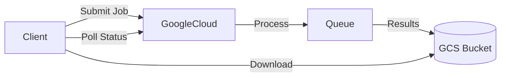

# Google Integration Guide

AGI Workforce provides deep integration with Google's Gemini ecosystem, supporting advanced features like Batch API, Live API, and Multimodal capabilities.

## Overview

- **Models**: Gemini 1.5 Pro, 1.5 Flash, 2.0 Flash-Lite, 2.0 Pro Experimental.
- **Vision**: Preferred provider for all vision-related tasks (screenshots, image analysis) due to superior multimodal understanding.
- **Features**:
  - **Batch API**: Cost-effective processing for large datasets (50% cheaper).
  - **Live API**: Real-time bidirectional voice/video interaction.
  - **Grounding**: Google Search integration for up-to-date information.
  - **Code Execution**: Sandboxed Python execution for complex calculations.

## Batch API

The Batch API allows you to submit large asynchronous jobs for significant cost savings.

### use Case

- Summarizing thousands of documents.
- Categorizing large datasets.
- Any non-latency-sensitive bulk processing.

### Architecture



### Usage (TypeScript)

**Submit a Batch Job:**

```typescript
import { googleBatch } from '@/api/google';

const jobId = await googleBatch.createJob({
  model: 'gemini-1.5-flash-002',
  inputFile: 'gs://my-bucket/inputs.jsonl',
  outputUri: 'gs://my-bucket/results/',
});
```

**Check Status:**

```typescript
const status = await googleBatch.getJobStatus(jobId);
if (status.state === 'SUCCEEDED') {
  console.log('Job Done!');
}
```

## Live API

The Live API (webrtc) enables real-time interaction with the model.

- **Audio In/Out**: Talk naturally to the AI.
- **Video In**: Show the AI your screen or camera.

**Configuration:**

```rust
let config = LiveSessionConfig {
    response_modalities: vec![Modality::Audio, Modality::Text],
    voice_name: Some("Aoede".to_string()),
};
```

## Advanced Settings

### Thinking & Reasoning

Gemini 2.0 models support "Thinking" to show their reasoning process.

- **Thinking Budget**: Set a token budget for reasoning (e.g., 1024 tokens).
- **Levels**: Configure depth of thought (0-4).

### Grounding

Enable Google Search grounding to reduce hallucinations.

```json
{
  "tools": [{ "googleSearch": {} }],
  "grounding_config": { "retrieval_mode": "grounding" }
}
```

## Configuration Reference

| Feature        | Environment Variable | Default                |
| :------------- | :------------------- | :--------------------- |
| **API Key**    | `GOOGLE_API_KEY`     | Required               |
| **Project ID** | `GOOGLE_PROJECT_ID`  | Required for Vertex AI |
| **Region**     | `GOOGLE_REGION`      | `us-central1`          |

## Troubleshooting

- **403 Forbidden**: Ensure `Vertex AI API` is enabled in Google Cloud Console.
- **Quota Exceeded**: Batch API has separate quotas. Request an increase if critical.
- **Audio Issues**: Live API requires a secure context (HTTPS) for microphone access.

## History

- **Phase 4**: Added Batch API and Live API support.
- **v1.0.9**: Full integration with Desktop App.
