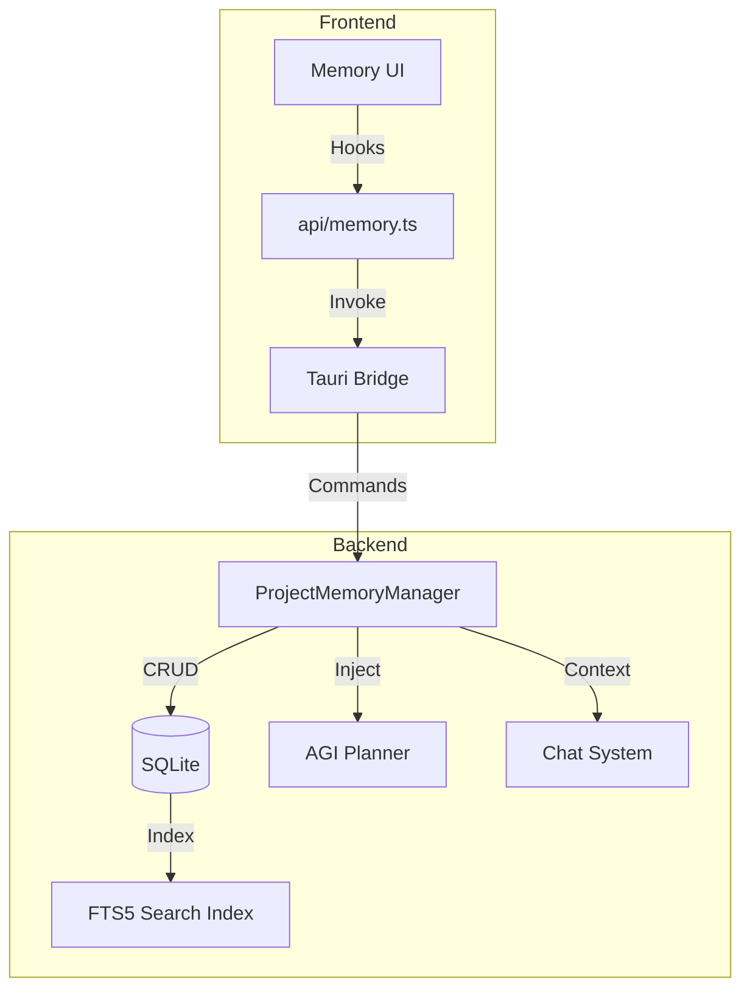

# Memory System

The Memory System provides AGI Workforce with persistent, project-scoped long-term memory. It allows the AI to recall architectural decisions, coding styles, and project context across sessions, ensuring consistent and intelligent behavior.

## Overview

- **Project-Scoped**: Memories are isolated per project folder.
- **Persistent**: Stored in a local SQLite database (`project_memories`), surviving app restarts.
- **Searchable**: Supports full-text search (FTS5) and semantic relevance.
- **Type-Aware**: Distinguishes between Facts, Decisions, Preferences, and Context.
- **Integrated**: Automatically injected into the planner and chat context.

## Core Features

### 1. Memory Categories

| Category       | Description                       | Importance | Example                                         |
| :------------- | :-------------------------------- | :--------- | :---------------------------------------------- |
| **Decision**   | Architectural choices & rationale | 7-10       | "Use Event-Driven Architecture for scalability" |
| **Preference** | Coding styles & conventions       | 6-8        | "Use snake_case for variables"                  |
| **Fact**       | Project-specific information      | 5-8        | "Tech stack includes Rust and Tauri"            |
| **Context**    | General background info           | 3-6        | "Project is a dashboard for IoT devices"        |

### 2. Lifeycle & Decay

Memories have an **Importance Score (1-10)**.

- High importance (8-10): Retained longer, prioritized in search.
- Decay: Memories lose relevance if not accessed. Visual indicators show aging memories.
- **The Dashboard** allows manual review and boosting of important memories.

### 3. Automated Capture

The system can automatically detect and save important information:

- **Decision Detection**: Regex patterns identify when the AI makes a significant decision.
- **Auto-Save**: Captures topic, decision, and rationale without user intervention.

## Architecture



### Backend (Rust)

- **Manager**: `src-tauri/src/core/agi/project_memory.rs`
- **Commands**: `src-tauri/src/sys/commands/project_memory.rs`
- **Schema**:
  - `project_memories`: Main storage
  - `project_memories_fts`: Search index

### Frontend (React)

- **Management UI**: `src/components/Memory/MemoryManager.tsx`
- **Sidebar**: `src/components/Memory/MemorySidebar.tsx`
- **Hooks**: `src/hooks/useMemoryIntegration.ts`

## Developer Guide

### usage

**Import the API:**

```typescript
import * as memory from '@/api/memory';
```

**Save a Decision:**

```typescript
await memory.saveArchitecturalDecision(
  'Use TypeScript Strict Mode',
  'Enforce strict mode across project',
  'Catches type errors at compile time',
);
```

**Search Memories:**

```typescript
const results = await memory.searchProjectMemories('/path/to/project', 'error handling');
```

**Inject into Prompt:**

```typescript
import { useMemoryIntegration } from '@/hooks/useMemoryIntegration';
const { formatMemoriesForPrompt } = useMemoryIntegration();
const context = formatMemoriesForPrompt(memories);
```

## Integration Points

1.  **Project Settings**: Manage memories via the "Memory" tab.
2.  **Chat Interface**: "Memory Sidebar" shows relevant context during conversations.
3.  **Planner**: Automatically queries the database for similar past problems before planning.

## Configuration

| Config            | Default | Description                                |
| :---------------- | :------ | :----------------------------------------- |
| `max_memories`    | 1000    | Max entries per project.                   |
| `decay_threshold` | 30 days | Days before warning about unused memories. |
| `min_importance`  | 5       | Minimum score to be auto-injected.         |

## Troubleshooting

- **Search not working?** Ensure FTS5 is enabled in your SQLite build (standard in Tauri).
- **Memories not loading?** Check that you have opened a valid project folder.
- **Export failed?** Check browser storage permissions.

## History

- **v1.0.9**: Full release with UI, Dashboard, and Planner integration.
