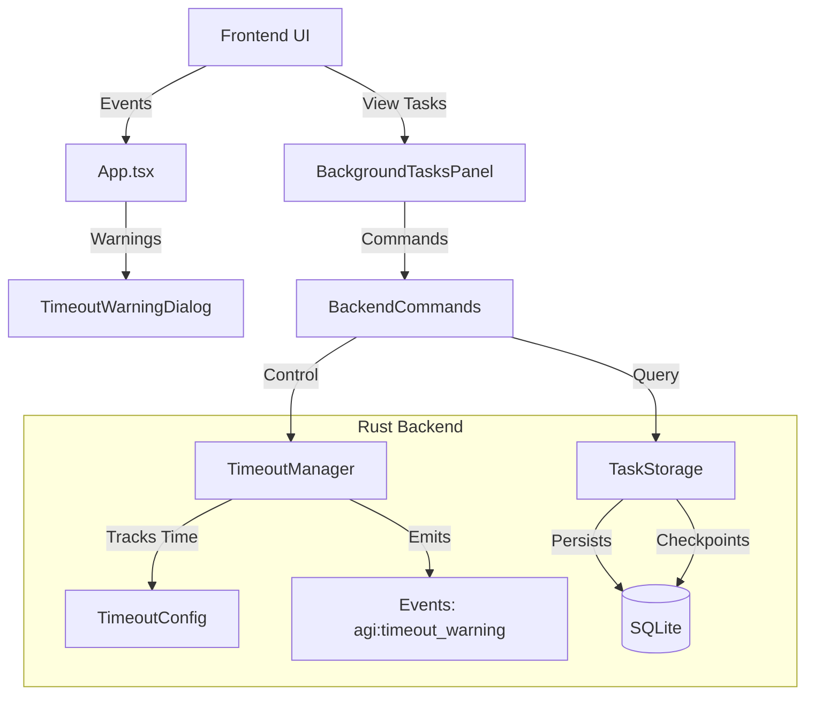

# Timeout System

The Timeout System provides comprehensive management for long-running AGI tasks, enabling execution for 30+ hours with safety, persistence, and user control.

## Overview

The system replaces hardcoded 5-minute limits with a configurable, resilient architecture that supports:

- **Configurable Timeouts**: 1 minute to 72 hours (Default: 24 hours).
- **Persistence**: SQLite-backed state preservation to survive app restarts.
- **Graceful Handling**: Warnings at 1h, 30m, and 5m remaining.
- **User Control**: Pause, resume, extend, or abort tasks at any time.

## Architecture

### Component Hierarchy



### Key Components

1.  **TimeoutManager (Rust)**: Tracks elapsed time, handles extensions, and emits warnings.
2.  **TaskStorage (Rust)**: Manages SQLite persistence for tasks and their progress checkpoints.
3.  **TimeoutWarningDialog (React)**: Modal that appears when a task is fast approaching its limit.
4.  **useTimeout (React Hook)**: Manages frontend state and listeners for timeout events.

## Configuration

Settings are managed via `settingsStore` and persisted to `localStorage`.

| Setting                 | Default    | Description                                              |
| :---------------------- | :--------- | :------------------------------------------------------- |
| `maxTimeoutMinutes`     | 1440 (24h) | Global maximum duration for new tasks.                   |
| `enableTimeoutWarnings` | `true`     | Whether to show warning dialogs.                         |
| `autoResumeOnRestart`   | `true`     | Whether to automatically resume tasks after app restart. |
| `checkpointInterval`    | 5 steps    | How often (in steps) to save progress to disk.           |

## User Interface

### Warning Levels

| Level        | Remaining | Color  | Description                    |
| :----------- | :-------- | :----- | :----------------------------- |
| **Info**     | > 30m     | Blue   | Task is running normally.      |
| **Warning**  | 5m - 30m  | Yellow | Task is approaching the limit. |
| **Critical** | < 5m      | Red    | Immediate action required.     |

### Actions

- **Extend**: Adds 30 minutes to the current deadline.
- **Pause**: Safely suspends execution. State is saved.
- **Resume**: Continues execution from the last checkpoint.
- **Abort**: Permanently stops the task.

## data Models

### PersistentTask (Rust/SQL)

```rust
struct PersistentTask {
    id: String,
    status: TaskStatus, // Queued, Running, Paused, Completed, Failed
    created_at: DateTime<Utc>,
    timeout_secs: u64,
    elapsed_secs: u64,
    ...
}
```

### TimeoutWarningData (TypeScript)

```typescript
interface TimeoutWarningData {
  taskId: string;
  taskName: string;
  remainingSeconds: number;
  maxTimeoutMinutes: number;
  executedSteps: number;
}
```

## Developer Guide

### Frontend API (`src/api/timeout.ts`)

```typescript
import { timeout } from '@/api';

// Get current config
const config = await timeout.getTimeoutConfig();

// Extend a task
await timeout.extendTimeout(taskId, 60); // +60 minutes
```

### Backend Commands (Tauri)

- `agi_extend_timeout`: `{ taskId, additionalMinutes }`
- `agi_pause_task`: `{ taskId }`
- `agi_resume_task`: `{ taskId }`
- `agi_get_timeout_status`: `{ taskId }`

## Troubleshooting

- **Task disappeared?** Check the "Background Tasks" panel in the sidebar.
- **Warnings not showing?** Verify `enableTimeoutWarnings` is ON in Settings.
- **App crashed?** Task should auto-resume on next launch if `autoResumeOnRestart` is true.

## Implementation History

- **v1.0.9**: Full frontend UI and Rust backend persistence structure implemented.
- **Legacy**: replaced hardcoded 300s timeout in `background_agent.rs`.
