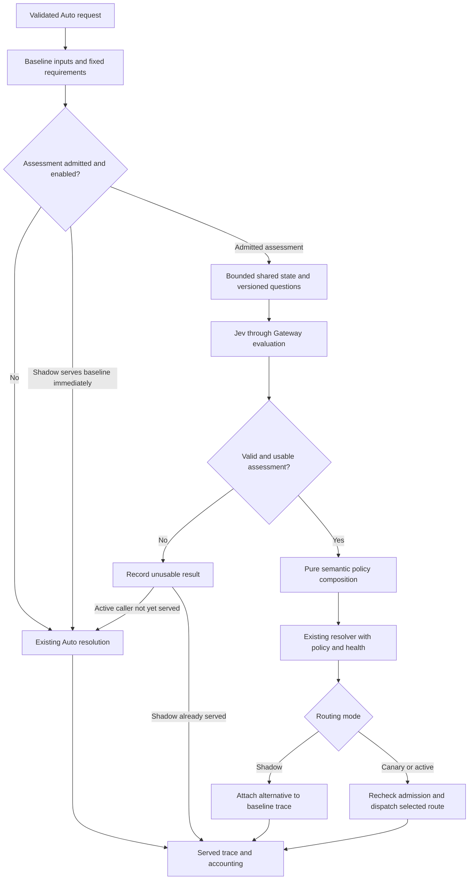

# Jev Auto routing architecture

Status: Proposed architecture; interfaces and configuration below are not implemented
Owner: Provider/platform owner, with Managed inference and billing owners
Last updated: 2026-09-19

This implements the proposed behavior in [spec.md](spec.md). The first serving
path is Managed web Auto through Vercel AI Gateway. All type and module names
introduced below are proposed; existing owners are linked explicitly.

## 1. Components and ownership

| Responsibility                                        | Owner                                                                                                                                    | Proposed change                                                                                                                                          |
| ----------------------------------------------------- | ---------------------------------------------------------------------------------------------------------------------------------------- | -------------------------------------------------------------------------------------------------------------------------------------------------------- |
| Evaluation transport contracts                        | [shared types](../../../packages/contracts/types/src)                                                                                    | Export provider-neutral question, answer, usage and error contracts, separate from `ProviderAdapter.stream`                                              |
| Gateway request and response normalization            | [Gateway provider](../../../packages/ai/providers/vercel-gateway/src)                                                                    | Add a separately exported evaluator, following the existing embeddings separation; contain the AI SDK dependency here                                    |
| Evaluator construction and credentials                | [provider service](../../../apps/web/lib/services/provider-adapter-service.ts)                                                           | Add construction for an explicitly selected evaluation route; retain server credential and endpoint policy ownership                                     |
| Semantic input, interpretation and policy composition | [routing package](../../../packages/ai/routing/src)                                                                                      | Pure functions for bounded question construction, answer validation, policy application and trace contribution; no SDK, environment secrets or network   |
| Per-turn coordination                                 | [Managed services](../../../apps/web/lib/services)                                                                                       | Add a server-only routing assessment coordinator for admission, limits, provider call, request reuse and accounting                                      |
| Question revisions                                    | [prompt manifest](../../../apps/web/lib/prompts/prompt-manifest.ts)                                                                      | Register immutable routing-question definitions and use existing stamps and release controls; extend typed structured-definition support where necessary |
| Evaluator model, route and routing policy             | [registry curation](../../../packages/ai/model-registry/catalog)                                                                         | Add evaluation route metadata and semantic policy; validate and generate through the existing compiler                                                   |
| Trace and cost lifecycle                              | [model rollout services](../../../apps/web/lib/services/model-rollout) and [COGS](../../../apps/web/lib/services/cogs-ledger-service.ts) | Attach semantic provenance, candidate comparison and idempotent assessment cost                                                                          |
| Evaluation                                            | [existing eval harness](../../../tools/evals)                                                                                            | Add routing corpus, evaluator runner and paired generator measurements                                                                                   |

The provider-routing lane owns the shared semantic policy and Gateway adapter.
The contracts-types lane owns cross-package transport types. Managed service,
registry, prompt and billing changes follow their existing owners. This design
creates neither a standalone service nor a network dependency inside the pure
router. The broader TS/Rust resolver convergence question remains separate;
Rust and local request paths receive no new external call in this slice.

## 2. Decision flow

### Managed insertion point

The request processor currently classifies text, applies conversation context,
derives implicit tool intent, resolves a tool-aware task type, and may demote an
Auto profile on weak heuristic confidence. It later loads workspace model policy,
retention, residency, available credentials and rollout state before resolving a
model. Preserve these as explicit baseline inputs rather than overwriting them.

1. Capture the original requested selection, baseline classification and resolved
   baseline routing input. Existing tool assembly runs once. Freeze a routing
   snapshot before either decision branch; branch computation must not mutate
   the request, allocate free capacity or persist conversation affinity.
2. Load policy required to admit the evaluator before sending text. Evaluation
   admission uses the model developer and transport identities, retention,
   residency, credential availability and spend limits. It is independent of
   whether the answering model's route is allowed.
3. Evaluate the immutable snapshot once if eligible. Keep all SDK work outside
   `classifyTaskLocally`, `classifyTaskFamily`, `resolveAutoRoute` and previews.
4. Interpret the result with a pure function. Preserve finalized tool/attachment
   requirements and `resolveToolAwareTaskType` precedence. Do not feed the result
   back into implicit tool enabling, memory retrieval or skill selection.
5. Resolve the candidate through the same observed-capability and registry policy
   path as baseline. Recompute health inputs for newly considered routes; do not
   reuse a health sample that covered only the baseline candidates as if complete.
6. Apply existing free-lane and final dispatch admission to the served branch.
   Initially skip semantic assessment for active free-lane traffic: its separate
   capacity allocation needs a measured composition experiment before inclusion.
   Later comparison branches must remain allocation-free.
7. Store the served input and served decision together, plus the comparison and
   semantic provenance. Update the conversation only with the model actually used.

For an accepted assessment, recompute task/profile policy from the original Auto
selection. Do not reuse a baseline-only demotion or pass Jev confidence to
`demoteLowConfidencePremiumSelection`: those confidence measures are different.
For any unusable assessment, use the complete baseline input, including its
existing heuristic behavior. Do not merge half of a failed assessment.

### Invocation policy

Within an admitted cohort, assess new user turns for which semantic requirements
could affect selection. Deterministic exclusions are: named model, disabled
feature, unapproved data path, unsupported workload, missing credential, exhausted
budget, saturated capacity, and cancellation. A single-candidate skip is valid
only when code proves that every supported semantic result would leave the same
eligible execution choice; one baseline candidate alone is not that proof.

Shadow sampling covers local high- and low-confidence cases. Short input is not
a sufficient skip rule. SDK calls and provider fallbacks for the same admitted
turn reuse its assessment; a new user turn or changed snapshot requires a new
assessment. There is no cross-turn result cache in the first implementation.

## 3. Proposed contracts

### Provider interface

`EvaluationRequest` carries a registry-resolved provider model reference, bounded
JSON state, named typed questions, an abort signal, and admitted provider options.
It does not accept client-selected evaluator endpoints or arbitrary credentials.

`EvaluationResult` carries normalized answers, actual returned model identity if
available, input/output usage with unknown values represented explicitly, provider
request identity, timing and allowlisted provider metadata. Choice and Score
distributions and confidence are preserved separately. Boolean carries only the
probability of true. A missing distribution is not fabricated from a scalar.

Validate exact expected question IDs, answer types, allowed choices, finite
probabilities, distribution sums, score bounds and consistency with the rubric.
Unrecognized/missing required answers invalidate the batch. Additional raw
provider metadata never becomes a routing instruction or log payload.

The Gateway evaluator uses an explicitly configured AI SDK evaluation provider
instance. Pass the existing resolved Gateway credential directly; avoid global
default-provider mutation and ambient credential discovery. Resolve its API base
through provider-owned metadata: the chat adapter's compatibility URL is not
evidence for the SDK evaluation endpoint. Provider admission, cancellation and
error sanitization must cover this new transport too.

Vercel currently documents confidence under TypeSafe provider metadata. Verify
the installed SDK's actual return shape in an authenticated smoke test, normalize
it once in the adapter, and retain missing values as missing. Alternative SDK
providers with weaker answer shapes are not automatic substitutes for Jev.

### Routing input and output

`RoutingAssessmentInput` contains an internal turn/snapshot identity, original
Auto selection, baseline task type with provenance, structural signals, bounded
conversation evidence and policy revision references. Only its deliberately
constructed `state` and questions go to Jev. Account IDs, budgets, credentials,
model catalog contents and infrastructure metadata are not needed by the initial
questions and remain local.

`RoutingAssessment` is a discriminated result:

| Status      | Contents                                                                                                     | Routing effect                                           |
| ----------- | ------------------------------------------------------------------------------------------------------------ | -------------------------------------------------------- |
| `usable`    | Validated answers plus complete prompt, policy, evaluator and snapshot provenance                            | Eligible for semantic composition in its configured mode |
| `abstained` | Valid answers plus `no_match`, `insufficient_context`, `ambiguous`, or `outside_validated_scope`             | Complete baseline                                        |
| `skipped`   | Local reason such as `disabled`, `explicit_model`, `policy`, `budget`, `capacity`, or `unsupported_workload` | Complete baseline; no provider call                      |
| `failed`    | Sanitized `timeout`, `provider_error`, `invalid_response`, or `version_mismatch`, plus known usage           | Complete baseline; account for any attempted call        |

User cancellation terminates the turn; it must not dispatch a baseline answer
after an aborted assessment. `usable` means that validated policy can consume the
answer, not that the answering model is certain to complete the task.

### Shared state and questions

Construct state from the latest user message, bounded preceding conversation
turns needed to interpret references, and server-derived attachment/tool/mode
descriptors. Keep role labels and evidence origin. Do not send fetched document
bodies, memory stores, full tool output, credentials or binary media in this
slice. Omit tool endpoint URLs, headers, attachment URLs and file paths from
descriptors. Do not add a generative summarizer to prepare this classification.

Bound the latest turn, history and total request independently. If the latest
turn cannot fit, skip rather than silently classify its prefix. If omitted
history or inaccessible visual/document content is essential, abstain. Record
truncation and omissions locally; a model's sufficiency answer cannot override a
known missing prerequisite. Media-dependent turns remain outside the initial
active cohort.

| Question            | Primitive | Meaning                                                                                                                                                              |
| ------------------- | --------- | -------------------------------------------------------------------------------------------------------------------------------------------------------------------- |
| Semantic task type  | Choice    | Select the applicable existing `RoutingTaskType`, with a separate no-suitable-type option; describe each label explicitly                                            |
| Reasoning demand    | Score     | Ordered, versioned rubric: direct transformation; application of known steps; synthesis/debugging across dependencies; extended reasoning with competing constraints |
| Context sufficiency | Boolean   | Can the supplied evidence support task-type and reasoning-demand judgments without guessing the missing referent or attachment content?                              |

The sufficiency question is about the supplied evidence, not whether the user
has provided everything required to finish the task. All three questions stand
alone against shared state. Question keys are response identifiers; instructions
must state the meaning in full. Task type and reasoning demand do not read each
other's answers. Do not average incompatible high/low difficulty modes into an
unjustified middle tier; the distribution informs the calibrated policy.

Keep `RoutingTaskType` and structural `TaskFamily` separate. The existing family
classifier remains structural; do not manufacture a family label from prose.
Revalidate family/task compatibility after a semantic correction. Independent
structural floors survive a taxonomy mismatch through the composed requirements;
an explicit family mismatch must not accidentally erase a required quality band.

### Applying an assessment

The proposed pure `applyRoutingAssessment` consumes the validated result,
baseline, fixed requirements and compiled semantic policy. It returns either the
unchanged baseline or a fully formed candidate routing input plus reason codes.

Task-type override, difficulty-to-quality-band mapping, permitted workload scope
and uncertainty policy belong in registry routing policy. The initial scope
changes semantic task classification and may raise a required quality band.
It cannot lower an existing curated family floor. Use a separate calibrated
assessment field rather than overloading heuristic `ClassifierResult.confidence`.

Add an optional assessed quality-floor input to the resolver. Combine it with
structural and curated floors; preserve a user-selected Auto profile and its
subscription ceiling. If a requested floor cannot be satisfied, record that
fact and follow the existing explicit unavailable/escalation policy. Do not
silently declare the floor met by clamping it to a cheaper available model.

Initially the implementation must compare the actual selected model against the
assessed floor before applying the candidate. Current family ordering can retain
below-floor fallback candidates; ordering alone is not a guarantee that the final
fallback meets the proposed requirement. An unmet assessed floor retains baseline
with a recorded reason until a separately evaluated escalation policy exists.

Capability counts, token requirements, dates, current prices, availability and
permission decisions stay computed in code. Semantic labels cannot grant tools,
raise the tier ceiling or change privacy mode. No new reasoning-effort or service
tier control is implied by the difficulty Score in this first slice.

Illustrative decisions below describe intended behavior, not measured Jev outputs:

| Request or condition                                     | Assessment and composition                                                                                                   |
| -------------------------------------------------------- | ---------------------------------------------------------------------------------------------------------------------------- |
| Short request to debug a distributed race condition      | A coding/high-demand assessment can correct a short-message chat heuristic and raise the quality floor within allowed policy |
| Routine edit with an existing coding floor               | A low-demand score alone leaves the floor intact; cheaper routine-code routing needs evaluated curation                      |
| Follow-up whose essential earlier referent was omitted   | Known context loss or an insufficient-context result preserves baseline                                                      |
| User explicitly names a model                            | Skip Jev; retain existing explicit-selection admission and fallback rules                                                    |
| Jev is unavailable or the assessment budget is exhausted | Preserve baseline without retrying through another evaluator                                                                 |

## 4. Configuration and reproducibility

Extend the existing registry/compiler with a proposed `auto.semanticAssessment`
policy. It references the evaluator's canonical model/family slot and route, the
immutable question definition, supported workload scope, acceptance policy and
difficulty-to-floor mapping. Evaluation becomes an explicit route/API capability;
the evaluator stays excluded from chat model selection. Generate the registry
and consumer contracts with the existing model sync command.

Runtime limits are owned by one server configuration consumed by the coordinator:
total deadline, state/question token and byte limits, in-flight limits, tenant
and provider quotas, spend cap, sampling fraction and result retention. Values
must be finite, validated and versioned; missing required limits disable calls.
Do not copy developer-helper limits into the product.

Register a server-only semantic routing flag with explicit `off`, `shadow`,
`canary`, and `active` modes. Missing/invalid configuration means off. A global
kill switch and workspace exclusions override cohort targeting. Cohorts remain
stable per conversation, are recorded, and compose with existing model/prompt
canaries without conflating the experiments.

Pin the tested evaluator identity where the Gateway route supports it. A moving
alias must be recorded as such. Unknown served revision is an unresolved release
condition, not proof of a pinned model: establish a verifiable immutable route or
an evaluated alias-change detection/revalidation policy before promotion. Do not
hardcode a provider slug in routing callers.

## 5. Latency, capacity and failures

The synchronous serving path makes at most one evaluation attempt per assessment
identity. Disable SDK automatic retries for this stage initially. Its deadline
includes queue/admission wait and network work, links to request cancellation,
and leaves the generator's own time budget intact. A deadline expiring resumes
baseline Auto only while the caller is still active.

Use bounded per-process concurrency plus shared provider/tenant quotas and spend
admission. Distributed limits must not multiply with replica count. Quota-store
failure disables optional assessment. Do not queue behind an unbounded backlog
or use a paid fallback evaluator on exhaustion. Provider rate limits are route
configuration and need a load measurement; no capacity target is claimed here.

Deduplicate concurrent handling of the same request identity using a bounded
lease/result mechanism with a stable snapshot key. A retry after an unknown
provider outcome does not promise exactly-once inference. Mark usage uncertain,
retain its cost reservation for reconciliation, and avoid automatic resubmission.
Request-scoped reuse expires with the configured lifecycle and honors temporary
chat retention. HMAC the state fingerprint with tenant scope for any persisted
correlation; a plain prompt hash is not anonymization.

## 6. Observability, accounting and shadow behavior

Extend `RoutingDecisionTrace` with a versioned semantic field carrying mode,
status/reason, baseline and proposed task types, structural family, effective
floor, baseline/proposed/served routes, prompt and policy revisions, evaluator
requested/actual identity, allowed distributions, elapsed time, usage and cost
provenance. Bump the trace schema and maintain tolerant readers. Trace state is
bounded and contains no raw prompt or provider error body.

Existing trace rows are unique on `(request_id, kind)`, with `served` and
`shadow` kinds. The latter already describes a second generator invocation.
Store semantic comparison inside the served row instead of inserting another
`shadow` row. An alternative route that was not executed has **unknown** quality
and cost; estimates must be labeled separately from measurements.

In shadow mode, capture the pre-answer snapshot, serve baseline immediately, and
schedule the admitted bounded assessment through the host's managed post-response
lifecycle. Never include the served answer in that assessment. Add an idempotent
trace merge that tolerates either insertion or completion winning the race and
does not overwrite served outcome fields. Detached promises that may be dropped
when the process exits are not a completion guarantee. Record dropped work and
missing telemetry; coverage gates exclude neither silently.

Use the COGS ledger with a distinct assessment source reference and parent request
attribution. Record known provider-reported usage, or route-priced estimates with
their provenance. Unknown usage is unknown, not zero. Reserve a bounded platform
assessment budget before egress and reconcile timeout/unknown-cost cases. This
reliable accounting lifecycle is an addition; best-effort trace writes cannot
serve as the spend ledger.

Initial shadow and canary evaluator spend is platform overhead with zero
additional customer debit. Retain sub-cent precision through the ledger's
microUSD accounting fields. The current `recordProviderCostEvent` rounds
`providerCostCents` before converting to microUSD, and also rounds reported cents.
Therefore using its current interface would erase small costs. Extend the
canonical cost-event input and writer to accept provider estimated/reported
microUSD directly, retaining legacy cent projections for existing consumers.
Add explicit pending/unknown cost handling and idempotent reconciliation; the
current insert-once event alone cannot represent an unknown bill later resolved.
Generation cost, retries, escalation and lost cache benefits remain separately
attributed to the same task for total economics. Any later billing policy change
requires its own product decision and rate-card integration.

The model label shown to the user remains the answering model. Existing routing
explanations may expose a deterministic reason such as task requirements or
fallback availability. Do not present confidence as a probability of successful
completion, or invent a natural-language rationale the evaluator did not return.

## 7. Evaluation and rollout

1. **Offline contract tests:** validate transport normalization, composition,
   malformed responses, policy admission, deadlines, cancellation, idempotency,
   accounting and baseline equivalence. Fixtures test the harness, not Jev quality.
2. **Held-out routing experiments:** run baseline, task-type-only, and the full
   assessment on identical task snapshots. Run the selected generators and grade
   actual outputs with the existing eval harness. Include deterministic graders
   and independent review where correctness cannot be mechanically checked.
3. **Approved shadow sampling:** measure decision disagreement, coverage, added
   assessment latency and spend. No customer behavior changes. Decision-only
   shadow data cannot establish counterfactual answer quality or CPST.
4. **Conversation-stable canary:** after declared gates pass, activate only the
   evaluated text workloads and permitted workspaces. Use a concurrent baseline
   control; record other model/prompt experiments and avoid confounded promotion.
5. **Expansion or rollback:** expand only measured strata. A policy-boundary
   violation or gate regression disables semantic routing; off restores the
   complete baseline. Preserve cost reconciliation for calls already attempted.

Split the corpus by conversation/template/source to prevent leakage. Include
short hard prompts, long easy transformations, quoted code, irrelevant keywords,
negation, multilingual and mixed-language requests, follow-ups, task pivots,
missing context, injection attempts, explicit model/Auto-profile choices, long
context, unavailable routes and insufficient budget. Keep unsupported media
cases as bypass tests. Changing a prompt, rubric, state builder, evaluator,
acceptance policy or generator policy invalidates the corresponding baseline.

Measure correct task interpretation, under-routing, over-routing, abstention,
coverage, task success, total cost and latency. Optimize total cost per verified
successful task under quality and latency constraints. Do not treat an HTTP
success, a streamed answer, or Jev's own confidence as a task-success oracle.

## 8. Open release questions

| Question                                                             | Evidence needed                                                                                                   | Owner                    |
| -------------------------------------------------------------------- | ----------------------------------------------------------------------------------------------------------------- | ------------------------ |
| Can Gateway expose or pin the evaluated Jev revision?                | Authenticated evaluation response and route configuration                                                         | Provider/platform        |
| Which workspaces may send classification context through this route? | Effective data-sharing, retention and residency policy for developer and transport                                | Managed platform/privacy |
| What assessment budget and deadline fit product latency?             | Provider/account limits, load tests and total task economics                                                      | Inference operations     |
| What score/confidence policies are useful?                           | Held-out results by workload and supported language                                                               | Routing/evaluation       |
| Can routine workloads use lower model bands safely?                  | Downstream quality evidence and an explicit curated floor change                                                  | Routing/product          |
| How are sub-cent and unknown evaluator costs reconciled durably?     | Extend the writer that currently rounds cents before microUSD conversion; verify reconciliation and failure paths | Billing/platform         |

These questions prevent unmeasured production activation. They do not prevent
implementing the contracts, adapter tests and offline experiment harness.
