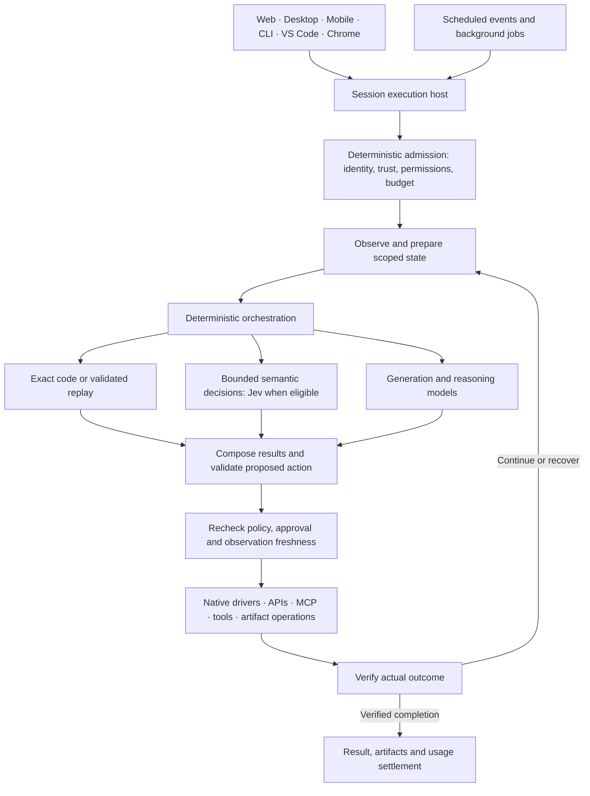
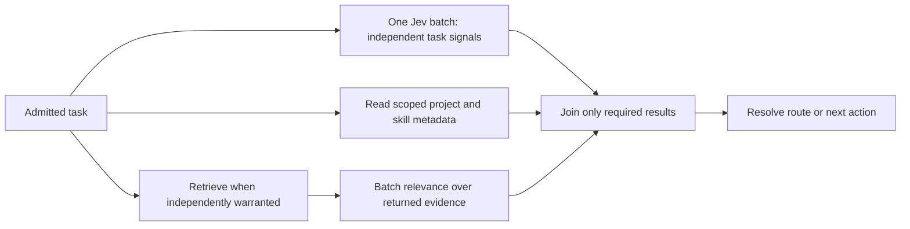

# Product architecture for semantic decisions and bounded execution

Status: Partly implemented; phase 1 and the host half of phase 3 exist on the managed web
host, every decision kind is disabled, and phases 2 and 4 to 6 are not started
Owner: AI platform maintainers
Last updated: 2026-09-20

## Architectural decision

Build a common execution architecture in which deterministic code, semantic decisions,
generation and reasoning have distinct jobs. Jev is one provider for the semantic decision
contract. It can participate throughout a task, rather than only at the initial router.
Keep one logical policy and contract system, with execution hosted where the session's
trust boundary permits. Shared architecture does not imply every request visits cloud.

This proposal extends the current [architecture](../../architecture/overview.md), the existing
[execution-plan and cost-per-successful-task design](../../architecture/execution-plan-contract.md),
and the [audit](audit.md). It does not introduce a second workflow engine, billing ledger,
provider router or permission system. The [action-control research](../../research/2026-09-20-jev-action-control.md)
is evidence for a bounded browser pilot, not proof of product-wide savings.

## Logical system

The branches represent available execution mechanisms, not a requirement to invoke all of
these on every turn. Deterministic work can bypass models. Routine semantic choices can
bypass generation. Open-ended tasks can go directly to the appropriate model. A planner
may produce a constrained subgoal once, then routine steps can use Jev until ambiguity or
changed requirements need replanning. There is no forced Jev latency tax on every request.

## Ownership and deployment

| Responsibility                     | Existing owner to extend                                      | Proposed change                                                                                        |
| ---------------------------------- | ------------------------------------------------------------- | ------------------------------------------------------------------------------------------------------ |
| Session/trust contracts            | `packages/contracts`, Rust protocol crate                     | Version cross-host observation/action envelopes only when needed; generate TS from Rust protocol types |
| Decision contracts and composition | `packages/ai/agent-core`                                      | Reuse the new evaluator; add domain-specific builders and fallback composition after evidence          |
| Model eligibility and economics    | `packages/ai/routing`, model registry                         | Resolve semantic signals against exact capability, provider, cost and user-selection rules             |
| Jev transport                      | `packages/ai/provider-runtime/src/typesafe-decisions.ts`      | Host-supplied configuration and tracing; credentials remain on an authorized host                      |
| Managed request hosting            | `apps/web` services and durable workflows                     | Authenticate, scope payloads, reserve spend, execute bounded work, persist progress and settle usage   |
| Browser execution                  | Extension `agentLoop.ts` and `cdpDriver.ts`                   | Add bounded action selection using the existing observation, ownership and approval paths              |
| Desktop execution                  | Electron dispatcher/permissions and Tauri registered commands | Keep distinct bridges; expose proven native capabilities through the correct shell                     |
| CLI/native execution               | Shared Rust crates and their session hosts                    | Preserve local/BYOK egress; no implicit TypeSafe call through a new helper                             |
| Retrieval and skills               | Data-layer search, skills package                             | Own candidate retrieval and selection inputs; reuse rather than copy catalogs                          |
| Rollout                            | Existing web feature-flag evaluator                           | Per-decision disabled/shadow/cohort/enabled mode and kill switch                                       |
| Accounting                         | Managed usage services and existing CPST telemetry            | Include decision, fallback, retry and verification spend in task outcomes                              |

Start as package-level modules in the existing hosts. A separate decision microservice is
not required. Extract a deployment only when measured traffic, isolation or release needs
justify it. Hosted clients can share one managed integration; this does not make native
Local/BYOK paths cloud clients.

Managed eligibility must include the tenant's permitted provider, region and data policy.
Cloud mode alone is insufficient. Local sessions use deterministic or local mechanisms;
BYOK stays on the authorized provider route. Neither silently falls back to TypeSafe.
Device execution still validates current local consent even when a managed host made the
semantic decision. Pause, logout, grant revocation or a new document invalidate stale work.

## Contracts to define before integrating features

These are proposed fields and responsibilities, not names of already shipped schemas.
Reuse existing equivalent fields and extend their canonical owners.

| Contract               | Minimum information                                                                                         | Invariant                                                      |
| ---------------------- | ----------------------------------------------------------------------------------------------------------- | -------------------------------------------------------------- |
| Task context           | Task/attempt/session/project IDs, trust mode, policy revision, budget, deadline                             | Admission comes from the host, never model output              |
| Observation            | Observation revision, source document/device, scoped content, provenance, candidate references              | Snapshot references identify actual observed resources         |
| Decision specification | Decision kind/version, input requirements, typed questions, allowed outputs, thresholds, deadline, fallback | Every decision has an owner and a labeled evaluation           |
| Decision result        | Version/model, answers/distributions, confidence where available, usage, latency, disposition               | A prediction grants no execution authority                     |
| Proposed action        | Original candidate ID, observation binding, operation, validated argument references, expected effect       | Models cannot invent executable selectors, credentials or code |
| Execution receipt      | Attempt ID, acknowledgement, known/unknown effect, postcondition evidence                                   | Timeout is not proof the action failed to occur                |
| Task outcome           | Verified success/failure/unknown, total cost and duration, recovery/escalation                              | Successful model output is not successful task completion      |

Keep configurable thresholds and rollout in the existing host configuration system, versioned
with question definitions and model selection. Extend canonical registries at implementation
time; do not scatter model literals or catalog copies into features. Avoid a universal
prompt containing unrelated decisions. Group compatible questions by state, permission,
deadline and failure policy.

## Where semantic decisions participate

| Product path                   | Jev's possible responsibility                             | Deterministic or generative responsibility                         |
| ------------------------------ | --------------------------------------------------------- | ------------------------------------------------------------------ |
| Chat and artifacts             | Intent, capability signals, artifact family               | Explicit choice, model eligibility, final answer/file generation   |
| Browser/desktop/mobile control | Observed operation/target/option selection                | Observation, exact values, permissions, input and outcome checks   |
| Tools/skills/connectors        | Candidate relevance and bounded enum arguments            | Discovery, connection state, scopes, arbitrary argument generation |
| Research and retrieval         | Relevance, support, contradiction and sufficiency signals | Search, evidence provenance, synthesis and difficult conclusions   |
| Memory and context             | Worth-extracting gate, candidate relevance                | Fact extraction, canonical storage, retention and exact budgets    |
| Workflows and workers          | Semantic branch, record class, exception triage           | Durable transitions, retries, schedules and external effects       |
| Quality and security           | Supplementary quality/risk/injection signals              | Exact schema checks, hard permissions and trust enforcement        |

Adding a decision is justified by measured total benefit, not by its possible semantic
interpretation. Keep existing zero-cost algorithms when an extra model call does not help.
High-consequence completion, memory suppression and security signals require their own
false-negative and false-positive evaluations.

## Parallel scheduling

Use the existing host's concurrency primitives for a short turn and its durable workflow
support for long-running work. Dependencies determine order; independent nodes may overlap.
Bound concurrent work by tenant, provider and runtime, with cancellation, deadlines and
backpressure. Optional semantic work must fall back promptly rather than monopolize the
interactive queue. Background work has separate budgets and must not starve user turns.

For UI control, operation plus conditional click/fill/select targets may share one Jev
request. Questions cannot depend on each other's answers. Validate compatibility and use
only the selected branch. A candidate-specific risk question needs a concrete candidate;
"is the chosen action risky?" cannot consume another parallel question's unknown answer.

Run independent sessions concurrently only when their resource ownership permits it. Order
mutations to the same tab, window, focus, filesystem target or workflow entity. Parallel
model questions do not authorize concurrent side effects. Reobserve after a transition.

Shadow mode observes the baseline without changing it. Do not start both alternative action
executors speculatively. Shadow tasks must have a supported lifetime in their host, be
metered, and avoid extending response time where they are not on the required path.

## Bounded action loop

1. Read DOM/accessibility or another authoritative state source. Use a perception model only
   when semantic observation is unavailable; Jev does not consume screenshots.
2. Build candidate actions from current, permitted, actionable resources. Include abstain and
   reobserve; include supplied values by reference. Do exact matching in code first.
3. Ask one bounded action Choice, or compatible operation/target questions together.
4. Apply calibrated confidence and model-version checks. Low confidence, missing data or
   provider failure goes to the existing safe path; it never executes a guessed fallback.
5. Recheck permission, session ownership, observation binding, target identity and
   actionability immediately before the mutation. Preserve required confirmations.
6. Record intent, execute once, and record the receipt. With an unknown acknowledgement,
   inspect resulting state before retrying; external systems do not provide universal
   exactly-once execution. Use idempotency where the underlying API supports it.
7. Verify the actual postcondition. Continue from a new observation, escalate, or finish.

Known text is copied by code. New text goes to a generative model when necessary. Complex
planning/recovery goes to a reasoning model with bounded escalation budget. A proven script
or API is preferable to repeated model decisions for a stable workflow.

## State, caching and recovery

Each host remains authoritative for its permitted session state. Persist durable managed
work through the existing workflow and storage paths; local journals stay local. Store
minimal bounded decision metadata by default, not raw page content, secrets or customer
files. Apply existing retention, tenant isolation and project scoping.

Cache semantic results only when state, candidate set, decision version, model, policy and
trust scope match. Dynamic UI choices should normally expire with the observation; a cached
label is never a fresh execution grant. Separate policy/configuration revisions from
observation revisions. Reuse supplied/generated field values only while their inputs and
intended destination remain unchanged.

Back off on rate limits within the overall deadline; retry choices separately from actions.
Circuit breaking should disable optional Jev work and retain the established fallback.
Long waits and approvals suspend durable work rather than pinning an interactive process.
The current evaluator's concurrency bound is per instance; production needs host/fleet
budgets before enabling customer traffic.

## Verification and operational metrics

Reuse provider tracing and managed usage accounting. Correlate task → attempt → decision →
action → outcome with metadata appropriate to the trust mode. Extend the existing CPST
measurement rather than create a second spend ledger. Current CPST telemetry includes a
skipped-verifier result; do not count it as independently verified success.

Track complete task p50/p95, verified completion rate, cost per verified successful task,
wrong valid actions, premature completion, fallback/escalation, stale target rejection,
model and driver calls, token usage, cancelled work and unmetered provider failures.
Count failed attempts and retries in costs. Keep startup, decision, execution, waiting and
verification timing distinguishable. Low inference latency alone is not the acceptance gate.

Capacity is demonstrated through representative load tests, not inferred from a provider's
advertised rate. Measure fairness and admission under saturation, budget enforcement,
outages and cancellation before claiming a concurrency target.

## Implementation sequence and exit gates

| Phase                     | Deliverable                                                                                                       | Exit evidence                                                                                             |
| ------------------------- | ----------------------------------------------------------------------------------------------------------------- | --------------------------------------------------------------------------------------------------------- |
| 1. Contracts and baseline | Bind decision specs to existing configuration, trace and spend owners; establish existing-agent task baseline     | Software tests, recorded total costs and independently verified outcomes                                  |
| 2. Browser pilot          | Isolated managed browser tasks using real indexed candidates and existing executor; include supplied-value typing | Held-out task quality, stale/ambiguous target tests, no unsafe side effects, comparative latency and CPST |
| 3. Managed shadow         | Host eligibility, metering, durable lifetime, cohort flag and kill switch                                         | Representative disagreement/calibration data; tested immediate fallback                                   |
| 4. Controlled activation  | Small eligible cohort for proven browser decisions                                                                | Quality floor plus meaningful total latency/cost benefit; rollback verified                               |
| 5. Additional domains     | Tool/skill selection, memory gates, retrieval and workflow branches independently                                 | Per-domain held-out evidence; preserve recall and user-visible behavior                                   |
| 6. Native expansion       | Explicit shell reachability and approved provider path for desktop/mobile control                                 | Platform-specific observation/execution tests and trust guarantees                                        |

Phases are dependency gates, not delivery-date estimates. Independent fixture, observability
and domain research work can proceed concurrently. Security-related decisions do not inherit
approval from a successful browser pilot. High-volume asynchronous work should expand only
when the real volume and cost evidence justify it.

## Current status

Existing infrastructure includes shared routing/provider packages, platform execution,
managed usage accounting, flags and durable workflows, plus the tested semantic evaluator,
TypeSafe adapter, candidate helper and small live development evaluations.

The managed web host now binds those to its own configuration, trace and spend owners, which
is phase 1, and carries the host half of phase 3: eligibility, metering, durable lifetime
through Next `after()`, a per-decision cohort flag and a kill switch. One shadow consumer,
`turn_signals`, exercises the whole path end to end against the deterministic task-family
classifier. Every decision kind is disabled by default and every default is off, so no
production request evaluates one; the exit evidence phase 3 asks for, representative
disagreement and calibration data, has not been gathered because nothing is switched on.

What is specified here and does not exist: the fleet-level rate budget (the evaluator's
concurrency bound is per instance), the browser pilot of phase 2 and its bounded action loop,
controlled activation, the additional domains, and native expansion. No route, latency or
user-visible behaviour has changed, and no product-wide improvement is claimed.
